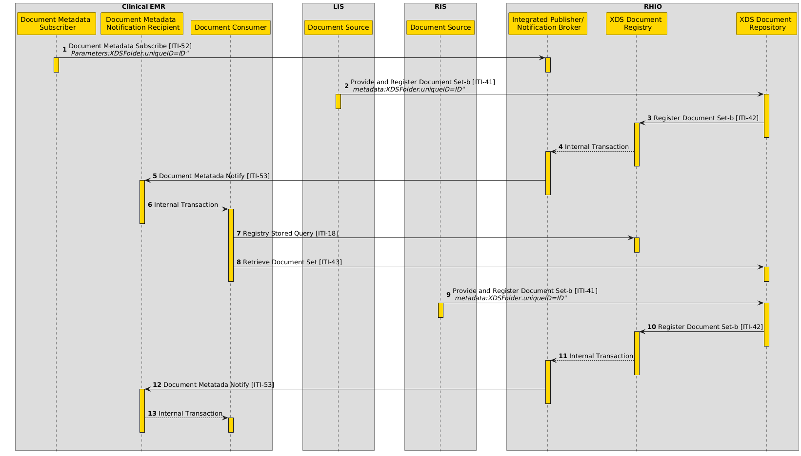
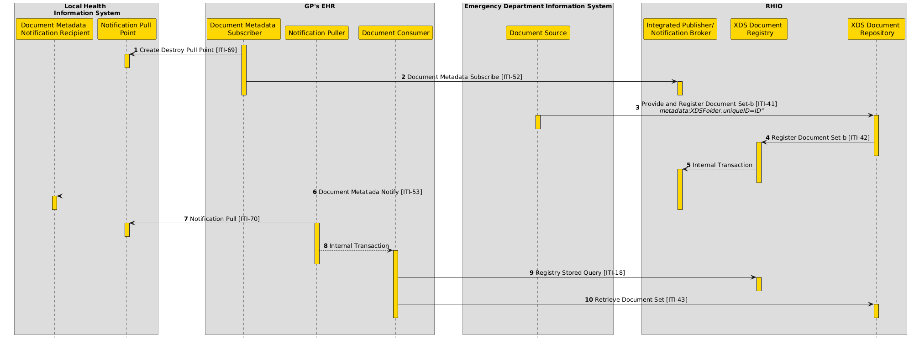
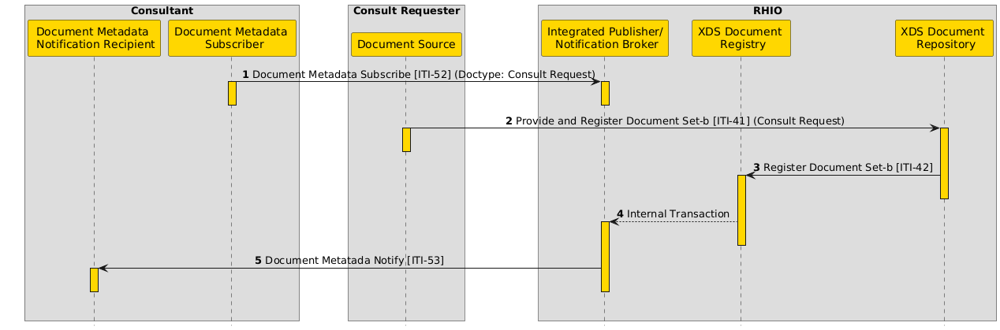
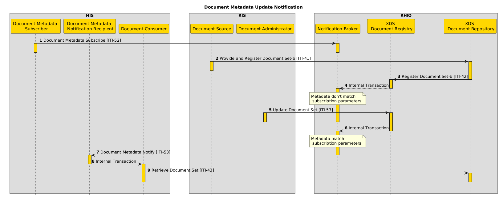
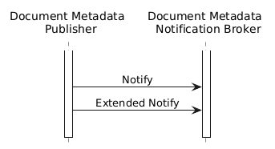

**Integrating the Healthcare Enterprise**

**IHE IT Infrastructure**

**Technical Framework Supplement**

**Extensions to the**

**Document Metadata Subscription (DSUB)**

**Profile**

**Rev. 1.5 – Trial Implementation**

Date: August 4, 2023

Author: IHE IT Infrastructure Technical Committee

Email: iti@ihe.net

**Please verify you have the most recent version of this document.** See
[<u>here</u>](http://ihe.net/Technical_Frameworks/) for Trial
Implementation and Final Text versions and
[<u>here</u>](http://ihe.net/Public_Comment/) for Public Comment
versions.

**Foreword**

This is a supplement to the IHE IT Infrastructure Technical Framework
V20.0. Each supplement undergoes a process of public comment and trial
implementation before being incorporated into the volumes of the
Technical Frameworks.

This supplement is published on August 4, 2023 for trial implementation
and may be available for testing at subsequent IHE Connectathons. The
supplement may be amended based on the results of testing. Following
successful testing it will be incorporated into the IT Infrastructure
Technical Framework. Comments are invited and may be submitted at
[<u>http://www.ihe.net/ITI_Public_Comments</u>](http://www.ihe.net/ITI_Public_Comments/).

This supplement describes changes to the existing technical framework
documents.

“Boxed” instructions like the sample below indicate to the Volume Editor
how to integrate the relevant section(s) into the relevant Technical
Framework volume.

*Amend Section X.X by the following:*

Where the amendment adds text, make the added text **<u>bold
underline</u>**. Where the amendment removes text, make the removed text
**~~bold strikethrough~~**. When entire new sections are added,
introduce with editor’s instructions to “add new text” or similar, which
for readability are not bolded or underlined.

Red color represents amendments introduced in the document after Rev 1.5
Extension. Only red text will be the object of Public Comment.

General information about IHE can be found at
[<u>IHE.net</u>](http://ihe.net/).

Information about the IHE IT Infrastructure domain can be found at
[<u>IHE Domains</u>](http://ihe.net/IHE_Domains/).

Information about the organization of IHE Technical Frameworks and
Supplements and the process used to create them can be found at
[<u>Profiles</u>](http://ihe.net/Profiles/) and [<u>IHE
Process</u>](http://ihe.net/IHE_Process/).

The current version of the IHE IT Infrastructure Technical Framework can
be found at
[<u>https://profiles.ihe.net/ITI/index.html</u>](https://profiles.ihe.net/ITI/index.html).

**CONTENTS**

[1. Introduction to this Supplement 9](#introduction-to-this-supplement)

> [Open Issues and Questions 10](#open-issues-and-questions)
>
> [Closed Issues 10](#closed-issues)

[2. IHE Technical Frameworks General Introduction
11](#ihe-technical-frameworks-general-introduction)

[9 Copyright Licenses 11](#copyright-licenses)

[10 Trademark 11](#trademark)

[3. IHE Technical Frameworks General Introduction Appendices
12](#ihe-technical-frameworks-general-introduction-appendices)

[4. Appendix A – Actors 12](#appendix-a-actors)

[5. Appendix B – Transactions 12](#appendix-b-transactions)

[6. Appendix D – Glossary 13](#appendix-d-glossary)

> [Copyright Permission 14](#copyright-permission)
>
> [Domain-specific additions 14](#domain-specific-additions)

[7. 26 Document Metadata Subscription Integration Profile
14](#document-metadata-subscription-integration-profile)

> [26.1.1.5 Notification Puller 16](#notification-puller)
>
> [26.1.1.6 Notification Pull Point 17](#notification-pull-point)
>
> [26.2.2 Folder Subscription Option 19](#folder-subscription-option)
>
> [26.2.3 Patient-Independent Subscription Option
> 19](#patient-independent-subscription-option)
>
> [26.2.4 Subscription Search Option 19](#subscription-search-option)
>
> [26.2.5 Subscription Deactivation Notify Option
> 20](#subscription-deactivation-notify-option)
>
> [26.2.6 Extended Events Document Metadata Subscription Option
> 20](#extended-events-document-metadata-subscription-option)
>
> [26.2.7 Update Events Folder Subscription Option
> 20](#update-events-folder-subscription-option)
>
> [26.2.8 Extended Events Folder Subscription Option
> 21](#extended-events-folder-subscription-option)
>
> [26.4.1 Concepts 22](#concepts)
>
> [26.4.2.6 Use Case \#6: Folder subscription
> 23](#use-case-6-folder-subscription)
>
> [26.4.2.6.1 Folder subscription Use Case Description
> 23](#folder-subscription-use-case-description)
>
> [26.4.2.6.2. Folder subscription Process Flow
> 23](#folder-subscription-process-flow)
>
> [26.4.2.7 Use Case \#7: GP’s EHR notification
> 24](#use-case-7-gps-ehr-notification)
>
> [26.4.2.7.1 GP’s EHR notification Use Case Description
> 24](#gps-ehr-notification-use-case-description)
>
> [26.4.2.7.2 GP’s EHR notification Process Flow
> 25](#gps-ehr-notification-process-flow)
>
> [26.4.2.8 Use Case \#8: Patient-independent tele-consultant
> notification
> 25](#use-case-8-patient-independent-tele-consultant-notification)
>
> [26.4.2.8.1 Patient-independent tele-consultant scenario
> 26](#patient-independent-tele-consultant-scenario)
>
> [26.4.2.8.2 Tele-Consultant patient-independent notification Process
> Flow
> 26](#tele-consultant-patient-independent-notification-process-flow)
>
> [26.4.2.9 Use Case \#9: Document Metadata Update Notification
> 26](#use-case-9-document-metadata-update-notification)
>
> [26.4.2.9.1 Document Metadata Update notification scenario
> 27](#document-metadata-update-notification-scenario)
>
> [26.4.2.9.2 Document Metadata Update notification Process Flow
> 27](#document-metadata-update-notification-process-flow)
>
> [26.4.2.10 Use Case \#10: Subscription search and deactivation
> notification
> 28](#use-case-10-subscription-search-and-deactivation-notification)
>
> [26.4.2.10.1 Subscription management by another system scenario
> 28](#subscription-management-by-another-system-scenario)
>
> [26.4.2.10.2 Subscription management by another system Process Flow
> 28](#subscription-management-by-another-system-process-flow)
>
> [26.5 DSUB Security Considerations 29](#dsub-security-considerations)
>
> [3.52.4.1.3.1 Folder Subscription Option
> 31](#folder-subscription-option-1)
>
> [3.52.4.1.3.2 Extended Events Document Metadata Subscription Option
> 31](#extended-events-document-metadata-subscription-option-1)
>
> [3.52.4.1.3.3 Update Events Folder Subscription Option
> 31](#update-events-folder-subscription-option-1)
>
> [3.52.4.1.3.4 Extended Events Folder Subscription Option
> 31](#extended-events-folder-subscription-option-1)
>
> [3.52.5.1.4 ihe:FolderMetadata 31](#ihefoldermetadata)
>
> [3.52.5.1.5 ihe:ExtendedFullDocumentEntry
> 32](#iheextendedfulldocumententry)
>
> [3.52.5.1.6 ihe:ExtendedMinimalDocumentEntry
> 32](#iheextendedminimaldocumententry)
>
> [3.52.5.1.7 ihe:UpdateFolder 32](#iheupdatefolder)
>
> [3.52.5.1.8 ihe:ExtendedFolder 32](#iheextendedfolder)
>
> [3.52.5.2 Building Filter Expressions
> 32](#building-filter-expressions)
>
> [3.52.5.2.3 Subscriptions for folders metadata
> 33](#subscriptions-for-folders-metadata)
>
> [3.52.5.2.4 Patient-Independent Subscriptions for Document metadata
> 35](#patient-independent-subscriptions-for-document-metadata)
>
> [3.52.5.2.5 Patient-Independent Subscriptions for SubmissionSet
> metadata
> 36](#patient-independent-subscriptions-for-submissionset-metadata)
>
> [3.52.6 Security Considerations 39](#security-considerations)
>
> [3.53.4 Messages 40](#messages)
>
> [3.53.4.1.2 Message Semantics 40](#message-semantics)
>
> [3.53.4.1.3 Expected Actions 42](#expected-actions)
>
> [3.53.4.1.4.4 Folder Notification Example (ihe:FolderMetadata)
> 42](#folder-notification-example-ihefoldermetadata)
>
> [3.53.4.2 Subscription Deactivation Notify Message
> 43](#subscription-deactivation-notify-message)
>
> [3.53.4.2.1 Trigger 43](#trigger)
>
> [3.53.4.2.2 Message Semantics 43](#message-semantics-1)
>
> [3.53.4.2.3 Expected Actions 44](#expected-actions-1)
>
> [3.53.4.2.4 Subscription Deactivation Notify Message Example
> 44](#subscription-deactivation-notify-message-example)
>
> [3.53.4.3 Extended Notify Message 44](#extended-notify-message)
>
> [3.53.4.3.1 Trigger 45](#trigger-1)
>
> [3.53.4.3.2 Message Semantics 45](#message-semantics-2)
>
> [3.53.4.3.3 Expected Actions 48](#expected-actions-2)
>
> [3.53.4.3.4 Extended Notify Message Examples
> 48](#extended-notify-message-examples)
>
> [3.53.4.3.4.1 Full Notification Message
> (ihe:ExtendedEventsFullDocumentEntry)
> 48](#full-notification-message-iheextendedeventsfulldocumententry)
>
> [3.53.4.3.4.2 Notification Message (ihe:ExtendedFolder)
> 49](#notification-message-iheextendedfolder)
>
> [3.54.4 Messages 52](#messages-1)
>
> [3.54.4.1.1 Trigger 53](#trigger-2)
>
> [3.54.4.1.2 Message Semantics 53](#message-semantics-3)
>
> [3.54.4.2 Extended Notify Message 53](#extended-notify-message-1)
>
> [3.54.4.2.1 Trigger 53](#trigger-3)
>
> [3.54.4.2.2 Message Semantics 54](#message-semantics-4)
>
> [3.54.4.2.3 Expected Actions 56](#expected-actions-3)
>
> [3.54.4.2.4 Extended Notify Message Example
> 56](#extended-notify-message-example)
>
> [3.54.5.1.1 Document Metadata Publisher Audit Message:
> 57](#document-metadata-publisher-audit-message)
>
> [3.54.5.1.2 Document Metadata Notification Broker audit message:
> 58](#document-metadata-notification-broker-audit-message)
>
> [3.69 Create Destroy Pull Point \[ITI-69\]
> 59](#create-destroy-pull-point-iti-69)
>
> [3.69.1 Scope 59](#scope)
>
> [3.69.2 Use Case Roles 59](#use-case-roles)
>
> [3.69.3 Referenced Standards 60](#referenced-standards)
>
> [3.69.4 Messages 60](#messages-2)
>
> [3.69.4.1 CreatePullPoint Request message
> 60](#createpullpoint-request-message)
>
> [3.69.4.1.1 Trigger Events 62](#trigger-events)
>
> [3.69.4.1.2 Message Semantics 62](#message-semantics-5)
>
> [3.69.4.1.3 Expected Actions 62](#expected-actions-4)
>
> [3.69.4.1.4 Example SOAP Encoding of the CreatePullPoint Request
> Message
> 62](#example-soap-encoding-of-the-createpullpoint-request-message)
>
> [3.69.4.2 CreatePullPoint Response message
> 63](#createpullpoint-response-message)
>
> [3.69.4.2.1 Trigger Events 63](#trigger-events-1)
>
> [3.69.4.2.2 Message Semantics 63](#message-semantics-6)
>
> [3.69.4.2.3 Expected Actions 63](#expected-actions-5)
>
> [3.69.4.2.4 Example SOAP Encoding of the CreatePullPoint Response
> Message
> 63](#example-soap-encoding-of-the-createpullpoint-response-message)
>
> [3.69.4.3 DestroyPullPoint Request message
> 64](#destroypullpoint-request-message)
>
> [3.69.4.3.1 Trigger Events 64](#trigger-events-2)
>
> [3.69.4.3.2 Message Semantics 64](#message-semantics-7)
>
> [3.69.4.3.3 Expected Actions 64](#expected-actions-6)
>
> [3.69.4.3.4 Example SOAP Encoding of the DestroyPullPoint Request
> Message
> 65](#example-soap-encoding-of-the-destroypullpoint-request-message)
>
> [3.69.4.4 DestroyPullPoint Response message
> 65](#destroypullpoint-response-message)
>
> [3.69.4.4.1 Trigger Events 65](#trigger-events-3)
>
> [3.69.4.4.2 Message Semantics 65](#message-semantics-8)
>
> [3.69.4.4.3 Expected Actions 65](#expected-actions-7)
>
> [3.69.4.4.4 Example SOAP Encoding of the DestroyPullPoint Response
> Message
> 66](#example-soap-encoding-of-the-destroypullpoint-response-message)
>
> [3.69.5 Security Considerations 66](#security-considerations-1)
>
> [3.69.5.1 Security Audit Considerations
> 66](#security-audit-considerations)
>
> [3.69.5.1.1 Notification Pull Point audit message
> 67](#notification-pull-point-audit-message)
>
> [3.69.5.1.2 Notification Puller audit message
> 68](#notification-puller-audit-message)
>
> [68](#section-1)
>
> [3.69.5.1.3 Notification Pull Point Actor Specific Security
> Considerations
> 70](#notification-pull-point-actor-specific-security-considerations)
>
> [3.70 Pull Notification \[ITI-70\] 70](#pull-notification-iti-70)
>
> [3.70.1 Scope 70](#scope-1)
>
> [3.70.2 Use Case Roles 70](#use-case-roles-1)
>
> [3.70.3 Referenced Standards 71](#referenced-standards-1)
>
> [3.70.4 Messages 71](#messages-3)
>
> [3.70.4.1 GetMessages Request message
> 71](#getmessages-request-message)
>
> [3.70.4.1.1 Trigger Events 71](#trigger-events-4)
>
> [3.70.4.1.2 Message Semantics 71](#message-semantics-9)
>
> [3.70.4.1.3 Expected Actions 72](#expected-actions-8)
>
> [3.70.4.1.4 Example SOAP Encoding of the GetMessages Request message
> 72](#example-soap-encoding-of-the-getmessages-request-message)
>
> [3.70.4.2 GetMessages Response message
> 73](#getmessages-response-message)
>
> [3.70.4.2.1 Trigger Events 73](#trigger-events-5)
>
> [3.70.4.2.2 Message Semantics 73](#message-semantics-10)
>
> [3.70.4.2.3 Expected Actions 74](#expected-actions-9)
>
> [3.70.4.2.4 Example SOAP Encoding of the GetMessage Response Message
> 74](#example-soap-encoding-of-the-getmessage-response-message)
>
> [3.70.5 Security Considerations 74](#security-considerations-2)
>
> [3.70.5.1 Security Audit Considerations
> 74](#security-audit-considerations-1)
>
> [3.70.5.1.1 Notification Puller audit message
> 75](#notification-puller-audit-message-1)
>
> [3.70.5.1.2 Notification Pull Point audit message
> 77](#notification-pull-point-audit-message-1)
>
> [3.70.5.1.3 Metadata Notification Pull Point Specific Security
> Considerations
> 79](#metadata-notification-pull-point-specific-security-considerations)
>
> [3.120 Document Subscription Search \[ITI-120\]
> 79](#document-subscription-search-iti-120)
>
> [3.120.1 Scope 79](#scope-2)
>
> [3.120.2 Use Case Roles 79](#use-case-roles-2)
>
> [3.120.3 Referenced Standards 80](#referenced-standards-2)
>
> [3.120.4 Messages 80](#messages-4)
>
> [3.120.4.1 Subscription Search Request message
> 80](#subscription-search-request-message)
>
> [3.120.4.1.1 Trigger Events 80](#trigger-events-6)
>
> [3.120.4.1.2 Message Semantics 81](#message-semantics-11)
>
> [3.120.4.1.2.1 Version 3.0 ebXML Registry Standard
> 81](#version-3.0-ebxml-registry-standard)
>
> [3.120.4.1.2.2 Query Request Parameters – Coding Style
> 81](#query-request-parameters-coding-style)
>
> [3.120.4.1.2.2.1 Parameter returnType 81](#parameter-returntype)
>
> [3.120.4.1.2.2.2 Subscription Search Query IDs
> 82](#subscription-search-query-ids)
>
> [3.120.4.1.2.4 Parameter for Subscription Search
> 82](#parameter-for-subscription-search)
>
> [3.120.4.1.2.4.1 GetSubscriptions 82](#getsubscriptions)
>
> [3.120.4.1.2.4.2 FindSubscriptions 83](#findsubscriptions)
>
> [3.120.4.1.3 Expected Actions 83](#expected-actions-10)
>
> [3.120.4.1.4 Example SOAP Encoding of the Subscription Search Request
> message
> 84](#example-soap-encoding-of-the-subscription-search-request-message)
>
> [3.120.4.2 Subscription Search Response message
> 85](#subscription-search-response-message)
>
> [3.120.4.2.1 Trigger Events 85](#trigger-events-7)
>
> [3.120.4.2.2 Message Semantics 85](#message-semantics-12)
>
> [3.120.4.2.3 Expected Actions 86](#expected-actions-11)
>
> [3.120.4.2.4 Example SOAP Encoding of the Subscription Search Response
> Message
> 86](#example-soap-encoding-of-the-subscription-search-response-message)
>
> [3.120.5 Security Considerations 87](#security-considerations-3)
>
> [3.120.5.1 Audit Record Considerations
> 88](#audit-record-considerations)
>
> [3.120.5.1.1 Document Metadata Subscriber audit message:
> 88](#document-metadata-subscriber-audit-message)
>
> [3.120.5.1.2 Document Metadata Notification Broker audit message:
> 90](#document-metadata-notification-broker-audit-message-1)

# Introduction to this Supplement

This trial implementation supplement extends the notification
infrastructure defined in the DSUB Profile (integrated into the Final
Text ITI Technical Framework in September 2016) adding the following
functionalities:

1.  Subscription to Folders objects and Folder’s updates (ITI TF-1:
    > 26.2.2 see “Folder Subscription Option”).

2.  Patient independent subscriptions for DocumentEntry and
    > SubmissionSet objects (see ITI TF-1: 26.2.3 “Patient-Independent
    > Subscription Option”).

3.  Pull-style notification approach (as defined in WS-BaseNotification
    > standard Section 5 "Pull-Style Notification"). There are certain
    > circumstances in which the basic “push-style” of notification
    > message delivery is not appropriate. For example, certain Document
    > Metadata Notification Recipients are behind a firewall such that
    > the Document Metadata Notification Broker cannot initiate a
    > message exchange to send the notification. A similar circumstance
    > exists for Document Metadata Notification Recipient that is unable
    > or unwilling to provide an endpoint to which the Notification
    > Broker can send notification messages. In other situations, the
    > Notification Recipient prefers to control the timing of receipt of
    > notification messages, instead of receiving notification messages
    > at unpredictable intervals, it may prefer to “pull” (retrieve) the
    > notification messages at a time of its own choosing. In the
    > “Pull-style” method, a Notification Puller creates a Pull Point
    > resource able to store notification generated by the Document
    > Metadata Notification Broker. This Pull Point resource is a
    > resource managed by the Pull Point that allows the storing of
    > notification targeted to a specific recipient. Notifications
    > stored in the Pull Point can be retrieved by the Notification
    > Puller using a specific transaction.

4.  Subscription Search through the \[ITI-120\] transaction: the
    > Document Metadata Subscriber can search for subscriptions when it
    > wants to discover subscriptions and be aware of their status from
    > the Document Metadata Notification Broker (ITI TF-1: 26.2.4 see
    > “Subscription Search Option”).

5.  Notification in case of Subscription Deactivation. The Document
    > Metadata Subscriber that supports this functionality is able to
    > receive a notification from the Document Metadata Notification
    > Broker in case of a Subscription deactivation (ITI TF-1: 26.2.5
    > see “Subscription Deactivation Option”).

6.  Patient-Dependent and Patient-Independent Subscription to metadata
    > update and delete events performed on DocumentEntry objects (ITI
    > TF-1: 26.2.6 see “Extended Events Document Metadata Subscription
    > Option”).

7.  Subscription for update and delete events performed on Folder
    > objects (ITI TF-1: 26.2.7 see “Update Events Folder Subscription
    > Option” and 26.2.8 see “Extended Events Folder Subscription
    > Option”).

## Open Issues and Questions

None

## Closed Issues

**~~None~~**

Is it possible to introduce the functionality of reactivating a
subscription after it has been deactivated through an \[ITI-52\]
Document Metadata Subscribe Transaction?

According to the OASIS standard, it is not possible to reactivate that
has been deactivated through the Unsubscribe Request Message.

On the other hand, the OASIS standard defines the possibility to pause a
subscription and then resume it.

Since, as described in the use-cases below, the scope of activating a
subscription is to receive almost real-time notifications when an event
that matches the parameters of the subscription happens, it would not be
useful to insert the possibility to pause a subscription.

# IHE Technical Frameworks General Introduction

The [<u>IHE Technical Framework General
Introduction</u>](https://profiles.ihe.net/GeneralIntro) is shared by
all of the IHE domain technical frameworks. Each technical framework
volume contains links to this document where appropriate.

# Copyright Licenses

IHE technical documents refer to, and make use of, a number of standards
developed and published by several standards development organizations.
Please refer to the IHE Technical Frameworks General Introduction,
[<u>Chapter 9 - Copyright
Licenses</u>](https://profiles.ihe.net/GeneralIntro/ch-9.html) for
copyright license information for frequently referenced base standards.
Information pertaining to the use of IHE International copyrighted
materials is also available there.

# Trademark

IHE® and the IHE logo are trademarks of the Healthcare
Information Management Systems Society in the United States and
trademarks of IHE Europe in the European Community. Please refer to the
IHE Technical Frameworks General Introduction, [<u>Chapter 10 -
Trademark</u>](https://profiles.ihe.net/GeneralIntro/ch-10.html) for
information on their use.

# IHE Technical Frameworks General Introduction Appendices

The [<u>IHE Technical Framework General Introduction
Appendices</u>](https://profiles.ihe.net/GeneralIntro/index.html) are
components shared by all of the IHE domain technical frameworks. Each
technical framework volume contains links to these documents where
appropriate.

*Update the following appendices to the General Introduction as
indicated below. Note that these are **not** appendices to this domain’s
Technical Framework (TF-1, TF-2, TF-3 or TF-4) but rather, they are
appendices to the IHE Technical Frameworks General Introduction located
[<u>here</u>](https://profiles.ihe.net/GeneralIntro/index.html).*

# [<u>Appendix A</u>](https://profiles.ihe.net/GeneralIntro/ch-A.html) – Actors

*Add the following **new or modified** actors to the [<u>IHE Technical
Frameworks General Introduction Appendix
A</u>](https://profiles.ihe.net/GeneralIntro/ch-A.html):*

<table>
<colgroup>
<col style="width: 32%" />
<col style="width: 67%" />
</colgroup>
<thead>
<tr class="header">
<th><blockquote>

<strong>Actor</strong>

</blockquote></th>
<th><blockquote>

<strong>Definition</strong>

</blockquote></th>
</tr>
<tr class="odd">
<th><blockquote>

Notification Pull Point

</blockquote></th>
<th><blockquote>

The Notification Pull Point is the actor that stores notifications
targeted to a specific Document Metadata Notification Recipient that
cannot be directly notified. This actor delivers notifications to the
Notification Puller when requested.

</blockquote></th>
</tr>
<tr class="header">
<th><blockquote>

Notification Puller

</blockquote></th>
<th><blockquote>

The Notification Puller is the actor that can create a pull point
resource for the storing of notifications. It pulls notifications stored
in a Notification Pull Point when requested.

</blockquote></th>
</tr>
</thead>
<tbody>
</tbody>
</table>

# [<u>Appendix B</u>](https://profiles.ihe.net/GeneralIntro/ch-B.html) – Transactions

*Add the following **new or modified** transactions to the [<u>IHE
Technical Frameworks General Introduction Appendix
B</u>](https://profiles.ihe.net/GeneralIntro/ch-B.html):*

<table>
<colgroup>
<col style="width: 32%" />
<col style="width: 67%" />
</colgroup>
<thead>
<tr class="header">
<th><blockquote>

<strong>Transaction</strong>

</blockquote></th>
<th><blockquote>

<strong>Definition</strong>

</blockquote></th>
</tr>
<tr class="odd">
<th><blockquote>

Create Destroy Pull Point [ITI-69]

</blockquote></th>
<th><blockquote>

This transaction is used to create a pull point resource. This
resource is used for the creation of subscriptions and for the pulling
of the notifications stored. This transaction is also used to destroy
the pull point resource when it is no longer needed.

</blockquote></th>
</tr>
<tr class="header">
<th><blockquote>

Pull Notification [ITI-70]

</blockquote></th>
<th><blockquote>

This transaction is used to retrieve pending notifications.

</blockquote></th>
</tr>
<tr class="odd">
<th><blockquote>

Document Subscription Search [ITI-120]

</blockquote></th>
<th><blockquote>

This transaction is used to search for informations about
subscriptions status and contents.

</blockquote></th>
</tr>
</thead>
<tbody>
</tbody>
</table>

# [<u>Appendix D</u>](https://profiles.ihe.net/GeneralIntro/ch-D.html) – Glossary

*Add the following **new or modified glossary** terms to the [<u>IHE
Technical Frameworks General Introduction Appendix
D</u>](https://profiles.ihe.net/GeneralIntro/ch-D.html):*

<table>
<colgroup>
<col style="width: 32%" />
<col style="width: 67%" />
</colgroup>
<thead>
<tr class="header">
<th><blockquote>

<strong>Glossary Term</strong>

</blockquote></th>
<th><blockquote>

<strong>Definition</strong>

</blockquote></th>
</tr>
<tr class="odd">
<th><blockquote>

Pull Point resource

</blockquote></th>
<th><blockquote>

A resource managed by the Pull Point that allows the storing of
notification targeted to a specific recipient.

</blockquote></th>
</tr>
</thead>
<tbody>
</tbody>
</table>

**Volume 1 – Profiles**

## Copyright Permission

None

## Domain-specific additions

None

*Editor: Make the following changes in Section 26*

# 26 Document Metadata Subscription Integration Profile

This profile describes the use of subscription and notification
mechanism for use within an XDS Affinity Domain and across communities.
The subscription allows for the matching of metadata during the
publication of a new document **<u>and the update or deletion of a
document</u>** for a given patient, and results in the delivery of a
notification. This profile is based on the OASIS WS-BaseNotification
standard and **<u>defines two methods of subscription and
notification</u>**:

1.  **<u>In the</u>** **~~defines a~~** “Push-style” method **~~for
    > notification.~~ <u>, a</u> ~~Using a push-style method of
    > notification, the~~** Document Metadata Subscriber may subscribe
    > on behalf of the Document Metadata Notification Recipient to
    > receive notifications about the availability of documents based on
    > specific criteria. A Document Metadata Notification Broker keeps
    > track of the subscriptions and sends the appropriate notifications
    > based on the registration, **<u>update or deletion</u>** of
    > objects in an XDS Document Registry. Subscriptions exist for a
    > certain period of time and can be cancelled.

2.  **<u>In the “Pull-style” method, a Notification Puller creates a
    > Pull Point resource able to store notification generated by the
    > Document Metadata Notification Broker. This Pull Point resource is
    > a resource managed by the Notification Pull Point that allows the
    > storing of notification targeted to a specific recipient.
    > Notifications stored in the Notification Pull Point can be
    > retrieved by the Notification Puller using a specific
    > transaction.</u>**

*Editor: Replace Figure 26.1-1 with the following:*

*Editor: Apply the following updates to Table 26.1-1 and add notes:*

**Table 26.1-1: Document Metadata Subscription Integration Profile -
Actors and Transactions**

<table>
<colgroup>
<col style="width: 31%" />
<col style="width: 31%" />
<col style="width: 17%" />
<col style="width: 19%" />
</colgroup>
<thead>
<tr class="header">
<th><blockquote>

<strong>Actors</strong>

</blockquote></th>
<th><blockquote>

<strong>Transactions</strong>

</blockquote></th>
<th><blockquote>

<strong>Optionality</strong>

</blockquote></th>
<th><blockquote>

<strong>Reference</strong>

</blockquote></th>
</tr>
<tr class="odd">
<th rowspan="4"><blockquote>

Document Metadata Notification Broker

</blockquote></th>
<th><blockquote>

Document Metadata Subscribe

</blockquote></th>
<th><blockquote>

R

</blockquote></th>
<th><blockquote>

ITI TF-2: 3.52

</blockquote></th>
</tr>
<tr class="header">
<th><blockquote>

Document Metadata Notify

</blockquote></th>
<th><blockquote>

R

</blockquote></th>
<th><blockquote>

ITI TF-2: 3.53

</blockquote></th>
</tr>
<tr class="odd">
<th><blockquote>

Document Metadata Publish

</blockquote></th>
<th><blockquote>

O

</blockquote></th>
<th><blockquote>

ITI TF-2: 3.54

</blockquote></th>
</tr>
<tr class="header">
<th><blockquote>

<strong><u>Document Subscription Search</u></strong>

</blockquote></th>
<th><blockquote>

<strong><u>O (Note 1)</u></strong>

</blockquote></th>
<th><blockquote>

<strong><u>ITI TF-2: 3.120</u></strong>

</blockquote></th>
</tr>
<tr class="odd">
<th rowspan="2"><blockquote>

Document Metadata Subscriber

</blockquote></th>
<th><blockquote>

Document Metadata Subscribe

</blockquote></th>
<th><blockquote>

R

</blockquote></th>
<th><blockquote>

ITI TF-2: 3.52

</blockquote></th>
</tr>
<tr class="header">
<th><blockquote>

<strong><u>Document Subscription Search</u></strong>

</blockquote></th>
<th><blockquote>

<strong><u>O (Note 1)</u></strong>

</blockquote></th>
<th><blockquote>

<strong><u>ITI TF-2: 3.120</u></strong>

</blockquote></th>
</tr>
<tr class="odd">
<th><blockquote>

Document Metadata Publisher

</blockquote></th>
<th><blockquote>

Document Metadata Publish

</blockquote></th>
<th><blockquote>

R

</blockquote></th>
<th><blockquote>

ITI TF-2: 3.54

</blockquote></th>
</tr>
<tr class="header">
<th><blockquote>

Document Metadata Notification Recipient

</blockquote></th>
<th><blockquote>

Document Metadata Notify

</blockquote></th>
<th><blockquote>

R

</blockquote></th>
<th><blockquote>

ITI TF-2:3.53

</blockquote></th>
</tr>
<tr class="odd">
<th rowspan="2"><blockquote>

<strong><u>Notification Puller</u></strong>

</blockquote></th>
<th><blockquote>

<strong><u>Pull Notification</u></strong>

</blockquote></th>
<th><blockquote>

<strong><u>R</u></strong>

</blockquote></th>
<th><blockquote>

<strong><u>ITI TF-2: 3.70</u></strong>

</blockquote></th>
</tr>
<tr class="header">
<th><blockquote>

<strong><u>Create Destroy Pull Point</u></strong>

</blockquote></th>
<th><blockquote>

<strong><u>O</u></strong>

</blockquote></th>
<th><blockquote>

<strong><u>ITI TF-2: 3.69</u></strong>

</blockquote></th>
</tr>
<tr class="odd">
<th rowspan="2"><blockquote>

<strong><u>Notification Pull Point</u></strong>

</blockquote></th>
<th><blockquote>

<strong><u>Pull Notification</u></strong>

</blockquote></th>
<th><blockquote>

<strong><u>R</u></strong>

</blockquote></th>
<th><blockquote>

<strong><u>ITI TF-2: 3.70</u></strong>

</blockquote></th>
</tr>
<tr class="header">
<th><blockquote>

<strong><u>Create Destroy Pull Point</u></strong>

</blockquote></th>
<th><blockquote>

<strong><u>O</u></strong>

</blockquote></th>
<th><blockquote>

<strong><u>ITI TF-2: 3.69</u></strong>

</blockquote></th>
</tr>
</thead>
<tbody>
</tbody>
</table>

> ***<u>Note 1: Document Metadata Notification Broker and Document
> Metadata Subscriber shall implement the Document Subscription Search
> \[ITI-120\] transaction if they support the Subscription Search
> Option</u>***

*Editor: Add Sections 26.1.1.5 and 26.1.1.6*

#### 26.1.1.5 Notification Puller

The Notification Puller is the actor that is involved in a notification
system using a pull-style approach. This actor “activates” the
Notification Pull Point using the Create Destroy Pull Point \[ITI-69\]
transaction to create (and destroy) the Pull Point resource.

The Notification Puller SHALL be grouped with a Document Metadata
Subscriber.

When using the “pull-style” method of notification, the order of the
transactions SHALL be:

1.  The Notification Puller (grouped with a Document Metadata
    > Subscriber) sends the Create Destroy Pull Point \[ITI-69\]
    > transaction. In response, the Notification Pull Point (grouped
    > with the Document Metadata Notification Recipient) returns the
    > endpoint of the Pull Point resource. The Notification
    > Puller/Document Metadata Subscriber now knows from where to “pull”
    > notifications.

2.  The Document Metadata Subscriber/Notification Puller sends the
    > Document Metadata Subscribe \[ITI-52\] transaction to the Document
    > Metadata Notification Broker, identifying the endpoint where the
    > notification is to be sent (the Notification Pull Point/Document
    > Metadata Notification Recipient).

3.  Over time, the Notification Pull Point/Document Metadata
    > Notification Recipient will receive notifications via Document
    > Metadata Notify \[ITI-53\].

4.  Later, the Notification Puller sends the Pull Notification
    > \[ITI-70\] transaction to the Notification Pull Point/Document
    > Metadata Notification Recipient to retrieve notifications it
    > subscribed to.

The order of the transaction for the destroy of the Pull Point resource
SHALL be:

1.  The Notification Puller (grouped with a Document Metadata
    > Subscriber) sends unsubscribe Requests (Document Metadata
    > Subscribe \[ITI-52\] transaction) to delete all subscriptions
    > created using the endpoint of the Pull Point resource that needs
    > to be destroyed.

2.  The Notification Puller can proceed with the destroying of the Pull
    > Point resource using Create Destroy Pull Point \[ITI-69\]
    > transaction.

If the Notification Puller does not support the optional Create Destroy
Pull Point \[ITI-69\] transaction, it SHALL be able to support the
following configuration requirements:

- It SHALL be configurable with the endpoints for the Pull Point
  > resources already created for it.

- It SHALL configure the endpoint for Pull Notification \[ITI-70\]
  > transaction.

#### 26.1.1.6 Notification Pull Point

The Notification Pull Point is the actor that stores notifications
targeted to systems which cannot be directly notified. The intended
recipient for the notifications received by the Notification Pull Point
is the Notification Puller that creates a Pull Point resource using the
Create Destroy Pull Point transaction. A Pull Point resource is created
in response to each Create Pull Point request (it is possible to have
many Pull Point resources for the same Notification Puller) and is used
to collect all notifications destined for the requesting Notification
Puller.

The Notification Pull Point can manage Pull Point resources created by
many different Notification Puller Actors.

The Notification Pull Point SHALL be grouped with a Document Metadata
Notification Recipient in order to receive notifications from a Document
Metadata Notification Broker.

In order to not lose nor duplicate notifications:

- After the creation of a Pull Point resource, the Notification Pull
  > Point receives and stores all notifications in the target Pull Point
  > resource. The Notification Puller can then retrieve the
  > notifications stored in a target Pull Point resource.

- Notifications returned to the Notification Puller are deleted from the
  > Pull Point resource in accordance to the WS-BaseNotification
  > standard.

If the Notification Pull Point does not support the optional Create
Destroy Pull Point \[ITI-69\] transaction, it SHALL be able to support
the following configuration requirements:

- At least one Pull Point resource needs to be pre-created for each
  > Notification Puller involved in the notification system.

- The endpoints of these Pull Point resources need to be disclosed to
  > the correct Notification Puller.

*Editor: apply the following changes in Table 26.2-1*

**Table 26.2-1: Document Metadata Subscription – Actors and Options**

<table>
<colgroup>
<col style="width: 35%" />
<col style="width: 41%" />
<col style="width: 23%" />
</colgroup>
<thead>
<tr class="header">
<th><blockquote>

<strong>Actor</strong>

</blockquote></th>
<th><blockquote>

<strong>Option Name</strong>

</blockquote></th>
<th><blockquote>

<strong>Reference</strong>

</blockquote></th>
</tr>
<tr class="odd">
<th rowspan="8"><blockquote>

Document Metadata Notification Broker

</blockquote></th>
<th><blockquote>

Document Metadata Publish Recipient

</blockquote></th>
<th><blockquote>

ITI TF-1: 26.2.1

</blockquote></th>
</tr>
<tr class="header">
<th><blockquote>

<strong><u>Folder Subscription</u></strong>

</blockquote></th>
<th><blockquote>

<strong><u>ITI TF-1: 26.2.2</u></strong>

</blockquote></th>
</tr>
<tr class="odd">
<th><blockquote>

<strong><u>Patient-Independent Subscription</u></strong>

</blockquote></th>
<th><blockquote>

<strong><u>ITI TF-1: 26.2.3</u></strong>

</blockquote></th>
</tr>
<tr class="header">
<th><blockquote>

<strong><u>Subscription Search</u></strong>

</blockquote></th>
<th><blockquote>

<strong><u>ITI TF-1: 26.2.4</u></strong>

</blockquote></th>
</tr>
<tr class="odd">
<th><blockquote>

<strong><u>Subscription Deactivation Notify</u></strong>

</blockquote></th>
<th><blockquote>

<strong><u>ITI TF-1: 26.2.5</u></strong>

</blockquote></th>
</tr>
<tr class="header">
<th><blockquote>

<strong><u>Extended Events Document Metadata
Subscription</u></strong>

</blockquote></th>
<th><blockquote>

<strong><u>ITI TF-1: 26.2.6</u></strong>

</blockquote></th>
</tr>
<tr class="odd">
<th><blockquote>

<strong><u>Update Events Folder Subscription</u></strong>

</blockquote></th>
<th><blockquote>

<strong><u>ITI TF-1: 26.2.7</u></strong>

</blockquote></th>
</tr>
<tr class="header">
<th><blockquote>

<strong><u>Extended Events Folder Subscription</u></strong>

</blockquote></th>
<th><blockquote>

<strong><u>ITI TF-1: 26.2.8</u></strong>

</blockquote></th>
</tr>
<tr class="odd">
<th rowspan="6"><blockquote>

Document Metadata Subscriber

</blockquote></th>
<th><blockquote>

<em><strong><del>No options defined</del></strong></em>
<strong><u>Patient-Independent Subscription</u></strong>

</blockquote></th>
<th><blockquote>

<strong><u>ITI TF-1: 26.2.3</u></strong>

</blockquote></th>
</tr>
<tr class="header">
<th><blockquote>

<strong><u>Folder Subscription</u></strong>

</blockquote></th>
<th><blockquote>

<strong><u>ITI TF-1: 26.2.2</u></strong>

</blockquote></th>
</tr>
<tr class="odd">
<th><blockquote>

<strong><u>Subscription Search</u></strong>

</blockquote></th>
<th><blockquote>

<strong><u>ITI TF-1: 26.2.4</u></strong>

</blockquote></th>
</tr>
<tr class="header">
<th><blockquote>

<strong><u>Extended Events Document Metadata
Subscription</u></strong>

</blockquote></th>
<th><blockquote>

<strong><u>ITI TF-1: 26.2.6</u></strong>

</blockquote></th>
</tr>
<tr class="odd">
<th><blockquote>

<strong><u>Update Events Folder Subscription</u></strong>

</blockquote></th>
<th><blockquote>

<strong><u>ITI TF-1: 26.2.7</u></strong>

</blockquote></th>
</tr>
<tr class="header">
<th><blockquote>

<strong><u>Extended Events Folder Subscription</u></strong>

</blockquote></th>
<th><blockquote>

<strong><u>ITI TF-1: 26.2.8</u></strong>

</blockquote></th>
</tr>
<tr class="odd">
<th rowspan="4"><blockquote>

Document Metadata Publisher

</blockquote></th>
<th><blockquote>

<strong><del>No options defined</del> <u>Folder Subscription
</u></strong>

</blockquote></th>
<th><blockquote>

<strong><u>ITI TF-1: 26.2.2</u></strong>

</blockquote></th>
</tr>
<tr class="header">
<th><blockquote>

<strong><u>Extended Events Document Metadata
Subscription</u></strong>

</blockquote></th>
<th><blockquote>

<strong><u>ITI TF-1: 26.2.6</u></strong>

</blockquote></th>
</tr>
<tr class="odd">
<th><blockquote>

<strong><u>Update Events Folder Subscription</u></strong>

</blockquote></th>
<th><blockquote>

<strong><u>ITI TF-1: 26.2.7</u></strong>

</blockquote></th>
</tr>
<tr class="header">
<th><blockquote>

<strong><u>Extended Events Folder Subscription</u></strong>

</blockquote></th>
<th><blockquote>

<strong><u>ITI TF-1: 26.2.8</u></strong>

</blockquote></th>
</tr>
<tr class="odd">
<th rowspan="5">Document Metadata Notification Recipient</th>
<th><blockquote>

<strong><del>No options defined</del> <u>Folder Subscription
</u></strong>

</blockquote></th>
<th><blockquote>

<strong><u>ITI TF-1: 26.2.2</u></strong>

</blockquote></th>
</tr>
<tr class="header">
<th><blockquote>

<strong><u>Subscription Deactivation Notify</u></strong>

</blockquote></th>
<th><blockquote>

<strong><u>ITI TF-1: 26.2.5</u></strong>

</blockquote></th>
</tr>
<tr class="odd">
<th><blockquote>

<strong><u>Extended Events Document Metadata
Subscription</u></strong>

</blockquote></th>
<th><blockquote>

<strong><u>ITI TF-1: 26.2.6</u></strong>

</blockquote></th>
</tr>
<tr class="header">
<th><blockquote>

<strong><u>Update Events Folder Subscription</u></strong>

</blockquote></th>
<th><blockquote>

<strong><u>ITI TF-1: 26.2.7</u></strong>

</blockquote></th>
</tr>
<tr class="odd">
<th><blockquote>

<strong><u>Extended Events Folder Subscription</u></strong>

</blockquote></th>
<th><blockquote>

<strong><u>ITI TF-1: 26.2.8</u></strong>

</blockquote></th>
</tr>
<tr class="header">
<th><blockquote>

<strong><u>Notification Pull Point</u></strong>

</blockquote></th>
<th><blockquote>

<strong><u>No options defined</u></strong>

</blockquote></th>
<th><blockquote>

<strong><u>- -</u></strong>

</blockquote></th>
</tr>
<tr class="odd">
<th><blockquote>

<strong><u>Notification Puller</u></strong>

</blockquote></th>
<th><blockquote>

<strong><u>No options defined</u></strong>

</blockquote></th>
<th><blockquote>

<strong><u>- -</u></strong>

</blockquote></th>
</tr>
</thead>
<tbody>
</tbody>
</table>

*Editor: add Sections 26.2.2 and 26.2.3 and 26.2.4 and 26.2.5 and 26.2.6
and 26.2.7*

### 26.2.2 Folder Subscription Option

The Document Metadata Notification Broker that supports this option
shall accept and process subscriptions that use Folder metadata as
filter parameters and shall be able to send notifications when the
content of the folder changes. A notification is sent if a new document
is added to an existing folder or if a document in an existing folder is
replaced. Refer to ITI TF-2: 3.52.4.1.3.1 ~~and 3.52.5.2.2~~ and
3.53.4.1.2 for details. It is likely that the Document Metadata
Notification Broker will maintain status of existing folders rather than
making GetFolders queries from the Register Stored Query \[ITI-18\]
transaction to determine folder status.

A Document Metadata Subscriber that supports this option shall be able
to create subscriptions that use Folder metadata as filter parameters
and shall be able to receive notifications when a new document is added
to or replaced in an existing folder.

### 26.2.3 Patient-Independent Subscription Option

A Patient-Independent Subscription does not specify a patientId
parameter. This type of subscription may be applied to DocumentEntry
objects or SubmissionSets.

A Document Metadata Subscriber that supports this option shall be able
to create patient-independent subscription filters.

A Document Metadata Notification Broker that supports this option shall
be able to accept patient-independent subscriptions.

See ITI TF-2: 3.52.5.2.4 and 3.52.5.2.5 for use cases related to
patient-independent subscriptions.

### 26.2.4 Subscription Search Option

A Document Metadata Notification Broker that supports this option shall
support the Document Subscription Search \[ITI-120\] transaction.

A Document Metadata Subscriber that supports this option shall support
the Document Subscription Search \[ITI-120\] transaction.

### 26.2.5 Subscription Deactivation Notify Option

A Document Metadata Notification Broker that supports this option shall
send to the Document Metadata Notification Recipient the notification
when the subscription is deactivated.

A Document Metadata Notification Recipient that supports this option
shall be able to accept the notification from the Document Metadata
Notification Broker when the subscription is deactivated.

Actors that support this Option shall support the Subscription
Deactivation Message (See Section 3.53.4.2).

### 26.2.6 Extended Events Document Metadata Subscription Option

This option extends the triggers for the creation of a DocumentEntry
object to include all possible update events and delete events of a
DocumentEntry object.

A Document Metadata Subscriber that supports this option shall be able
to create subscriptions that use DocumentEntry metadata as filter
parameters.

A Document Metadata Notification Recipient that supports this option
shall be able to receive notifications also when the metadata of a
Document Entry object are updated or deleted.

A Document Metadata Notification Broker that declares support for this
option shall accept and process subscriptions that use DocumentEntry
metadata as filter parameters and shall be able to send notifications
also when the metadata of the Document Entry are updated or deleted.

A Document Metadata Publisher that declares support for this option
shall specify the type of event (registration, update or delete of
Document Entry objects) that led to metadata publishing, for which a
subscription may exist.

Actors that support this Option shall support the Extended Notify
Message in the \[ITI-53\] Document Metadata Notify and \[ITI-54\]
Document Metadata Publish transactions (See Section 3.53.4.3 and Section
3.54.4.2).

### 26.2.7 Update Events Folder Subscription Option

- This option extends the trigger events for the Folder object when a
  document is added or replaced, to include all possible update events
  of a Folder object.

  All possible update events include the removal of a document from the
  Folder, the update of the status of the Folder object or the update of
  metadata attributes of a Folder object.

  A Document Metadata Subscriber that supports this option shall be able
  to create subscriptions that use Folder metadata as filter parameters.

  A Document Metadata Notification Recipient that supports this option
  shall be able to receive notifications also when an event that
  triggers a notification to be sent according to this option happens.

  A Document Metadata Notification Broker that declares support for this
  option shall accept and process subscriptions that use Folder metadata
  as filter parameters and shall be able to send notifications also when
  a trigger event included in this Option happens.

  A Document Metadata Publisher that declares support for this option
  shall specify the type of event (registration or update of Folder
  objects), that led to metadata publish, for which a subscription may
  exist.

  Actors that support this Option shall support the Extended Notify
  Message in the ITI-53 and ITI-54 transactions (See Section 3.53.4.3
  and Section 3.54.4.2).

### 26.2.8 Extended Events Folder Subscription Option

This option extends the triggers for the Folder object when a document
is added or replaced or the Folder is updated, to include delete events
of a Folder object.

A Document Metadata Subscriber that supports this option shall be able
to create subscriptions that use Folder metadata as filter parameters
and shall be able to receive notifications also when the Folder is
deleted.

A Document Metadata Notification Broker that declares support for this
option shall accept and process subscriptions that use Folder metadata
as filter parameters and shall be able to send notifications also when
the Folder is deleted.

A Document Metadata Publisher that declares support for this option
shall specify the type of event (registration or update or delete of
Folder objects), that led to metadata publishing, for which a
subscription may exist.

Actors that support this Option shall support the Extended Notify
Message in the \[ITI-53\] Document Metadata Notify and \[ITI-54\]
Document Metadata Publish transactions (See Section 3.53.4.3 and Section
3.54.4.2).

*Editor: apply the following changes to Table 26.3-1*

**Table 26.3-1: DSUB - Required Actor Groupings**

<table>
<colgroup>
<col style="width: 36%" />
<col style="width: 39%" />
<col style="width: 24%" />
</colgroup>
<thead>
<tr class="header">
<th><blockquote>

<strong>DSUB Actor</strong>

</blockquote></th>
<th><blockquote>

<strong>Profile/Actor to be grouped with</strong>

</blockquote></th>
<th><blockquote>

<strong>Reference</strong>

</blockquote></th>
</tr>
<tr class="odd">
<th rowspan="2"><blockquote>

Document Metadata Notification Broker

</blockquote></th>
<th><blockquote>

ATNA / Secure Node or Secure Application

</blockquote></th>
<th><blockquote>

ITI TF-1: 9.4

</blockquote></th>
</tr>
<tr class="header">
<th><blockquote>

CT / Time Client

</blockquote></th>
<th><blockquote>

ITI TF-1: 7.1

</blockquote></th>
</tr>
<tr class="odd">
<th rowspan="2"><blockquote>

Document Metadata Subscriber

</blockquote></th>
<th><blockquote>

ATNA / Secure Node or Secure Application

</blockquote></th>
<th><blockquote>

ITI TF-1: 9.4

</blockquote></th>
</tr>
<tr class="header">
<th><blockquote>

CT / Time Client

</blockquote></th>
<th><blockquote>

ITI TF-1: 7.1

</blockquote></th>
</tr>
<tr class="odd">
<th rowspan="2"><blockquote>

Document Metadata Publisher

</blockquote></th>
<th><blockquote>

ATNA / Secure Node or Secure Application

</blockquote></th>
<th><blockquote>

ITI TF-1: 9.4

</blockquote></th>
</tr>
<tr class="header">
<th><blockquote>

CT / Time Client

</blockquote></th>
<th><blockquote>

ITI TF-1: 7.1

</blockquote></th>
</tr>
<tr class="odd">
<th rowspan="2"><blockquote>

Document Metadata Notification Recipient

</blockquote></th>
<th><blockquote>

ATNA / Secure Node or Secure Application

</blockquote></th>
<th><blockquote>

ITI TF-1: 9.4

</blockquote></th>
</tr>
<tr class="header">
<th><blockquote>

CT / Time Client

</blockquote></th>
<th><blockquote>

ITI TF-1: 7.1

</blockquote></th>
</tr>
<tr class="odd">
<th><blockquote>

<strong><u>Notification Pull Point</u></strong>

</blockquote></th>
<th><blockquote>

<strong><u>DSUB / Document Metadata Notification
Recipient</u></strong>

</blockquote></th>
<th><blockquote>

<strong><u>ITI TF-1: 26.1</u></strong>

</blockquote></th>
</tr>
<tr class="header">
<th><blockquote>

<strong><u>Notification Puller</u></strong>

</blockquote></th>
<th><blockquote>

<strong><u>DSUB / Document Metadata Subscriber</u></strong>

</blockquote></th>
<th><blockquote>

<strong><u>ITI TF-1: 26.1</u></strong>

</blockquote></th>
</tr>
</thead>
<tbody>
</tbody>
</table>

*Editor: make the following changes to Section 26.4.1*

### 26.4.1 Concepts

This profile describes the use of subscription and notification
mechanisms for use within an XDS Affinity Domain and across communities.
The subscription allows for the matching of metadata during the
publication of a new document for a given patient and also for
patient-independent events, and results in the delivery of a
notification.

The subscription also allows for the matching of metadata during the
update or delete of a document for a given patient and the creation,
update or delete of a Folder, and results in the delivery of a
notification.

If a system can implement the Document Metadata Notification Recipient,
it can be directly notified using a push-style method.

**<u>In other scenarios, a system that cannot be notified using the
push-style delivery approach implements the pull-style approach because,
for example,</u>**

- **<u>a system that receives notifications is behind a firewall</u>**

- **<u>a system is unable or unwilling to provide an endpoint to which
  > the Document Metadata Notification Broker can send
  > notifications.</u>**

- **<u>a system does not want to be notified at unpredictable times but
  > rather at a time of its own choosing.</u>**

**<u>The use cases below describe both of these scenarios.</u>**

*Editor: add Sections 26.4.2.6, 24.4.2.7 and 24.2.4.8*

#### 26.4.2.6 Use Case \#6: Folder subscription 

This use case recognizes that it is often not possible to identify in
advance the type of document that will be produced during a clinical
event, so a subscription using the findDocuments filter expression is
useless. In many cases, it is only possible to identify the specific
clinical event of interest (e.g., Hospitalization, Clinical Day Service,
etc.).

##### 26.4.2.6.1 Folder subscription Use Case Description

Mr. White is admitted in hospital for a complex diagnostic study
pathway. Dr. Brown is the clinician responsible for the “Day Service” of
this patient. Any document produced by LIS, RIS, and ward Informative
Systems should be collected in a Folder object used for keeping and for
managing the evolution of the clinical pathway. Dr. Brown wants to be
notified of any content published in this folder. The Dr. Brown’s system
can create a subscription selecting as filter parameter the
XDSFolder.uniqueId of the folder just created.

During the “Day Service”, a Laboratory Report and a Radiology Report are
produced. Both the documents are submitted into the folder created for
the clinical event. Each publishing event results in a match with the
subscription created by Dr. Brown’s system. The Document Metadata
Notification Broker creates two notifications and they are sent to the
Document Metadata Notification Recipient referenced in the subscription
(i.e., Dr. Brown’s system). The Dr. Brown is kept up to date during the
clinical processes.

##### 26.4.2.6.2. Folder subscription Process Flow

**Figure 26.4.2.6.2-1: Interaction Diagram for Folder subscription Use
Case**

#### 26.4.2.7 Use Case \#7: GP’s EHR notification 

This use case describes the scenario in which a General Practitioner
(GP) would like to be notified for hospitalizations of patients
assisted, even though the GP’s EHR system is on-line only for a
restricted time interval.

##### 26.4.2.7.1 GP’s EHR notification Use Case Description

Dr. Brown is a GP. He assists many patients and he is very interested in
receiving notifications of their eventual hospitalization. This ready
acknowledgment and the direct communication between the GP and the
hospital can be fundamental for granting a complete and secure clinical
approach in solving the health problems of the patient.

The GP’s EHR is not on-line when a clinical event occurs such as a
hospitalization. When a pull-style EHR goes on-line, it can immediately
retrieve outstanding notifications. When a push-style EHR goes on-line
it, must wait until the Document Metadata Notification Broker retries a
push. This retry might not be in time before the EHR goes off-line
again.

In this use case, the GP’s EHR creates a Pull Point resource able to
store notifications on behalf of his EHR. The EHR receives in the
Response message the endpoint of the pull point resource just created.
The EHR system can use this endpoint for any of the supported
subscription.

Mr. White is one of the Dr. Brown patients. During the night, he becomes
sick and he is hospitalized. A diagnosis for the admission of the
patient is formulated, and a document is created by the Emergency
Department Information System and registered in XDS Document Registry.
The Document Metadata Notification Broker discovers a match with a
subscription created by the Dr. Brown’s EHR, and sends a notification to
the Document Metadata Notification Recipient grouped with the
Notification Pull Point referenced in the subscription. The Notification
Pull Point stores this and other notifications. The next morning Dr.
Brown’s EHR pulls all pending notifications. The EHR receives the
notification that was created after the publication of the Admission
Document. Dr. Brown reads the Admission Document and analyzes notes
gathered during the last weeks and discovers some symptoms or findings
that can be useful for focusing the diagnostic and therapeutic phases
during the current hospitalization.

##### 26.4.2.7.2 GP’s EHR notification Process Flow

**Figure 26.4.2.7.2-1: Sequence Diagram for GP’s EHR notification**

The Document Metadata Subscriber that is grouped with the Notification
Puller creates the pull point resource by the Create Destroy Pull Point
\[ITI-69\] transaction. The response message of this transaction
contains the endpoint of the Document Metadata Notification Recipient
grouped with the Notification Pull Point.

The Document Metadata Subscriber creates a subscription for a specific
patient with the Document Metadata Subscribe \[ITI-52\] transaction
identifying the Document Metadata Notification Recipient/Notification
Pull Point as target for notifications created.

A document published in the XDS environment (using the transactions
Provide and Register Document Set-b \[ITI-41\] and Register Document
Set-b \[ITI-42\]) matches with a subscription already created. The
Document Metadata Notification Broker creates and sends a notification
to the Document Metadata Notification Recipient/Notification Pull Point
using the Document Metadata Notify \[ITI-53\] transaction.

Without any specific trigger event, the Notification Puller can pull
notifications stored in the Notification Pull Point using a Pull
Notification \[ITI-70\] transaction.

The notification payload might then be used for querying and retrieving
documents using the XDS transactions Register Stored Query \[ITI-18\]
and Retrieve Document Set-b \[ITI-43\].

#### 26.4.2.8 Use Case \#8: Patient-independent tele-consultant notification 

In this use case, a system used to provide tele-consulting services
would be notified about Consult Requests published by Consult Requester
systems. It is not possible to know in advance the patient for whom the
consulting process is started and there are many consultants that can
participate in the workflow. The consulting system can create just one
patient-independent subscription for Consult Request documents.

##### 26.4.2.8.1 Patient-independent tele-consultant scenario

Dr. Green is the clinician in charge of the consulting process. Dr.
Green submits a subscription for documents with a document type of
"Consult Request".

Dr. Brown is a Clinician who works for the Hope Clinic, a regional
hospital specializing in neurological surgery treatment. This hospital
and some other clinics provide tele-consulting services to many local
hospitals.

Mr. White, after a car accident, is admitted to the Emergency Department
in a local hospital. This hospital is not equipped with a Neurological
ward so the ER physician, Dr. Young, decides to ask for a consult by a
specialist. Using a Consult Requester system, Dr. Young publishes a
Consult Request, looking for an available Consultant. This is done by
publishing a Subscription for Consult Request document with a
subscription expiration time that covers the whole work shift of the
clinician and that has a "Consult Request" documentType.

When Dr. Young’s Consult Request is published, the Notification Broker
identifies a match with a patient-independent subscription and sends a
notification to Dr. Green.

##### 26.4.2.8.2 Tele-Consultant patient-independent notification Process Flow

**Figure 26.4.2.8.2-1: Interaction Diagram for patient-independent
subscription**

#### 26.4.2.9 Use Case \#9: Document Metadata Update Notification

This use case takes into consideration the fact that it is possible to
incur in metadata update of documents when mistakes happen or, in
general, when there is the need to change only the metadata and not the
clinical document itself. If the metadata match the subscription
parameters after the update, a notification will be sent.

##### 26.4.2.9.1 Document Metadata Update notification scenario

Mr Nick undergoes a Radiographic exam in the local hospital, with a new
RIS, required by Dr. Sam after his hospitalization. After the exam, the
radiological doctor produces the diagnostic report.

The IT specialist of the new RIS, after the production of the document,
immediately realizes that some errors are present in the metadata, and
updates the metadata of the document.

After that, Dr Sam receives the notification that a Radiographic report
has been produced for Mr Nick, and he is able to retrieve the document,
and see the report.

##### 26.4.2.9.2 Document Metadata Update notification Process Flow

**Figure 26.4.2.9.2-1: Interaction Diagram for Document Metadata Update
Notification scenario**

The Document Metadata Subscriber actor of the HIS creates a subscription
for documents, considering also update events, for a specific patient
with the Document Metadata Subscribe \[ITI-52\] transaction identifying
the Document Metadata Notification Recipient as target for notifications
created.

A document is published by the Document Source of the RIS in the XDS
environment (using the transactions Provide and Register Document Set-b
\[ITI-41\] and Register Document Set-b \[ITI-42\]) for that patient. The
event is sent by internal transaction to the Document Metadata
Notification Broker for the evaluation against the existing
subscription, but it does not trigger any notification because there are
no matches.

After the mistake detection, the Document Administrator of the RIS
performs an update of the metadata of the document produced, using the
transactions Update Document Set \[ITI-57\].

The event is sent through an internal transaction to the Document
Metadata Notification Broker, and because the metadata now match the
parameters of the subscription, it creates and sends a notification to
the Document Metadata Notification Recipient using the Document Metadata
Notify \[ITI-53\] transaction.

The notification payload is used by the Document Consumer of the HIS,
grouped with the Document Metadata Notification Recipient, to retrieve
documents using the XDS transaction Retrieve Document Set-b \[ITI-43\].

#### 26.4.2.10 Use Case \#10: Subscription search and deactivation notification

In this use case, a Subscription Administrator system, which implements
the Document Metadata Subscriber, manages the subscriptions made by
other systems, in order to unsubscribe and deactivate the subscription.

In this use case it is specified that the notification in case of
deactivation is sent when another system deactivates the subscription,
but this notification can be triggered also when the subscription is
deactivated from the same system that created it or at the termination
time.

##### 26.4.2.10.1 Subscription management by another system scenario

In this scenario Dr Sam, a clinician of an HIS system, wants to know
when a subscription he created for a certain patient is deactivated.

A Subscription Administrator searches for the subscriptions created for
that patient, and manages the deactivation of the subscription created
by the HIS system. After the deactivation, Dr Sam receives the
notification that the unsubscription has occurred.

##### 26.4.2.10.2 Subscription management by another system Process Flow

**Figure 26.4.2.10.2-1: Interaction Diagram for Subscription management
by other system**

The Document Metadata Subscriber actor of the HIS creates a subscription
for documents, considering also the deactivation event, for a specific
patient, using the Document Metadata Subscribe \[ITI-52\] transaction
and identifying the Document Metadata Notification Recipient as target
for notifications created.

Another Document Metadata Subscriber, that is part of the Subscription
Administrator system, searches for the subscriptions created for the
patient, using a \[ITI-120\].

Then the Document Metadata Subscriber of the Subscription Administrator
system sends a Document Metadata Subscription \[ITI-52\] to the
Notification Broker to deactivate the subscription created by the
Notification Metadata Subscriber of the HIS system.

The Document Metadata Notification Broker creates and sends a
notification to the Document Metadata Notification Recipient using the
Document Metadata Notify \[ITI-53\] transaction, to notify that the
subscription has been deactivated.

*Editor: apply the following changes to Section 26.5*

## 26.5 DSUB Security Considerations

The risk analysis for this profile enumerates assets, threats, and
mitigations. ~~The risk assessment spreadsheet is stored and available
from IHE at~~

Though notification may provide sufficient data to
retrieve documents, the retrieval of the document itself is handled
through regular XDS retrieve document, no additional risk is weighting
on the document; XDS risk assessment and mitigations are sufficient at
the repository level.

The risk assessment is presented in the table
below:

**Table 26.5-1: DSUB risk assessment**

| **Scenario**                                                                                                                                                         | **Asset**                                            | **Type of impact**                                                   | **Level of impact**                         | **Probability** | **Mitigation**                                                                                                                                     |
|----------------------------------------------------------------------------------------------------------------------------------------------------------------------|------------------------------------------------------|----------------------------------------------------------------------|---------------------------------------------|-----------------|----------------------------------------------------------------------------------------------------------------------------------------------------|
| Eavesdropping of notification                                                                                                                                        | metadata (as sent in notification)                   | Loss of confidentiality for patients                                 | High (from an organizational point of view) | High            | Recommend use of TLS unless the transmission is otherwise protected through specific implementation                                                |
| A user replaying subscription to overload the recipient                                                                                                              | notification recipient                               | Availability of notification recipient                               | Medium                                      | Medium          | DSUB design: Node authentication through ATNA, audit trails through ATNA and recommendation to use XUA to convey personal authentication           |
|                                                                                                                                                                      |                                                      |                                                                      |                                             |                 | Implementation: Access control                                                                                                                     |
| Replay of subscription generates multiplication of actions automatically taken on notification (e.g. database updates) that have to be flushed out later             | notification recipient and associated systems        | Availability of notification recipient and associated systems        | Medium                                      | Low             | DSUB design: Node authentication through ATNA, audit trails through ATNA and recommendation to use XUA to convey personal authentication           |
|                                                                                                                                                                      |                                                      |                                                                      |                                             |                 | Implementation: Access control                                                                                                                     |
| A user get unauthorized access to metadata through a subscription sent to an authentified node (as there is no link to end user in the subscription)                 | metadata (as sent in notification)                   | Loss of confidentiality for patients                                 | High (from an organizational point of view) | High            | DSUB design: Node authentication through ATNA and association of SAML assertion to notification to define who the notification can be disclosed to |
|                                                                                                                                                                      |                                                      |                                                                      |                                             |                 | Implementation: Access control on the notification recipient                                                                                       |
| A notification is done without any record of that notification.                                                                                                      | metadata (as sent in notification)                   | Loss of confidentiality for patients that cannot be traced to a user | High (from an organizational point of view) | High            | DSUB design: audit trails through ATNA on the notification recipient actor                                                                         |
| Malicious subscriptions to overload an innocent recipient are done without any information about the user requesting the information                                 | notification recipient                               | Availability of notification recipient                               | High (from an organizational point of view) | High            | DSUB design: Node authentication through ATNA and recommendation to use XUA to convey personal authentication                                      |
|                                                                                                                                                                      |                                                      |                                                                      |                                             |                 | Implementation: Access control                                                                                                                     |
| Intrusion in the Notification recipient (either through the application or through the taking over of the system on which the notification recipient is implemented) | metadata (as sent in notification)                   | Loss of confidentiality for patients                                 | High (from an organizational point of view) | High            | Implementation: notification recipient should be secured against intrusion                                                                         |
| Overload of a notification recipient because notification ids have been lost and the subscriptions cannot be cancelled                                               | notification recipient                               | Availability of notification recipient                               | Medium                                      | High            | Implementation: administrative service allowing cancellation of subscription                                                                       |
| A subscription gets maliciously canceled                                                                                                                             | notification recipient                               | Availability of notification                                         | Medium                                      | Medium          | DSUB design: Node authentication through ATNA, audit trails through ATNA and recommendation to use XUA to convey personal authentication           |
|                                                                                                                                                                      |                                                      |                                                                      |                                             |                 | Implementation: administrative mechanism to inform the intended recipient of the cancellation of the subscription                                  |
| Back-up recovery or reboot of the system restarts old subscriptions and/or erase newly submitted subscription                                                        | notification broker                                  | integrity of subscription                                            | Medium                                      | Medium          | Implementation: back-up recovery design should take the consistency of subscription handling into account                                          |
| Updates to access control policies is not conveyed to the publisher and/or the notification broker leading to unauthorized disclosure of metadata                    | metadata (as sent in publication or in notification) | Loss of confidentiality for patients                                 | Medium                                      | High            | None identified                                                                                                                                    |
| Eavesdropping of publication                                                                                                                                         | metadata (as sent in publication)                    | Loss of confidentiality for patients                                 | High (from an organizational point of view) | High            | DSUB design: Recommend use of TLS unless the transmission is otherwise protected through specific implementation                                   |
| A system masquerading for an authorized system is maliciously publishing wrong metadata to the notification broker                                                   | metadata (as sent in publication)                    | Integrity of metadata being published                                | Medium                                      | Medium          | DSUB design: Node authentication through ATNA                                                                                                      |

~~[<u>http://wiki.ihe.net/images/4/46/DSUB_risk_assesment.xls</u>](http://wiki.ihe.net/images/4/46/DSUB_risk_assesment.xls).~~

The purpose of this risk assessment is to notify implementers of some of
the risks that they need to consider in implementing DSUB actors. For
general IHE risks and threats please see ITI TF-1: Appendix L. The
implementers are also advised that many risks cannot be mitigated by the
IHE profile and instead the responsibility for mitigation is transferred
to the implementer, and occasionally to the XDS Affinity Domain and
enterprises. In these instances, IHE’s responsibility to notify affected
parties is fulfilled through the following section.

A policy decision can be made during the Subscribe transaction whether
the subscription is an authorized subscription and whether a
notification/type of notification is authorized. (This could be based on
the XUA identity, the consumer address value, etc.)

This profile does not include the solution to changes of policy between
the subscribe time and notify time (which can be substantial). The
recommendation is that the policy is enforced conservatively (i.e., the
length of subscription can be determined by the Document Metadata
Notification Broker). **<u>The need to convey submissionSet metadata or
Folder metadata can be related to access policies to content
published</u>**. An approach allows the access of content published in
accordance to consent given by the patient. The consent is dynamic and
can change during time. The availability of content can be discovered
only asking the document-sharing infrastructure. The creation of
subscription is not dependent to access policies rules. If the Document
Metadata Notification Broker sends the references, then the control of
access policies is in query/retrieve transactions of the Document
Metadata Notification Recipient. **<u>It is suggested to use
ihe:FolderMetadata topic or ihe:SubmissionSetMetadata topics when it is
not desirable to convey more sensible content (wrapped in documentEntry
metadata) using notification.</u>**

Specific security considerations are presented in the Security
Considerations section of each transaction in Volume 2.

**Volume 2 – Transactions**

*Editor: Add Section 3.52.4.1.3.1*

###### 3.52.4.1.3.1 Folder Subscription Option

A Document Metadata Notification Broker supporting the Folder
Subscription Option shall accept and understand a subscription created
for an existing folder.

A Document Metadata Subscriber supporting the Folder Subscription Option
shall be able to create subscriptions for a folder.

The events for which a subscription is created are the registration of a
Folder and the registration or replacement of DocumentEntry objects
linked to the Folder.

###### 3.52.4.1.3.2 Extended Events Document Metadata Subscription Option

A Document Metadata Notification Broker supporting the Extended Events
Document Metadata Subscription Option shall accept and manage a
subscription created for the registration, update and delete events on
DocumentEntry objects.

###### 3.52.4.1.3.3 Update Events Folder Subscription Option

A Document Metadata Notification Broker supporting the Update Events
Document Metadata Subscription Option shall accept and manage a
subscription created for the registration and update events on Folder
objects, including also the registration, the replacement and the
removal of DocumentEntry objects linked to a Folder and the update of
the status or the metadata of the Folder.

###### 3.52.4.1.3.4 Extended Events Folder Subscription Option

A Document Metadata Notification Broker supporting the Extended Events
Document Metadata Subscription Option shall accept and process a
subscription created for the registration, update and delete events on
Folder objects.

*Editor: Add Section 3.52.5.1.4*

##### 3.52.5.1.4 ihe:FolderMetadata

This topic indicates that the events for which the subscription is made
shall be creating or updating a Folder, and that the notification shall
contain the full metadata describing each matching Folder object, as
described in the Document Metadata Notify transaction in Section
3.53.4.1.2.

Note that the event of updating a Folder means the insertion or the
replacement of a document linked to the Folder.

##### 3.52.5.1.5 ihe:ExtendedFullDocumentEntry

This topic indicates that the events for which the subscription is made
shall be DocumentEntry registrations, updates and deletes, and that the
notification shall contain the full metadata describing each matching
DocumentEntry as described in the Notification transaction in Section
3.53.4.1.2.

##### 3.52.5.1.6 ihe:ExtendedMinimalDocumentEntry

This topic indicates that the events for which the subscription is made
shall be DocumentEntry registrations, updates and deletes, and that the
notification shall contain the minimal set of data describing each
matching DocumentEntry as described in the Document Metadata Notify
transaction in Section 3.53.4.1.2.

##### 3.52.5.1.7 ihe:UpdateFolder

This topic indicates that the events for which the subscription is made
shall be registrations and updates on Folder objects (including the
registration, replace and removal of a DocumentEntry object linked to a
Folder and the update of the status or the metadata of a Folder), as
described in the Notification transaction in Section 3.53.4.1.2.

##### 3.52.5.1.8 ihe:ExtendedFolder

This topic indicates that the events for which the subscription is made
shall be registrations and updates on Folder objects (including the
registration, replacement and removal of a DocumentEntry object linked
to a Folder and the update of the status or the metadata of a Folder)
and the delete of a Folder, as described in the Notification transaction
in Section 3.53.4.1.2.

*Editor: Apply the following changes in Section 3.52.5.2*

#### 3.52.5.2 Building Filter Expressions

The XDS metadata, specified in ITI TF-3: 4.1, describes the objects
which are used in a document registration. The Registry Stored Query
\[ITI-18\] transaction uses a subset of the metadata to build a list of
queries available to a XDS Document Consumer to search for documents
with specific characteristics. The list of queries is in ITI TF-2:
3.18.4.1.2.3.7. The transaction Document Metadata Subscribe uses the
syntax of the Registry Stored Query \[ITI-18\] transaction for the
creation of the filtering expression.

Filters can be created using the parameters of the FindDocuments,
FindDocumentsByReferenceId, **<u>GetFolders, FindFolders,</u>**
FindSubmissionSet queries defined within the Registry Stored Query
transaction and use the syntax of the FindDocuments
FindDocumentsByReferenceId, **~~or~~** FindSubmissionSets,
**<u>GetFolders or FindFolders</u>** queries to express the filter.

The evaluation of filter expressions is based on the XDS metadata model.
In this transaction, the stream of events for which subscriptions are
possible is limited to events representing the existence of
**<u>Folder</u>**, SubmissionSet and documentEntry Objects. The Document
Metadata Notification Broker becomes aware of such events either via a
Document Metadata Publish transaction \[ITI-54\], or via other
mechanisms not specified by IHE. The Document Metadata Notification
Broker shall determine if there is a subscription which matches any of
the Document Entry Objects**<u>, Folder Objects</u>** or SubmissionSet
Object in an event.

A match means that if a Registry Stored Query, with the same parameters
as the filter expression in the subscription, were sent to a XDS
Document Registry containing the Document Entry Objects, **~~or~~**
SubmissionSet Object **<u>or Folder Object</u>** from the event, the
result of this Stored Query would contain one or more of these Objects.

In an XDS Affinity Domain context, the applicable events are likely to
be Register Document Set \[ITI-42\] transaction containing one or more
Document Entry objects. In this case, the Document Metadata Notification
Broker may have to map between the model within which the events took
place, and the XDS metadata model.

A good understanding of the Registry Stored Query transaction and the
XDS metadata is necessary to understand how the filter expressions work.
For example, if the filter expression below were implemented as a stored
query on the registry

*Editor: Add Sections 3.52.5.2.3, 3.52.5.2.4, 3.52.5.2.5*

##### 3.52.5.2.3 Subscriptions for folders metadata

A Document Metadata Subscriber that supports the Folder Subscription
Option shall be able to create subscriptions in accordance with the
filter semantics defined in this section.

This type of filter shall be accepted by a Document Metadata
Notification Broker that supports the Folder Subscription Option, the
Update Events Folder Subscription Option and the Extended Events Folder
Subscription Option. Document Metadata Notification Broker that accepts
a Subscribe Request containing a filter expression based on the
GetFolders and FindFolders stored queries shall yield a match as
described in Section 3.52.5.2. A Document Metadata Subscriber MAY be
able to create a filter expression that includes XDSFolder.uniqueId,
XDSFolder.patientId, XDSFolder.codeList. Parameters that can be used for
creating the filter expression are described below:

1.  **\$XDSFolderPatientId**: this is a required parameter that matches
    > with the metadata XDSFolder.patientId;

2.  **\$XDSFolderUniqueId:** this parameter matches with the metadata
    > XDSFolder.uniqueId. This is an optional parameter that contains
    > the identifier defined for the Folder Object subscribed. This
    > parameter may be multi-valued.

3.  **\$XDSFolderCodeList**: this parameter matches with the metadata
    > XDSFolder.codeList. This allows creating a filter specifying the
    > type of clinical activity that resulted in placing XDS Documents
    > in an XDSFolder. This parameter may be multi-valued.

The AdHocQuery/@id attribute SHALL contain an identifier specific for
the type of filter used in creating the subscription. The UUID that
identifies subscriptions for Folder’s metadata is:

“urn:uuid:9376254e-da05-41f5-9af3-ac56d63d8ebd”

An example of subscription on a folder filter is presented below:

\<?xml version="1.0" encoding="UTF-8"?\>

\<s:Envelope xmlns:s="<http://www.w3.org/2003/05/soap-envelope>"

    xmlns:a="<http://www.w3.org/2005/08/addressing>"

    xmlns:xsi="<http://www.w3.org/2001/XMLSchema-instance>"

    xmlns:wsnt="<http://docs.oasis-open.org/wsn/b-2>"

    xmlns:rim="urn:oasis:names:tc:ebxml-regrep:xsd:rim:3.0"

    xsi:schemaLocation="<http://www.w3.org/2003/05/soap-envelope>
<http://www.w3.org/2003/05/soap-envelope>
<http://www.w3.org/2005/08/addressing>
<http://www.w3.org/2005/08/addressing/ws-addr.xsd>
<http://docs.oasis-open.org/wsn/b-2>
<http://docs.oasis-open.org/wsn/b-2.xsd>
urn:oasis:names:tc:ebxml-regrep:xsd:rim:3.0 ../schema/ebRS/rim.xsd"\>

    \<s:Header\>

       
\<a:Action\><http://docs.oasis-open.org/wsn/bw-2/NotificationProducer/SubscribeRequest>\</a:Action\>

       
\<a:MessageID\>382dcdc7-8e84-9fdc-8443-48fd83bca938\</a:MessageID\>

        \<a:To
s:mustUnderstand="1"\>[http://localhost:8080/services/initiatingGateway/query\</a:To](http://localhost:8080/services/initiatingGateway/query%3c/a:To)\>

    \</s:Header\>

    \<s:Body\>

        \<wsnt:Subscribe\>

            \<!-- The Recipient on whose behalf the subscription is
requested - the address where the notification is to be sent --\>

            \<wsnt:ConsumerReference\>

               
\<a:Address\>[https://NotificationRecipientServer/xdsBnotification](https://notificationrecipientserver/xdsBnotification)\</a:Address\>

            \</wsnt:ConsumerReference\>

            \<wsnt:Filter\>

                \<wsnt:TopicExpression
Dialect="<http://docs.oasis-open.org/wsn/t-1/TopicExpression/Simple>"\>ihe:FolderMetadata\</wsnt:TopicExpression\>

                \<rim:AdhocQuery
id="urn:uuid:9376254e-da05-41f5-9af3-ac56d63d8ebd"\>

                    \<rim:Slot name="\$XDSFolderPatientId"\>

                        \<rim:ValueList\>

                           
\<rim:Value\>'st3498702^^^&amp;1.3.6.1.4.1.21367.2005.3.7&amp;ISO'\</rim:Value\>

                        \</rim:ValueList\>

                    \</rim:Slot\>

                    \<rim:Slot name="\$XDSFolderCodeList"\>

                        \<rim:ValueList\>

                           
\<rim:Value\>('FolderCodeExample^^folderCodeListCodingScheme')\</rim:Value\>

                        \</rim:ValueList\>

                      \</rim:Slot\>

                \</rim:AdhocQuery\>

            \</wsnt:Filter\>

           
\<wsnt:InitialTerminationTime\>2010-05-31T00:00:00.00000Z\</wsnt:InitialTerminationTime\>

        \</wsnt:Subscribe\>

    \</s:Body\>

\</s:Envelope\>

##### 3.52.5.2.4 Patient-Independent Subscriptions for Document metadata

A Document Metadata Subscriber that supports the Patient-Independent
Subscription Option shall be able to create subscriptions in accordance
with the filter semantics defined in this section.

A Document Metadata Notification Broker that supports
Patient-Independent Subscription Option shall accept subscription
filters defined in this section.

This section defines a filter semantics that allow the subscription for
patient-independent DocumentEntry metadata. Each filter parameter
described below is optional; however, at least one of
\$XDSDocumentEntryClassCode, \$XDSDocumentEntryTypeCode,
\$XDSDocumentEntryPracticeSettingCode or
\$XDSDocumentEntryHealthcareFacilityTypeCode shall be specified. All
parameters may be multi-valued.

1.  **\$XDSDocumentEntryClassCode**: this parameter is optional and
    > matches against the XDSDocumentEntry.classCode metadata elements
    > in a given registry submission

2.  **\$XDSDocumentEntryTypeCode:** this parameter is optional and
    > matches against the XDSDocumentEntry.typeCode metadata elements in
    > a given registry submission

3.  **\$XDSDocumentEntryPracticeSettingCode:** this parameter is
    > optional and matches against the
    > XDSDocumentEntry.practiceSettingCode metadata elements in a given
    > registry submission

4.  **\$XDSDocumentEntryHealthcareFacilityTypeCode:** this parameter is
    > optional and matches against the
    > XDSDocumentEntry.healthcareFacilityTypeCode metadata elements in a
    > given registry submission

5.  **\$XDSDocumentEntryEventCodeList:** this parameter is optional and
    > matches against the XDSDocumentEntry.eventCodeList metadata
    > elements in a given registry submission

6.  **\$XDSDocumentEntryConfidentialityCode:** this parameter is
    > optional and matches against the
    > XDSDocumentEntry.confidentialityCode metadata elements in a given
    > registry submission

7.  **\$XDSDocumentEntryFormatCode:** this parameter is optional and
    > matches against the XDSDocumentEntry.formatCode metadata elements
    > in a given registry submission

8.  **\$XDSDocumentEntryAuthorPerson:** this parameter is optional and
    > matches against the XDSDocumentEntry.author metadata elements in a
    > given registry submission. All properties of this parameter
    > specified in ITI TF-2: 3.18.4.1.2.3.7.1 are applicable in this
    > transaction.

The AdHocQuery/@id attribute SHALL be
“urn:uuid:742790e0-aba6-43d6-9f1f-e43ed9790b79”.

An example of patient-independent subscription for documents is
presented below:

\<?xml version="1.0" encoding="UTF-8"?\>

\<s:Envelope xmlns:s="<http://www.w3.org/2003/05/soap-envelope>"

    xmlns:a="<http://www.w3.org/2005/08/addressing>"

    xmlns:xsi="<http://www.w3.org/2001/XMLSchema-instance>"

    xmlns:wsnt="<http://docs.oasis-open.org/wsn/b-2>"

    xmlns:rim="urn:oasis:names:tc:ebxml-regrep:xsd:rim:3.0"

    xsi:schemaLocation="<http://www.w3.org/2003/05/soap-envelope>
<http://www.w3.org/2003/05/soap-envelope>
<http://www.w3.org/2005/08/addressing>
<http://www.w3.org/2005/08/addressing/ws-addr.xsd>
<http://docs.oasis-open.org/wsn/b-2>
<http://docs.oasis-open.org/wsn/b-2.xsd>
urn:oasis:names:tc:ebxml-regrep:xsd:rim:3.0 ../schema/ebRS/rim.xsd"\>

    \<s:Header\>

       
\<a:Action\><http://docs.oasis-open.org/wsn/bw-2/NotificationProducer/SubscribeRequest>\</a:Action\>

       
\<a:MessageID\>382dcdc7-8e84-9fdc-8443-48fd83bca938\</a:MessageID\>

        \<a:To
s:mustUnderstand="1"\>http://notificationBroker/ad45m6o5493a\</a:To\>

    \</s:Header\>

    \<s:Body\>

        \<wsnt:Subscribe\>

            \<!-- The Recipient on whose behalf the subscription is
requested - the address where the notification is to be sent --\>

            \<wsnt:ConsumerReference\>

               
\<a:Address\>[https://NotificationRecipientServer/xdsBnotification](https://notificationrecipientserver/xdsBnotification)\</a:Address\>

            \</wsnt:ConsumerReference\>

            \<wsnt:Filter\>

                \<wsnt:TopicExpression
Dialect="<http://docs.oasis-open.org/wsn/t-1/TopicExpression/Simple>"\>ihe:MinimalDocumentEntry\</wsnt:TopicExpression\>

                \<rim:AdhocQuery
id="urn:uuid:742790e0-aba6-43d6-9f1f-e43ed9790b79"\>

                    \<rim:Slot
name="\$XDSDocumentEntryHealthcareFacilityTypeCode"\>

                        \<rim:ValueList\>

                            \<rim:Value\>('Emergency
Department^^healthcareFacilityCodingScheme')\</rim:Value\>

                        \</rim:ValueList\>

                      \</rim:Slot\>

                \</rim:AdhocQuery\>

            \</wsnt:Filter\>

           
\<wsnt:InitialTerminationTime\>2010-05-31T00:00:00.00000Z\</wsnt:InitialTerminationTime\>

        \</wsnt:Subscribe\>

    \</s:Body\>

\</s:Envelope\>

##### 3.52.5.2.5 Patient-Independent Subscriptions for SubmissionSet metadata

A Document Metadata Subscriber that supports Patient-Independent
Subscription Option shall be able to create subscriptions in accordance
with the filter semantics defined in this section.

A Document Metadata Notification Broker that supports
Patient-Independent Subscription Option shall accept subscription
filters defined in this section.

This section defines a filter semantic that allows the subscription for
patient-independent SubmissionSet metadata. Each filter parameter
described below is optional; however, at least one of
\$XDSSubmissionSetSourceId, \$XDSSubmissionSetAuthor or
\$XDSSubmissionSetIntendedRecipient shall be specified.

1.  **\$XDSSubmissionSetSourceId**: this optional parameter identifies
    > the source of the content published by the submission and
    > represent the value of the XDSSubmissionSets.sourceId metadata.
    > This parameter may be multi-valued.

2.  **\$XDSSubmissionSetAuthor:** this optional parameter identifies the
    > author person of the content published by the submission and
    > represents the value of the XDSSubmissionSets.author metadata.
    > This parameter may be multi-valued.

3.  **\$XDSSubmissionSetIntendedRecipient**: this is an optional
    > parameter for the subscription. A Document Metadata Subscriber
    > shall be able to subscribe to this parameter in addition to other
    > parameters that have direct correspondence with query parameters
    > in the Registry Stored Query \[ITI-18\] transaction. This
    > parameter represents the value of the
    > XDSSubmissionSet.intendedRecipient metadata. This parameter may be
    > multi-valued.

> Note: intendedRecipient attribute is optional. If the parameter is
> specified, the filter matches only SubmissionSets where the
> intendedRecipient contains the value conveyed in the parameter.

The AdHocQuery/@id attribute SHALL contain

“urn:uuid:868cad3d-ec09-4565-b66c-1be10d034399”.

An example of patient-independent subscription for SubmissionSet
metadata is presented below:

\<?xml version="1.0" encoding="UTF-8"?\>

\<s:Envelope xmlns:s="<http://www.w3.org/2003/05/soap-envelope>"

    xmlns:a="<http://www.w3.org/2005/08/addressing>"

    xmlns:xsi="<http://www.w3.org/2001/XMLSchema-instance>"

    xmlns:wsnt="<http://docs.oasis-open.org/wsn/b-2>"

    xmlns:rim="urn:oasis:names:tc:ebxml-regrep:xsd:rim:3.0"

    xsi:schemaLocation="<http://www.w3.org/2003/05/soap-envelope>
<http://www.w3.org/2003/05/soap-envelope>
<http://www.w3.org/2005/08/addressing>
<http://www.w3.org/2005/08/addressing/ws-addr.xsd>
<http://docs.oasis-open.org/wsn/b-2>
<http://docs.oasis-open.org/wsn/b-2.xsd>
urn:oasis:names:tc:ebxml-regrep:xsd:rim:3.0 ../schema/ebRS/rim.xsd"\>

    \<s:Header\>

       
\<a:Action\><http://docs.oasis-open.org/wsn/bw-2/NotificationProducer/SubscribeRequest>\</a:Action\>

       
\<a:MessageID\>382dcdc7-8e84-9fdc-8443-48fd83bca938\</a:MessageID\>

        \<a:To
s:mustUnderstand="1"\>http://notificationBroker/qiwmen34dekE\</a:To\>

    \</s:Header\>

    \<s:Body\>

        \<wsnt:Subscribe\>

            \<!-- The Recipient on whose behalf the subscription is
requested - the address where the notification is to be sent --\>

            \<wsnt:ConsumerReference\>

               
\<a:Address\>https://NotificationRecipientServer/xdsBnotification\</a:Address\>

            \</wsnt:ConsumerReference\>

            \<wsnt:Filter\>

                \<wsnt:TopicExpression
Dialect="<http://docs.oasis-open.org/wsn/t-1/TopicExpression/Simple>"\>ihe:SubmissionSetMetadata\</wsnt:TopicExpression\>

                \<rim:AdhocQuery
id="urn:uuid:868cad3d-ec09-4565-b66c-1be10d034399"\>

                   \<rim:Slot
name="\$XDSSubmissionSetIntendedRecipient"\>

                        \<rim:ValueList\>

                            \<rim:Value\>('Some
Hospital%')\</rim:Value\>

                            \<rim:Value\>('\|Welby%')\</rim:Value\>

                        \</rim:ValueList\>

                      \</rim:Slot\>

                \</rim:AdhocQuery\>

            \</wsnt:Filter\>

           
\<wsnt:InitialTerminationTime\>2010-05-31T00:00:00.00000Z\</wsnt:InitialTerminationTime\>

        \</wsnt:Subscribe\>

    \</s:Body\>

\</s:Envelope\>

*Editor: Apply the following changes in Table 3.52.5.3-1*

**Table 3.52.5.3-1: Topics and Filter Expression Combinations**

<table>
<colgroup>
<col style="width: 50%" />
<col style="width: 49%" />
</colgroup>
<thead>
<tr class="header">
<th><blockquote>

<strong>Filter Expression</strong>

</blockquote></th>
<th><blockquote>

<strong>Topic Expression</strong>

</blockquote></th>
</tr>
<tr class="odd">
<th rowspan="4"><blockquote>

subscription for DocumentEntry

</blockquote></th>
<th><blockquote>

ihe:FullDocumentEntry

</blockquote></th>
</tr>
<tr class="header">
<th><blockquote>

ihe:MinimalDocumentEntry

</blockquote></th>
</tr>
<tr class="odd">
<th><blockquote>

<strong><u>ihe:ExtendedFullDocumentEntry</u></strong>

</blockquote></th>
</tr>
<tr class="header">
<th><blockquote>

<strong><u>ihe:ExtendedMinimalDocumentEntry</u></strong>

</blockquote></th>
</tr>
<tr class="odd">
<th rowspan="3"><blockquote>

<strong><u>subscription for Folders</u></strong>

</blockquote></th>
<th><blockquote>

<strong><u>ihe:FolderMetadata</u></strong>

</blockquote></th>
</tr>
<tr class="header">
<th><blockquote>

<strong><u>ihe:UpdateFolder</u></strong>

</blockquote></th>
</tr>
<tr class="odd">
<th><blockquote>

<strong><u>ihe:ExtendedFolder</u></strong>

</blockquote></th>
</tr>
<tr class="header">
<th><blockquote>

subscription for SubmissionSets

</blockquote></th>
<th><blockquote>

ihe:SubmissionSetMetadata

</blockquote></th>
</tr>
<tr class="odd">
<th rowspan="4"><blockquote>

<strong><u>subscription for DocumentEntry
(Patient-Independent)</u></strong>

</blockquote></th>
<th><blockquote>

<strong><u>ihe:FullDocumentEntry</u></strong>

</blockquote></th>
</tr>
<tr class="header">
<th><blockquote>

<strong><u>ihe:MinimalDocumentEntry</u></strong>

</blockquote></th>
</tr>
<tr class="odd">
<th><blockquote>

<strong><u>ihe:ExtendedFullDocumentEntry</u></strong>

</blockquote></th>
</tr>
<tr class="header">
<th><blockquote>

<strong><u>ihe:ExtendedMinimalDocumentEntry</u></strong>

</blockquote></th>
</tr>
<tr class="odd">
<th><blockquote>

<strong><u>subscription for SubmissionSet
(Patient-Independent)</u></strong>

</blockquote></th>
<th><blockquote>

<strong><u>ihe:SubmissionSetMetadata</u></strong>

</blockquote></th>
</tr>
</thead>
<tbody>
</tbody>
</table>

*Editor: Apply the following changes in Section 3.52.6*

### 3.52.6 Security Considerations

The risk assessment for the Document Metadata Subscribe transaction is
described in the risk assessment spreadsheet for the Document Metadata
Subscription Profile, which is available from IHE at
[<u>http://wiki.ihe.net/images/4/46/DSUB_risk_assesment.xls</u>](http://wiki.ihe.net/images/4/46/DSUB_risk_assesment.xls).
The derived mitigations are as follows:

- Document Metadata Subscriber and Document Metadata Notification Broker
  > shall be grouped with an ATNA Secure Node or Secure Application for
  > Node Authentication and Audit Trails

- The use of encrypted TLS is recommended when the transmission is not
  > otherwise secured (e.g., transmission over a secure network)

As it is possible through the document metadata subscribe transaction to
maliciously overload the Document Metadata Notification Recipient
Actors, it is recommended that a strong authentication be used in
combination with access rights enforcement and that authentication data
should be conveyed through XUA. This recommendation also addresses the
possibility of malicious cancellations of subscriptions.

Additionally, it is recommended that organizational measures be taken to
avoid:

- overload of a Document Metadata Notification Recipient through
  > subscription which cannot be cancelled because the subscription id
  > has been lost e.g., through an administrative service allowing
  > cancellation of subscription under well-defined circumstances

- cancellation of a subscription unnoticed by the intended document
  > metadata notification recipient e.g., through an informative message
  > (out of the scope of this profile) sent to the intended recipient

**<u>The Document Metadata Subscriber that supports the
Patient-Independent Subscription Option can create a subscription
without specifying the patientId subscription parameter. This
functionality increases risks connected with policy changes between
subscription time and notification event. It is recommended to take
organizational/technical measures to reduce this risk.</u>** This
profile provides the ihe:MinimalDocumentEntry topic expression to avoid
disclosing sensitive information. Using this type of topic expression
allows delegation of the access control decisions to the Document
Sharing infrastructure.

*Editor: Apply the following changes in Section 3.53.4*

### 3.53.4 Messages

**Figure 3.53.4-1: Document Metadata Notify Sequence**

*Editor: Apply the following changes in Section 3.53.4.1.2. Note:
**highlighted** text shall be added **bold**
in the final text.*

##### 3.53.4.1.2 Message Semantics

The Notify message shall comply with the requirements in the
WS-BaseNotification standard. Note that the value of the WS-Addressing
Action element is prescribed in the standard, and differs from the
requirements of ITI TF-2: Appendix V.

The Notify message convey in the
*wsnt:Notify/wsnt:NotificationMessage/wsnt:Message* the event that
matched with a subscription. Depending on the event which triggered the
notification, there may be one or more Document Entry Objects,
**<u>Folder Objects,</u>** or SubmissionSet Objects whose metadata
matches the filter conditions of any particular subscription. This
transaction defines the following structures for conveying a Notify
message:

**A Full Notification**, which shall be sent if the subscription request
included the topic ihe:FullDocumentEntry (see ITI TF-2: 3.52.5.1). In
this case, the notification shall consist of parts of the payload of a
Register Document Set-b Transaction as defined in ITI TF-2: 3.42.4.1.
The \<lcm:SubmitObjectsRequest\> element is the only child of the
wsnt:Notify/wsnt:NotificationMessage/wsnt:Message element in this
message. The \<rim:RegistryObjectList\> element shall be the only child
of the \<lcm:SubmitObjectsRequest\> element. Only
\<rim:ExtrinsicObject\> elements representing Document Entries shall be
sent within the \<rim:RegistryObjectList\> element.

**A Minimal Notification**, which shall be sent if the subscription
request included the topic ihe:MinimalDocumentEntry. In this case, the
notification shall consist of parts of the payload of a Register
Document Set-b Transaction as defined in ITI TF-2: 3.42.4.1. The
\<lcm:SubmitObjectsRequest\> element is the only child of the
wsnt:Notify/wsnt:NotificationMessage/wsnt:Message element in this
message. The \<rim:RegistryObjectList\> element shall be the only child
of the \<lcm:SubmitObjectsRequest\> element. Only \<rim:ObjectRef\>
elements representing Document Entries shall be sent within the
\<rim:RegistryObjectList\> element.

> <u>**A Folder Notification, which shall be
> sent if the subscription request included the topic
> ihe:FolderMetadata. A Document Metadata Notification Broker that
> supports Folder Subscription Option shall be able to create this type
> of notification. In this case, the ~~response~~ notification shall
> consist**~~s~~ **of parts of the payload of a Register Document Set-b
> Transaction as defined in ITI TF-2: 3.42.4.1. The
> \<lcm:SubmitObjectsRequest\> element is the only child of the
> wsnt:Notify/wsnt:NotificationMessage/wsnt:Message element in this
> message. The \<rim:RegistryObjectList\> element shall be the only
> child of the \<lcm:SubmitObjectsRequest\> element. Only one
> \<rim:RegistryPackage\> element representing the folder object shall
> be sent within the \<rim:RegistryObjectList\> element and shall be
> characterized by classification scheme:
> classificationScheme="urn:uuid:d9d542f3-6cc4-48b6-8870-ea235fbc94c2"
> (that represents an object of Folder type).**</u>
>
> **A submissionSet Notification**, which shall be sent if the
> subscription request included the topic ihe:SubmissionSetMetadata. In
> this case the **<u>~~response~~ notification shall</u>**
> consist**~~s~~** of parts of the payload of a Register Document Set-b
> Transaction as defined in ITI TF-2: 3.42.4.1. The
> \<lcm:SubmitObjectsRequest\> element is the only child of the
> wsnt:Notify/wsnt:NotificationMessage/wsnt:Message element in this
> message. The \<rim:RegistryObjectList\> element shall be the only
> child of the \<lcm:SubmitObjectsRequest\> element. Only one
> \<rim:RegistryPackage\> element representing the submissionSet object
> shall be sent within the \<rim:RegistryObjectList\> element and shall
> be characterized by classification scheme:
> classificationScheme="urn:uuid:a54d6aa5-d40d-43f9-88c5-b4633d873bdd"
> (that represents an object of submissionSet type).

There shall be a single
*wsnt:Notify/wsnt:NotificationMessage/wsnt:Message* element in this
transaction. If multiple objects need to be represented in a single
notification, the WS-BaseNotification standard allows this to be done.

*Editor: Update Vol 2 Section 3.53.4.1.3 as follows*

##### 3.53.4.1.3 Expected Actions

The Document Metadata Notification Recipient shall accept the Notify
message. The Notify message shall be processed according to the
configuration and business logic of the actor. Possibilities include
conveying the notification information to other systems and/or users.

The Document Metadata Notification Broker may send the filter conditions
of the subscription, and/or the address (either a logical identifier or
a service address url) of the Notification Broker that produces the
notification. Both of these alternatives increase certain security
risks, their use should be determined by local policy for security and
confidentiality.

**<u>If the Document Metadata Notification Recipient is grouped with a
Notification Pull Point, the notification received SHALL be stored in
the related Pull Point resource.</u>**

*Editor: add Section 3.53.4.1.4.4*

###### 3.53.4.1.4.4 Folder Notification Example (ihe:FolderMetadata)

\<?xml version="1.0" encoding="UTF-8"?\>  
\<s:Envelope xmlns:s="http://www.w3.org/2003/05/soap-envelope"  
xmlns:a="http://www.w3.org/2005/08/addressing"  
xmlns:xsi="http://www.w3.org/2001/XMLSchema-instance"  
xmlns:wsnt="http://docs.oasis-open.org/wsn/b-2"  
xmlns:lcm="urn:oasis:names:tc:ebxml-regrep:xsd:lcm:3.0"  
xmlns:rim="urn:oasis:names:tc:ebxml-regrep:xsd:rim:3.0"  
xsi:schemaLocation="http://www.w3.org/2003/05/soap-envelope
http://www.w3.org/2003/05/soap-envelope
http://www.w3.org/2005/08/addressing
http://www.w3.org/2005/08/addressing/ws-addr.xsd
http://docs.oasis-open.org/wsn/b-2
http://docs.oasis-open.org/wsn/b-2.xsd
urn:oasis:names:tc:ebxml-regrep:xsd:rim:3.0 ../schema/ebRS/rim.xsd"
urn:oasis:names:tc:ebxml-regrep:xsd:lcm:3.0 ../schema/ebRS/lcm.xsd"\>  
\<s:Header\>  
\<a:Action\>http://docs.oasis-open.org/wsn/bw-2/NotificationConsumer/Notify\</a:Action\>  
\<a:MessageID\>382dcdca-8e87-9fdf-8446-48fd83bca93b\</a:MessageID\>  
\<a:To\>https://NotificationRecipientServer/xdsBnotification\</a:To\>  
\</s:Header\>  
\<s:Body\>  
\<wsnt:Notify\>  
\<wsnt:NotificationMessage\>  
\<wsnt:SubscriptionReference\>  
\<a:Address\>https://NotificationBrokerServer/Subscription/382dcdc7-8e84-9fdc-8443-48fd83bca938\</a:Address\>  
\</wsnt:SubscriptionReference\>  
\<wsnt:Topic
Dialect="http://docs.oasis-open.org/wsn/t-1/TopicExpression/Simple"  
\>ihe:FolderMetadata\</wsnt:Topic\>  
\<wsnt:ProducerReference\>  
\<a:Address\>https://ProducerReference\</a:Address\>  
\</wsnt:ProducerReference\>  
\<wsnt:Message\>  
\<lcm:SubmitObjectsRequest  
xsi:schemaLocation="urn:oasis:names:tc:ebxml-regrep:xsd:lcm:3.0
../../schema/ebRS/lcm.xsd"  
xmlns:lcm="urn:oasis:names:tc:ebxml-regrep:xsd:lcm:3.0"  
xmlns:xsi="http://www.w3.org/2001/XMLSchema-instance"  
xmlns:rim="urn:oasis:names:tc:ebxml-regrep:xsd:rim:3.0"  
xmlns:rs="urn:oasis:names:tc:ebxml-regrep:xsd:rs:3.0"\>  
\<rim:RegistryObjectList\>  
\<rim:RegistryPackage id="Folder01"\>  
  
\<!-- here all the Folder metadata --\>  
  
\</rim:RegistryPackage\>  
\<rim:Classification id="Fol" classifiedObject="Folder01"  
classificationNode="urn:uuid:d9d542f3-6cc4-48b6-8870-ea235fbc94c2"/\>  
\</rim:RegistryObjectList\>  
\</lcm:SubmitObjectsRequest\>  
\</wsnt:Message\>  
\</wsnt:NotificationMessage\>  
\</wsnt:Notify\>  
\</s:Body\>  
\</s:Envelope\>

### 

- *Editor: add Section 3.53.4.2*

### 3.53.4.2 Subscription Deactivation Notify Message

- The Subscription Deactivation Notify Message is sent from the Document
  Metadata Notification Broker to the Document Metadata Notification
  Recipient only if it supports the Subscription Deactivation Notify
  Option.

#### 3.53.4.2.1 Trigger

When a subscription deactivation occurs, a Document Metadata
Notification Broker supporting the Subscription Deactivation Notify
Option shall trigger a Notification message to the corresponding
Document Metadata Notification Recipient, to notify that the
subscription is no longer active.

The subscription deactivation can be triggered by:

- the Document Metadata Notification Broker at the termination time;

- a Document Metadata Subscriber by using a \[ITI-52\] transaction. The
  > subscription can be deactivated by the Document Metadata Subscriber
  > that created it or by another one.

#### 3.53.4.2.2 Message Semantics

- The Subscription Deactivation Notify message shall comply with the
  requirements in the WS-BaseNotification standard. Note that the value
  of the WS-Addressing Action element is prescribed in the standard, and
  differs from the requirements of ITI TF-2: Appendix V.

  The Subscription Deactivation Notify message contains in the
  *wsnt:Notify/wsnt:NotificationMessage* the elements:

<!-- -->

- *\<wsnt:SubscriptionReference\>* that contains two elements, the
  > *\<wsnt:Address\>*, containing the identifier of the subscription,
  > and the *\<wsnt:TerminationTime\>*, containing the termination time
  > of the subscription;

- *\<wsnt:Message\>* that contains the *\<wsnt:Unsubscribe\>* element
  > only, to convey the information that the subscription has been
  > deactivated.

#### 3.53.4.2.3 Expected Actions

- The Document Metadata Notification Recipient shall accept the Notify
  message. The Notify message shall be processed according to the
  configuration and business logic of the actor. Possibilities include
  conveying the notification information to other systems and/or users.

  The Document Metadata Notification Broker may send the filter
  conditions of the subscription, and/or the address (either a logical
  identifier or a service address url) of the Notification Broker that
  produces the notification. Both of these alternatives increase certain
  security risks, their use should be determined by local policy for
  security and confidentiality.

#### 3.53.4.2.4 Subscription Deactivation Notify Message Example

- 

\<?xml version="1.0" encoding="UTF-8"?\>

\<s:Envelope xmlns:s="http://www.w3.org/2003/05/soap-envelope"

xmlns:a="http://www.w3.org/2005/08/addressing"

xmlns:xsi="http://www.w3.org/2001/XMLSchema-instance"

xmlns:wsnt="http://docs.oasis-open.org/wsn/b-2"

xmlns:lcm="urn:oasis:names:tc:ebxml-regrep:xsd:lcm:3.0"

xmlns:rim="urn:oasis:names:tc:ebxml-regrep:xsd:rim:3.0"\>

\<s:Header\>

\<a:Action\>http://docs.oasis-open.org/wsn/bw-2/NotificationConsumer/Notify\</a:Action\>

\<a:MessageID\>382dcdca-8e87-9fdf-8446-48fd83bca93b\</a:MessageID\>

\<a:To\>https://NotificationRecipientServer/xdsBnotification\</a:To\>

\</s:Header\>

\<s:Body\>

\<wsnt:Notify\>

\<wsnt:NotificationMessage\>

\<wsnt:SubscriptionReference\>

\<a:Address\>https://NotificationBrokerServer/Subscription/382dcdc7-8e84-9fdc-8443-48fd83bca938\</a:Address\>

\<wsnt:TerminationTime\>2008-05-31T00:00:00Z\</wsnt:TerminationTime\>

\</wsnt:SubscriptionReference\>

\<wsnt:Message\>

\<wsnt:Unsubscribe/\>

\</wsnt:Message\>

\</wsnt:NotificationMessage\>

\</wsnt:Notify\>

\</s:Body\>

\</s:Envelope\>

- *Editor: add Section 3.53.4.3*

### 3.53.4.3 Extended Notify Message

- The Extended Notify Message is sent from the Document Metadata
  Notification Broker to the Document Metadata Notification Recipient
  when it supports at least one of the following the Options:

<!-- -->

- Extended Events Document Metadata Subscription Option, in case of
  > notifications about DocumentEntry objects (see Section
  > 3.52.4.1.3.2);

- Update Events Folder Subscription Option, in case of notifications
  > about Folder objects (see Section 3.52.4.1.3.3).

- Extended Events Folder Subscription Option, in case of notifications
  > about Folder objects (see Section 3.52.4.1.3.4).

#### 3.53.4.3.1 Trigger

When an event occurs where the topics of the event match the filter
requirements of one or more existing subscriptions, the Document
Metadata Notification Broker will trigger an Extended Notify message to
the corresponding Document Metadata Notification Recipient.

The Document Metadata Notification Broker shall support the Extended
Events Document Metadata Subscription, in case of events matching a
subscription created for DocumentEntry objects, and the Update Events
Folder Subscription or the Extended Events Folder Subscription, in case
of events matching a subscription created for Folder objects. The
description of matching subscriptions to events can be found in Section
3.52.5.2.

#### 3.53.4.3.2 Message Semantics

- The Extended Notify message shall comply with the requirements in the
  WS-BaseNotification standard. Note that the value of the WS-Addressing
  Action element is prescribed in the standard, and differs from the
  requirements of ITI TF-2: Appendix V .

  The Extended Notify Message conveys in the
  *wsnt:Notify/wsnt:NotificationMessage/wst:Message* the event that
  matched with a subscription.

  The element *wsnt:Notify/wsnt:NotificationMessage/wsnt:Topic* has a
  different value, that depends on the event that triggered the
  notification. The value of this element is composed by the topic of
  the subscription (contained in the *TopicExpression* element of the
  ITI-52) and the type of event for which the notification is created,
  as described in the Tables below (Table 3.53.4.3.2-1 and Table
  3.53.4.3.2-2) :

<table style="width:100%;">
<colgroup>
<col style="width: 21%" />
<col style="width: 20%" />
<col style="width: 19%" />
<col style="width: 19%" />
<col style="width: 18%" />
</colgroup>
<thead>
<tr class="header">
<th><blockquote>

<strong>Event/Topic ITI-52</strong>

</blockquote></th>
<th><blockquote>

<strong>ihe:FullDocumentEntry</strong>

</blockquote></th>
<th><blockquote>

<strong>ihe:MinimalDocumentEntry</strong>

</blockquote></th>
<th><blockquote>

<strong>ihe:ExtendedFullDocumentEntry</strong>

</blockquote></th>
<th><blockquote>

<strong>ihe:ExtendedMinimalDocumentEntry</strong>

</blockquote></th>
</tr>
<tr class="odd">
<th>New document available (i.e., registration of a Document Entry
object)</th>
<th>ihe:FullDocumentEntry</th>
<th>ihe:MinimalDocumentEntry</th>
<th>ihe:ExtendedFullDocumentEntry</th>
<th>ihe:ExtendedMinimalDocumentExtry</th>
</tr>
<tr class="header">
<th>Update of the metadata status of a document (i.e., update of the
Document Entry status)</th>
<th>-</th>
<th>-</th>
<th>ihe:ExtendedFullDocumentEntry/Deprecate</th>
<th>ihe:ExtendedMinimalDocumentEntry/Deprecate</th>
</tr>
<tr class="odd">
<th>Delete of a document (i.e., delete of a Document Entry object)</th>
<th>-</th>
<th>-</th>
<th>ihe:ExtendedFullDocumentEntry/Delete</th>
<th>ihe:ExtendedMinimalDocumentEntry/Delete</th>
</tr>
<tr class="header">
<th>Update of all the metadata of a document (i.e., of the
confidentialityCode of a Document Entry object)</th>
<th>-</th>
<th>-</th>
<th>ihe:ExtendedFullDocumentEntry/UpdateMetadata</th>
<th>ihe:ExtendedMinimalDocumentEntry/UpdateMetadata</th>
</tr>
</thead>
<tbody>
</tbody>
</table>

**Table 3.53.4.3.2-1: Topics Combinations for Document Entry Metadata**

<table>
<colgroup>
<col style="width: 26%" />
<col style="width: 23%" />
<col style="width: 26%" />
<col style="width: 23%" />
</colgroup>
<thead>
<tr class="header">
<th><blockquote>

<strong>Event/Topic ITI-52</strong>

</blockquote></th>
<th><blockquote>

<strong>ihe:FolderMetadata</strong>

</blockquote></th>
<th><blockquote>

<strong>ihe:UpdateFolder</strong>

</blockquote></th>
<th><blockquote>

<strong>ihe:ExtendedFolder</strong>

</blockquote></th>
</tr>
<tr class="odd">
<th>Creation of a new Folder (i.e., the creation of a Folder
object)</th>
<th>ihe:FolderMetadata</th>
<th>ihe:UpdateFolder</th>
<th>ihe:UpdateFolder</th>
</tr>
<tr class="header">
<th>Insert of a new document in a Folder (i.e., update a Folder object
with a new link to a Document Entry object)</th>
<th>ihe:FolderMetadata</th>
<th>ihe:UpdateFolder/UpdateContent</th>
<th>ihe:ExtendedFolder/UpdateContent</th>
</tr>
<tr class="odd">
<th>Replace of a document in a Folder (i.e., update a Folder object with
a new link to a Document Entry object and with the link to the Document
Entry object replaced)</th>
<th>ihe:FolderMetadata</th>
<th>ihe:UpdateFolder/UpdateContent</th>
<th>ihe:ExtendedFolder/UpdateContent</th>
</tr>
<tr class="header">
<th>Removal of a document from a Folder (i.e., update a Folder object
erasing a Document Entry link)</th>
<th>-</th>
<th>ihe:UpdateFolder/RemoveDocument</th>
<th>ihe:ExtendedFolder/RemoveDocument</th>
</tr>
<tr class="odd">
<th>Update of the metadata a Folder (i.e., the update of a Folder
object)</th>
<th>-</th>
<th>ihe:UpdateFolder/UpdateMetadata</th>
<th>ihe:ExtendedFolder/UpdateMetadata</th>
</tr>
<tr class="header">
<th>Update of the metadata status of a Folder (i.e., update of the
Folder status)</th>
<th>-</th>
<th>ihe:UpdateFolder/Deprecate</th>
<th>ihe:ExtendedFolder/Deprecate</th>
</tr>
<tr class="odd">
<th>Deletion of a Folder (i.e., the delete of a Folder type List
object)</th>
<th>-</th>
<th>-</th>
<th>ihe:ExtendedFolder/Delete</th>
</tr>
</thead>
<tbody>
</tbody>
</table>

**Table 3.53.4.3.2-2: Topics Combinations for Folder Metadata**

- Depending on the event that triggered the notification, there may be
  one or more Document Entry Objects, Folder Objects, or SubmissionSet
  Objects whose metadata match the filter conditions of any particular
  subscription.

For notifications related to DocumentEntry Objects, this transaction
defines the following structures for conveying an Extended Notify
message:

- A **Full Notification**, which shall be sent if the subscription
  > request included the topic ihe:ExtendedFullDocumentEntry (see ITI
  > TF-2: 3.52.5.1). The \<lcm:SubmitObjectsRequest\> element is the
  > only child of the wsnt:Notify/wsnt:NotificationMessage/wsnt:Message
  > element in this message. The \<rim:RegistryObjectList\> element
  > shall be the only child of the \<lcm:SubmitObjectsRequest\> element.
  > Only \<rim:ExtrinsicObject\> elements representing Document Entries
  > shall be sent within the \<rim:RegistryObjectList\> element.

- A **Minimal Notification**, which shall be sent if the subscription
  > request included the topic ihe:ExtendedMinimalDocumentEntry. The
  > \<lcm:SubmitObjectsRequest\> element is the only child of the
  > wsnt:Notify/wsnt:NotificationMessage/wsnt:Message element in this
  > message. The \<rim:RegistryObjectList\> element shall be the only
  > child of the \<lcm:SubmitObjectsRequest\> element. Only
  > \<rim:ObjectRef\> elements representing Document Entries shall be
  > sent within the \<rim:RegistryObjectList\> element.

For notifications related to SubmissionSet Objects, this transaction
defines the following structures for conveying an Extended Notify
message:

A **submissionSet Notification**, which shall be sent if the
subscription request included the topic ihe:SubmissionSetMetadata. In
this case the response consists of parts of the payload of a Register
Document Set-b Transaction as defined in Section 3.42.4.1. The
\<lcm:SubmitObjectsRequest\> element is the only child of the
wsnt:Notify/wsnt:NotificationMessage/wsnt:Message element in this
message. The \<rim:RegistryObjectList\> element shall be the only child
of the \<lcm:SubmitObjectsRequest\> element. Only one
\<rim:RegistryPackage\> element representing the submissionSet object
shall be sent within the \<rim:RegistryObjectList\> element and shall be
characterized by classification scheme:
classificationScheme="urn:uuid:a54d6aa5-d40d-43f9-88c5-b4633d873bdd"
(that represents an object of submissionSet type).

For notifications related to Folder Objects, this transaction defines
the following structures for conveying an Extended Notify message:

A **Folder Notification**, which shall be sent if the subscription
request included the topic ihe:ExtendedFolderMetadata. A Document
Metadata Notification Broker that supports Update Events Folder
Subscription Option or the Extended Events Folder Subscription Option
shall be able to create this type of notification.The
\<lcm:SubmitObjectsRequest\> element is the only child of the
wsnt:Notify/wsnt:NotificationMessage/wsnt:Message element in this
message. The \<rim:RegistryObjectList\> element shall be the only child
of the \<lcm:SubmitObjectsRequest\> element. Only one
\<rim:RegistryPackage\> element representing the folder object shall be
sent within the \<rim:RegistryObjectList\> element and shall be
characterized by classification scheme:
classificationScheme="urn:uuid:d9d542f3-6cc4-48b6-8870-ea235fbc94c2"
(that represents an object of Folder type).

There shall be a single
*wsnt:Notify/wsnt:NotificationMessage/wsnt:Message* element in this
transaction. If multiple objects need to be represented in a single
notification, the WS-BaseNotification standard allows this to be done.

#### 3.53.4.3.3 Expected Actions

- The Document Metadata Notification Recipient that supports the
  Extended Events Document Metadata Subscription Option, or the Update
  Events Folder Subscription Option or the Extended Events Folder
  Subscription Option shall accept the Extended Notify message. The
  Extended Notify message shall be processed according to the
  configuration and business logic of the actor. Possibilities include
  conveying the notification information to other systems and/or users.

  The Document Metadata Notification Broker may send the filter
  conditions of the subscription, and/or the address (either a logical
  identifier or a service address url) of the Notification Broker that
  produces the notification. Both of these alternatives increase certain
  security risks, their use should be determined by local policy for
  security and confidentiality.

#### 3.53.4.3.4 Extended Notify Message Examples

#### 3.53.4.3.4.1 Full Notification Message (ihe:ExtendedEventsFullDocumentEntry)

\<?xml version="1.0" encoding="UTF-8"?\>

\<s:Envelope xmlns:s="http://www.w3.org/2003/05/soap-envelope"

xmlns:a="http://www.w3.org/2005/08/addressing"

xmlns:xsi="http://www.w3.org/2001/XMLSchema-instance"

xmlns:wsnt="http://docs.oasis-open.org/wsn/b-2"

xmlns:lcm="urn:oasis:names:tc:ebxml-regrep:xsd:lcm:3.0"

xmlns:rim="urn:oasis:names:tc:ebxml-regrep:xsd:rim:3.0"\>

\<s:Header\>

\<a:Action\>http://docs.oasis-open.org/wsn/bw-2/NotificationConsumer/Notify\</a:Action\>

\<a:MessageID\>382dcdca-8e87-9fdf-8446-48fd83bca93b\</a:MessageID\>

\<a:To\>https://NotificationRecipientServer/xdsBnotification\</a:To\>

\</s:Header\>

\<s:Body\>

\<wsnt:Notify xmlns:xsi="http://www.w3.org/2001/XMLSchema-instance"

xmlns:a="http://www.w3.org/2005/08/addressing"
xmlns:s="http://www.w3.org/2003/05/soap-envelope"

xmlns:wsnt="http://docs.oasis-open.org/wsn/b-2"

xmlns:lcm="urn:oasis:names:tc:ebxml-regrep:xsd:lcm:3.0"

xmlns:rim="urn:oasis:names:tc:ebxml-regrep:xsd:rim:3.0"\>

\<wsnt:NotificationMessage\>

\<wsnt:SubscriptionReference\>

\<a:Address\>https://NotificationBrokerServer/Subscription/382dcdc7-8e84-9fdc-8443-48fd83bca938\</a:Address\>

\</wsnt:SubscriptionReference\>

\<wsnt:Topic
Dialect="http://docs.oasis-open.org/wsn/t-1/TopicExpression/Simple"

\>ihe:ExtendedFullDocumentEntry/UpdateMetadata\</wsnt:Topic\>

\<wsnt:ProducerReference\>

\<a:Address\>https://ProducerReference\</a:Address\>

\</wsnt:ProducerReference\>

\<wsnt:Message\>

\<lcm:SubmitObjectsRequest\>

\<rim:RegistryObjectList\>

…

\</rim:ExtrinsicObject\>

\</rim:RegistryObjectList\>

\</lcm:UpdateObjectsRequest\>

\</wsnt:Message\>

\</wsnt:NotificationMessage\>

\</wsnt:Notify\>

\</s:Body\>

\</s:Envelope\>

#### 3.53.4.3.4.2 Notification Message (ihe:ExtendedFolder)

\<?xml version="1.0" encoding="UTF-8"?\>

\<s:Envelope xmlns:s="http://www.w3.org/2003/05/soap-envelope"

xmlns:a="http://www.w3.org/2005/08/addressing"

xmlns:xsi="http://www.w3.org/2001/XMLSchema-instance"

xmlns:wsnt="http://docs.oasis-open.org/wsn/b-2"

xmlns:lcm="urn:oasis:names:tc:ebxml-regrep:xsd:lcm:3.0"

xmlns:rim="urn:oasis:names:tc:ebxml-regrep:xsd:rim:3.0"\>

\<s:Header\>

\<a:Action\>http://docs.oasis-open.org/wsn/bw-2/NotificationConsumer/Notify\</a:Action\>

\<a:MessageID\>382dcdca-8e87-9fdf-8446-48fd83bca93b\</a:MessageID\>

\<a:To\>https://NotificationRecipientServer/xdsBnotification\</a:To\>

\</s:Header\>

\<s:Body\>

\<wsnt:Notify\>  
\<wsnt:NotificationMessage\>  
\<wsnt:SubscriptionReference\>  
\<a:Address\>https://NotificationBrokerServer/Subscription/382dcdc7-8e84-9fdc-8443-48fd83bca938\</a:Address\>  
\</wsnt:SubscriptionReference\>  
\<wsnt:Topic
Dialect="http://docs.oasis-open.org/wsn/t-1/TopicExpression/Simple"  
\>ihe:UpdateFolder/Deprecate\</wsnt:Topic\>  
\<wsnt:ProducerReference\>  
\<a:Address\>https://ProducerReference\</a:Address\>  
\</wsnt:ProducerReference\>  
\<wsnt:Message\>  
\<lcm:SubmitObjectsRequest  
xsi:schemaLocation="urn:oasis:names:tc:ebxml-regrep:xsd:lcm:3.0
../../schema/ebRS/lcm.xsd"  
xmlns:lcm="urn:oasis:names:tc:ebxml-regrep:xsd:lcm:3.0"  
xmlns:xsi="http://www.w3.org/2001/XMLSchema-instance"  
xmlns:rim="urn:oasis:names:tc:ebxml-regrep:xsd:rim:3.0"  
xmlns:rs="urn:oasis:names:tc:ebxml-regrep:xsd:rs:3.0"\>  
\<rim:RegistryObjectList\>  
\<rim:RegistryPackage id="Folder01"\>  
  
\<!-- here all the Folder metadata --\>  
  
\</rim:RegistryPackage\>  
\<rim:Classification id="Fol" classifiedObject="Folder01"  
classificationNode="urn:uuid:d9d542f3-6cc4-48b6-8870-ea235fbc94c2"/\>  
\</rim:RegistryObjectList\>  
\</lcm:SubmitObjectsRequest\>  
\</wsnt:Message\>  
\</wsnt:NotificationMessage\>  
\</wsnt:Notify\>

\</s:Body\>

\</s:Envelope\>

*Editor: make the following changes in Section 3.53.5.1.1*

<table>
<colgroup>
<col style="width: 19%" />
<col style="width: 29%" />
<col style="width: 7%" />
<col style="width: 43%" />
</colgroup>
<thead>
<tr class="header">
<th></th>
<th><blockquote>

<strong>Field Name</strong>

</blockquote></th>
<th><blockquote>

<strong>Opt</strong>

</blockquote></th>
<th><blockquote>

<strong>Value Constraints</strong>

</blockquote></th>
</tr>
<tr class="odd">
<th rowspan="5"><blockquote>

<strong>Event</strong>

<strong>AuditMessage/ 
EventIdentification</strong>

</blockquote></th>
<th><blockquote>

EventID

</blockquote></th>
<th><blockquote>

M

</blockquote></th>
<th><blockquote>

EV(110107, DCM, “Import”)

</blockquote></th>
</tr>
<tr class="header">
<th><blockquote>

EventActionCode

</blockquote></th>
<th><blockquote>

M

</blockquote></th>
<th><blockquote>

“C” (Create)

</blockquote></th>
</tr>
<tr class="odd">
<th><blockquote>

<em>EventDateTime</em>

</blockquote></th>
<th><blockquote>

<em>M</em>

</blockquote></th>
<th><blockquote>

<em>not specialized</em>

</blockquote></th>
</tr>
<tr class="header">
<th><blockquote>

<em>EventOutcomeIndicator</em>

</blockquote></th>
<th><blockquote>

<em>M</em>

</blockquote></th>
<th><blockquote>

<em>not specialized</em>

</blockquote></th>
</tr>
<tr class="odd">
<th><blockquote>

EventTypeCode

</blockquote></th>
<th><blockquote>

M

</blockquote></th>
<th><blockquote>

EV(“ITI-53”, “IHE Transactions”, “Document Metadata Notify”)

</blockquote></th>
</tr>
<tr class="header">
<th colspan="4"><blockquote>

Source (Document Metadata Notification Broker) (1)

</blockquote></th>
</tr>
<tr class="odd">
<th colspan="4"><blockquote>

Destination (Document Metadata Notification Recipient) (1)

</blockquote></th>
</tr>
<tr class="header">
<th colspan="4"><blockquote>

Human Requestor (0..n)

</blockquote></th>
</tr>
<tr class="odd">
<th colspan="4"><blockquote>

Audit Source (Document Metadata Notification Recipient) (1)

</blockquote></th>
</tr>
<tr class="header">
<th colspan="4"><blockquote>

Patient (0..1)

</blockquote></th>
</tr>
<tr class="odd">
<th colspan="4"><blockquote>

DocumentEntry<strong><u>/Folder</u></strong>/SubmissionSet(1..n)

</blockquote></th>
</tr>
</thead>
<tbody>
</tbody>
</table>

…

<table>
<colgroup>
<col style="width: 19%" />
<col style="width: 30%" />
<col style="width: 6%" />
<col style="width: 43%" />
</colgroup>
<thead>
<tr class="header">
<th rowspan="9"><blockquote>

<strong>DocumentEntry</strong>

<strong><u>Folder</u></strong>

<strong>SubmissionSet</strong>

<strong>(AuditMessage/ 
ParticipantObjectIdentification)</strong>

</blockquote></th>
<th><blockquote>

ParticipantObjectTypeCode

</blockquote></th>
<th><blockquote>

M

</blockquote></th>
<th><blockquote>

“2” (system object)

</blockquote></th>
</tr>
<tr class="odd">
<th><blockquote>

ParticipantObjectTypeCodeRole

</blockquote></th>
<th><blockquote>

M

</blockquote></th>
<th><blockquote>

“3” (report)

</blockquote></th>
</tr>
<tr class="header">
<th><blockquote>

<em>ParticipantObjectDataLifeCycle</em>

</blockquote></th>
<th><blockquote>

<em>U</em>

</blockquote></th>
<th><blockquote>

<em>not specialized</em>

</blockquote></th>
</tr>
<tr class="odd">
<th><blockquote>

ParticipantObjectIDTypeCode

</blockquote></th>
<th><blockquote>

M

</blockquote></th>
<th><blockquote>

The Document Metadata Notification Recipient shall include one of the
following values, depending on the specific object in the message:

EV("urn:uuid:7edca82f-054d-47f2-a032-9b2a5b5186c1”, “IHE XDS
Metadata”, “document entry object type”)

EV(“urn:uuid:34268e47-fdf5-41a6-ba33-82133c465248”, “IHE XDS
Metadata”, “on-demand document entry object type”)

<strong><u>EV("urn:uuid:d9d542f3-6cc4-48b6-8870-ea235fbc94c2”, “IHE
XDS Metadata”, “folder classification node”)</u></strong>

EV(urn:uuid:a54d6aa5-d40d-43f9-88c5-b4633d873bdd”, “IHE XDS
Metadata”, ”submission set classification node”)

</blockquote></th>
</tr>
<tr class="header">
<th><blockquote>

<em>ParticipantObjectSensitivity</em>

</blockquote></th>
<th><blockquote>

<em>U</em>

</blockquote></th>
<th><blockquote>

<em>not specialized</em>

</blockquote></th>
</tr>
<tr class="odd">
<th><blockquote>

ParticipantObjectID

</blockquote></th>
<th><blockquote>

M

</blockquote></th>
<th><blockquote>

The value of the object's EntryUUID attribute.

</blockquote></th>
</tr>
<tr class="header">
<th><blockquote>

<em>ParticipantObjectName</em>

</blockquote></th>
<th><blockquote>

<em>U</em>

</blockquote></th>
<th><blockquote>

<em>not specialized</em>

</blockquote></th>
</tr>
<tr class="odd">
<th><blockquote>

<em>ParticipantObjectQuery</em>

</blockquote></th>
<th><blockquote>

<em>U</em>

</blockquote></th>
<th><blockquote>

<em>not specialized</em>

</blockquote></th>
</tr>
<tr class="header">
<th><blockquote>

ParticipantObjectDetail

</blockquote></th>
<th><blockquote>

C

</blockquote></th>
<th><blockquote>

This element is required, if known:

Type: “urn:ihe:iti:xca:2010:homeCommunityId” (literal string)

Value: value of the homeCommunityId

</blockquote></th>
</tr>
</thead>
<tbody>
</tbody>
</table>

*Editor: make the following changes in Section 3.53.5.1.2*

<table>
<colgroup>
<col style="width: 19%" />
<col style="width: 30%" />
<col style="width: 7%" />
<col style="width: 42%" />
</colgroup>
<thead>
<tr class="header">
<th></th>
<th><blockquote>

<strong>Field Name</strong>

</blockquote></th>
<th><blockquote>

<strong>Opt</strong>

</blockquote></th>
<th><blockquote>

<strong>Value Constraints</strong>

</blockquote></th>
</tr>
<tr class="odd">
<th rowspan="5"><blockquote>

<strong>Event</strong>

<strong>AuditMessage/ 
EventIdentification</strong>

</blockquote></th>
<th><blockquote>

EventID

</blockquote></th>
<th><blockquote>

M

</blockquote></th>
<th><blockquote>

EV(110106, DCM, “Export”)

</blockquote></th>
</tr>
<tr class="header">
<th><blockquote>

EventActionCode

</blockquote></th>
<th><blockquote>

M

</blockquote></th>
<th><blockquote>

“R” (Read)

</blockquote></th>
</tr>
<tr class="odd">
<th><blockquote>

<em>EventDateTime</em>

</blockquote></th>
<th><blockquote>

<em>M</em>

</blockquote></th>
<th><blockquote>

<em>not specialized</em>

</blockquote></th>
</tr>
<tr class="header">
<th><blockquote>

<em>EventOutcomeIndicator</em>

</blockquote></th>
<th><blockquote>

<em>M</em>

</blockquote></th>
<th><blockquote>

<em>not specialized</em>

</blockquote></th>
</tr>
<tr class="odd">
<th><blockquote>

EventTypeCode

</blockquote></th>
<th><blockquote>

M

</blockquote></th>
<th><blockquote>

EV(“ITI-53”, “IHE Transactions”, “Document Metadata Notify”)

</blockquote></th>
</tr>
<tr class="header">
<th colspan="4"><blockquote>

Source (Document Metadata Notification Broker) (1)

</blockquote></th>
</tr>
<tr class="odd">
<th colspan="4"><blockquote>

Destination (Document Metadata Notification Recipient) (1)

</blockquote></th>
</tr>
<tr class="header">
<th colspan="4"><blockquote>

Audit Source (Document Metadata Notification Broker) (1)

</blockquote></th>
</tr>
<tr class="odd">
<th colspan="4"><blockquote>

DocumentEntry<strong><u>/Folder</u></strong>/SubmissionSet (1..n)

</blockquote></th>
</tr>
</thead>
<tbody>
</tbody>
</table>

…

<table>
<colgroup>
<col style="width: 20%" />
<col style="width: 30%" />
<col style="width: 6%" />
<col style="width: 42%" />
</colgroup>
<thead>
<tr class="header">
<th rowspan="9"><blockquote>

<strong>DocumentEntry</strong>

<strong><u>Folder</u></strong>

<strong>SubmissionSet</strong>

<strong>(AuditMessage/ 
ParticipantObjectIdentification)</strong>

</blockquote></th>
<th><blockquote>

ParticipantObjectTypeCode

</blockquote></th>
<th><blockquote>

M

</blockquote></th>
<th><blockquote>

“2” (system object)

</blockquote></th>
</tr>
<tr class="odd">
<th><blockquote>

ParticipantObjectTypeCodeRole

</blockquote></th>
<th><blockquote>

M

</blockquote></th>
<th><blockquote>

“3” (report)

</blockquote></th>
</tr>
<tr class="header">
<th><blockquote>

<em>ParticipantObjectDataLifeCycle</em>

</blockquote></th>
<th><blockquote>

<em>U</em>

</blockquote></th>
<th><blockquote>

<em>not specialized</em>

</blockquote></th>
</tr>
<tr class="odd">
<th><blockquote>

ParticipantObjectIDTypeCode

</blockquote></th>
<th><blockquote>

M

</blockquote></th>
<th><blockquote>

The Document Metadata Notification Broker shall include one of the
following values, depending on the specific object in the message:

EV("urn:uuid:7edca82f-054d-47f2-a032-9b2a5b5186c1”, “IHE XDS
Metadata”, “document entry object type”)

EV(“urn:uuid:34268e47-fdf5-41a6-ba33-82133c465248”, “IHE XDS
Metadata”, “on-demand document entry object type”)

<strong><u>EV("urn:uuid:d9d542f3-6cc4-48b6-8870-ea235fbc94c2”, “IHE
XDS Metadata”, “folder classification node”)</u></strong>

EV(urn:uuid:a54d6aa5-d40d-43f9-88c5-b4633d873bdd”, “IHE XDS
Metadata”, ”submission set classification node”)

</blockquote></th>
</tr>
<tr class="header">
<th><blockquote>

<em>ParticipantObjectSensitivity</em>

</blockquote></th>
<th><blockquote>

<em>U</em>

</blockquote></th>
<th><blockquote>

<em>not specialized</em>

</blockquote></th>
</tr>
<tr class="odd">
<th><blockquote>

ParticipantObjectID

</blockquote></th>
<th><blockquote>

M

</blockquote></th>
<th><blockquote>

The value of the object's EntryUUID attribute.

</blockquote></th>
</tr>
<tr class="header">
<th><blockquote>

<em>ParticipantObjectName</em>

</blockquote></th>
<th><blockquote>

<em>U</em>

</blockquote></th>
<th><blockquote>

<em>not specialized</em>

</blockquote></th>
</tr>
<tr class="odd">
<th><blockquote>

<em>ParticipantObjectQuery</em>

</blockquote></th>
<th><blockquote>

<em>U</em>

</blockquote></th>
<th><blockquote>

<em>not specialized</em>

</blockquote></th>
</tr>
<tr class="header">
<th><blockquote>

ParticipantObjectDetail

</blockquote></th>
<th><blockquote>

C

</blockquote></th>
<th><blockquote>

This element is required, if known:

Type: “urn:ihe:iti:xca:2010:homeCommunityId” (literal string)

Value: value of the homeCommunityId

</blockquote></th>
</tr>
</thead>
<tbody>
</tbody>
</table>

*Editor: Apply the following changes in Section 3.53.4*

### 3.54.4 Messages

**Figure 3.54.4-1: Document Metadata Publish Sequence**

*Editor: make the following changes in Section 3.54.4.1.1*

##### 3.54.4.1.1 Trigger

When an event occurs for which a subscription may exist, the Document
Metadata Publisher will trigger a Notification message to the Document
Metadata Notification Broker. Events that could trigger a notification
are publication of or update to a DocumentEntry**<u>, Folder</u>** or
SubmissionSet **<u>and the deletion of a DocumentEntry or Folder.</u>**

*Editor: make the following changes in Section 3.54.4.1.2*

##### 3.54.4.1.2 Message Semantics

The Document Metadata Publisher shall use a Notify message to
communicate published objects to the Document Metadata Notification
Broker.

This message shall have one *\<NotificationMessage\> element*.

This element SHALL have two child elements:

- *\<ProducerReference\>* that identifies the source of the data
  > published.

- *\<Message\>* that identifies published objects. This element shall
  > have a child element *\<lcm:SubmitObjectsRequest\>* that has only
  > one child element *\<rim:RegistryObjectList\>* This element conveys
  > a list of SubmissionSet, **<u>Folder,</u>** and DocumentEntry
  > objects.

> Note: SubmissionSet **<u>and Folder</u>** objects are constructed from
> *\<rim:RegistryObject\>* elements and must include the
> *\<rim:Classification\>* **<u>that distinguishes SubmissionSet from
> Folder objects</u>**.

Note that there is no subscription information in the Notify message in
the Publish transaction.

- *Editor: add Section 3.54.4.2*

### 3.54.4.2 Extended Notify Message

- The Extended Notify Message is sent from the Document Metadata
  Publisher to the Document Metadata Notification Broker when it
  supports at least one of the following the Options:

<!-- -->

- Extended Events Document Metadata Subscription Option, in case of
  > notifications about DocumentEntry objects (see Section
  > 3.52.4.1.3.2);

- Update Events Folder Subscription Option, in case of notifications
  > about Folder objects (see Section 3.52.4.1.3.3).

- Extended Events Folder Subscription Option, in case of notifications
  > about Folder objects (see Section 3.52.4.1.3.4).

#### 3.54.4.2.1 Trigger

When an event occurs where the topics of the event match the filter
requirements of one or more existing subscriptions, the Document
Metadata Publisher will trigger an Extended Notify Message to the
Document Metadata Notification Broker.

The Document Metadata Publisher shall support the Extended Events
Document Metadata Subscription, in case of events matching a
subscription created for DocumentEntry objects, and the Update Events
Folder Subscription or the Extended Events Folder Subscription, in case
of events matching a subscription created for Folder objects. The
description of matching subscriptions to events can be found in Section
3.52.5.2.

#### 3.54.4.2.2 Message Semantics

- The Extended Notify message shall comply with the requirements in the
  WS-BaseNotification standard. Note that the value of the WS-Addressing
  Action element is prescribed in the standard, and differs from the
  requirements of ITI TF-2: Appendix V.

  The Document Metadata Publisher shall use an Extended Notify message
  to communicate published objects to the Document Metadata Notification
  Broker Actor.

This message shall have one *wsnt:Notify/wsnt:NotificationMessage*
element, which shall have three child elements:

- The element *wsnt:Notify/wsnt:NotificationMessage/wsnt:Topic* has a
  > different value, that depends on the event that triggered the
  > publication. The value of this element is composed by the topic of
  > the subscription (contained in the *TopicExpression* element of the
  > ITI-52) and an ending part that specifies the type of event, as
  > described in the table below:

  - 

**Table 3.53.4.3.2-1: Topics Combinations for Document Entry Metadata**

<table style="width:100%;">
<colgroup>
<col style="width: 21%" />
<col style="width: 20%" />
<col style="width: 19%" />
<col style="width: 19%" />
<col style="width: 18%" />
</colgroup>
<thead>
<tr class="header">
<th><blockquote>

<strong>Event/Topic ITI-52</strong>

</blockquote></th>
<th><blockquote>

<strong>ihe:FullDocumentEntry</strong>

</blockquote></th>
<th><blockquote>

<strong>ihe:MinimalDocumentEntry</strong>

</blockquote></th>
<th><blockquote>

<strong>ihe:ExtendedFullDocumentEntry</strong>

</blockquote></th>
<th><blockquote>

<strong>ihe:ExtendedMinimalDocumentEntry</strong>

</blockquote></th>
</tr>
<tr class="odd">
<th>New document available (i.e., registration of a Document Entry
object)</th>
<th>ihe:FullDocumentEntry</th>
<th>ihe:MinimalDocumentEntry</th>
<th>ihe:ExtendedFullDocumentEntry</th>
<th>ihe:ExtendedMinimalDocumentExtry</th>
</tr>
<tr class="header">
<th>Update of the metadata status of a document (i.e., update of the
Document Entry status)</th>
<th>-</th>
<th>-</th>
<th>ihe:ExtendedFullDocumentEntry/Deprecate</th>
<th>ihe:ExtendedMinimalDocumentEntry/Deprecate</th>
</tr>
<tr class="odd">
<th>Delete of a document (i.e., delete of a Document Entry object)</th>
<th>-</th>
<th>-</th>
<th>ihe:ExtendedFullDocumentEntry/Delete</th>
<th>ihe:ExtendedMinimalDocumentEntry/Delete</th>
</tr>
<tr class="header">
<th>Update of all the metadata of a document (i.e., of the
confidentialityCode of a Document Entry object)</th>
<th>-</th>
<th>-</th>
<th>ihe:ExtendedFullDocumentEntry/UpdateMetadata</th>
<th>ihe:ExtendedMinimalDocumentEntry/UpdateMetadata</th>
</tr>
</thead>
<tbody>
</tbody>
</table>

**Table 3.53.4.3.2-2: Topics Combinations for Folder Metadata**

<table>
<colgroup>
<col style="width: 26%" />
<col style="width: 25%" />
<col style="width: 22%" />
<col style="width: 24%" />
</colgroup>
<thead>
<tr class="header">
<th><blockquote>

<strong>Event/Topic ITI-52</strong>

</blockquote></th>
<th><blockquote>

<strong>ihe:FolderMetadata</strong>

</blockquote></th>
<th><blockquote>

<strong>ihe:UpdateFolder</strong>

</blockquote></th>
<th><blockquote>

<strong>ihe:ExtendedFolder</strong>

</blockquote></th>
</tr>
<tr class="odd">
<th>Creation of a new Folder (i.e., the creation of a Folder
object)</th>
<th>ihe:FolderMetadata</th>
<th>ihe:UpdateFolder</th>
<th>ihe:UpdateFolder</th>
</tr>
<tr class="header">
<th>Insert of a new document in a Folder (i.e., update a Folder object
with a new link to a Document Entry object)</th>
<th>ihe:FolderMetadata</th>
<th>ihe:UpdateFolder/UpdateContent</th>
<th>ihe:ExtendedFolder/UpdateContent</th>
</tr>
<tr class="odd">
<th>Replace of a document in a Folder (i.e., update a Folder object with
a new link to a Document Entry object and with the link to the Document
Entry object replaced)</th>
<th>ihe:FolderMetadata</th>
<th>ihe:UpdateFolder/UpdateContent</th>
<th>ihe:ExtendedFolder/UpdateContent</th>
</tr>
<tr class="header">
<th>Removal of a document from a Folder (i.e., update a Folder object
erasing a Document Entry link)</th>
<th>-</th>
<th>ihe:UpdateFolder/RemoveDocument</th>
<th>ihe:ExtendedFolder/RemoveDocument</th>
</tr>
<tr class="odd">
<th>Update of the metadata a Folder (i.e., the update of a Folder
object)</th>
<th>-</th>
<th>ihe:UpdateFolder/UpdateMetadata</th>
<th>ihe:ExtendedFolder/UpdateMetadata</th>
</tr>
<tr class="header">
<th>Update of the metadata status of a Folder (i.e., update of the
Folder status)</th>
<th>-</th>
<th>ihe:UpdateFolder/Deprecate</th>
<th>ihe:ExtendedFolder/Deprecate</th>
</tr>
<tr class="odd">
<th>Deletion of a Folder (i.e., the delete of a Folder type List
object)</th>
<th>-</th>
<th>-</th>
<th>ihe:ExtendedFolder/Delete</th>
</tr>
</thead>
<tbody>
</tbody>
</table>

- The element *\<ProducerReference\>* that identifies the source of the
  > data published. This element conveys the value of the
  > SubmissionSet.sourceId attribute. This attribute shall contain a
  > URI, for example “urn:oid:1.2.3.4.5”.

- The element *\<Message\>* that identifies published objects. This
  > element shall have a single child element
  > *\<lcm:SubmitObjectsRequest\>* that has only one child element
  > *\<rim:RegistryObjectList\>*. This element conveys a list of
  > SubmissionSet, Folder, and DocumentEntry objects.

#### 3.54.4.2.3 Expected Actions

- The Document Metadata Notification Broker that supports the Extended
  Events Document Metadata Subscription Option, or the Update Events
  Folder Subscription Option or the Extended Events Folder Subscription
  Option shall evaluate the Publish transaction.

  If there are matching subscriptions, the Document Metadata
  Notification Broker shall send the corresponding Notification
  transaction to the appropriate Document Metadata Notification
  Recipients.

#### 3.54.4.2.4 Extended Notify Message Example

\<?xml version="1.0" encoding="UTF-8"?\>

\<s:Envelope xmlns:s="http://www.w3.org/2003/05/soap-envelope"

xmlns:a="http://www.w3.org/2005/08/addressing"

xmlns:xsi="http://www.w3.org/2001/XMLSchema-instance"

xmlns:wsnt="http://docs.oasis-open.org/wsn/b-2"

xmlns:ihe="urn:ihe:iti:pub-sub:2008"

xmlns:rim="urn:oasis:names:tc:ebxml-regrep:xsd:rim:3.0"\>

\<s:Header\>

\<a:Action\>http://docs.oasis-open.org/wsn/bw-2/NotificationConsumer/Notify\</a:Action\>

\<a:MessageID\>382dcdca-8e87-9fdf-8446-48fd83bca93b\</a:MessageID\>

\<a:To\>https://NotificationBroker/xdsBpublish\</a:To\>

\</s:Header\>

\<s:Body\>

\<wsnt:Notify

xmlns:lcm="urn:oasis:names:tc:ebxml-regrep:xsd:lcm:3.0"\>

\<wsnt:NotificationMessage\>

\<wsnt:Topic
Dialect="http://docs.oasis-open.org/wsn/t-1/TopicExpression/Simple"

\>ihe:ExtendedMinimalDocumentEntry/Deprecate\</wsnt:Topic\>

\<wsnt:ProducerReference\>

\<a:Address\>urn:oid:1.2.3.4.5\</a:Address\>

\</wsnt:ProducerReference\>

\<wsnt:Message\>

\<lcm:SubmitObjectsRequest\>

\<rim:RegistryObjectList\>

\<!-- The list of extrinsic objects --\>

\<rim:ExtrinsicObject id="Document01" mimeType="text/xml"

objectType="urn:uuid:7edca82f-054d-47f2-a032-9b2a5b5186c1"\>...
\</rim:ExtrinsicObject\>

\<!-- The list of RegistryPackage objects --\>

\<rim:RegistryPackage
objectType="urn:oasis:names:tc:ebxml-regrep:ObjectType:RegistryObject:RegistryPackage"

id="Submission01"\>

\<rim:Classification

classificationNode="urn:uuid:a54d6aa5-d40d-43f9-88c5-b4633d873bdd"

classifiedObject="Submission01"
objectType="urn:oasis:names:tc:ebxml-regrep:ObjectType:RegistryObject:Classification"

id="classification01"/\>

\</rim:RegistryPackage\>

\<rim:RegistryPackage
objectType="urn:oasis:names:tc:ebxml-regrep:ObjectType:RegistryObject:RegistryPackage"

id="Folder01"\>

\<rim:Classification

classificationNode="urn:uuid:d9d542f3-6cc4-48b6-8870-ea235fbc94c2"

classifiedObject="Folder01"
objectType="urn:oasis:names:tc:ebxml-regrep:ObjectType:RegistryObject:Classification"

id="classification02"/\>

\</rim:RegistryPackage\>

\</rim:RegistryObjectList\>

\</lcm:SubmitObjectsRequest\>

\</wsnt:Message\>

\</wsnt:NotificationMessage\>

\</wsnt:Notify\>

\</s:Body\>

\</s:Envelope\>

*Update Vol 2 Sec 3.54.5.1.1 as follows*

##### 3.54.5.1.1 Document Metadata Publisher Audit Message:

<table>
<colgroup>
<col style="width: 15%" />
<col style="width: 27%" />
<col style="width: 7%" />
<col style="width: 50%" />
</colgroup>
<thead>
<tr class="header">
<th></th>
<th><blockquote>

<strong>Field Name</strong>

</blockquote></th>
<th><blockquote>

<strong>Opt</strong>

</blockquote></th>
<th><blockquote>

<strong>Value Constraints</strong>

</blockquote></th>
</tr>
<tr class="odd">
<th rowspan="5"><blockquote>

<strong>Event</strong>

<strong>AuditMessage/ 
EventIdentification</strong>

</blockquote></th>
<th><blockquote>

EventID

</blockquote></th>
<th><blockquote>

M

</blockquote></th>
<th><blockquote>

EV(110106, DCM, “Export”)

</blockquote></th>
</tr>
<tr class="header">
<th><blockquote>

EventActionCode

</blockquote></th>
<th><blockquote>

M

</blockquote></th>
<th><blockquote>

“R” (Read)

</blockquote></th>
</tr>
<tr class="odd">
<th><blockquote>

<em>EventDateTime</em>

</blockquote></th>
<th><blockquote>

<em>M</em>

</blockquote></th>
<th><blockquote>

<em>not specialized</em>

</blockquote></th>
</tr>
<tr class="header">
<th><blockquote>

<em>EventOutcomeIndicator</em>

</blockquote></th>
<th><blockquote>

<em>M</em>

</blockquote></th>
<th><blockquote>

<em>not specialized</em>

</blockquote></th>
</tr>
<tr class="odd">
<th><blockquote>

EventTypeCode

</blockquote></th>
<th><blockquote>

M

</blockquote></th>
<th><blockquote>

EV(“ITI-54”, “IHE Transactions”, “Document Metadata Publish”)

</blockquote></th>
</tr>
<tr class="header">
<th colspan="4"><blockquote>

Source (Document Metadata Publisher) (1)

</blockquote></th>
</tr>
<tr class="odd">
<th colspan="4"><blockquote>

Human Requestor (0..n)

</blockquote></th>
</tr>
<tr class="header">
<th colspan="4"><blockquote>

Destination (Document Metadata Notification Broker) (1)

</blockquote></th>
</tr>
<tr class="odd">
<th colspan="4"><blockquote>

Audit Source (Document Metadata Publisher) (1)

</blockquote></th>
</tr>
<tr class="header">
<th colspan="4"><blockquote>

Patient (0..1)

</blockquote></th>
</tr>
<tr class="odd">
<th colspan="4"><blockquote>

DocumentEntry<strong><u>/Folder</u></strong>/SubmissionSet(1..n)

</blockquote></th>
</tr>
</thead>
<tbody>
</tbody>
</table>

…

<table>
<colgroup>
<col style="width: 20%" />
<col style="width: 28%" />
<col style="width: 6%" />
<col style="width: 43%" />
</colgroup>
<thead>
<tr class="header">
<th rowspan="9"><blockquote>

<strong>DocumentEntry</strong>

<strong><u>Folder</u></strong>

<strong>SubmissionSet</strong>

<strong>(AuditMessage/ 
ParticipantObjectIdentification)</strong>

</blockquote></th>
<th><blockquote>

ParticipantObjectTypeCode

</blockquote></th>
<th><blockquote>

M

</blockquote></th>
<th><blockquote>

“2” (system object)

</blockquote></th>
</tr>
<tr class="odd">
<th><blockquote>

ParticipantObjectTypeCodeRole

</blockquote></th>
<th><blockquote>

M

</blockquote></th>
<th><blockquote>

“3” (report)

</blockquote></th>
</tr>
<tr class="header">
<th><blockquote>

<em>ParticipantObjectDataLifeCycle</em>

</blockquote></th>
<th><blockquote>

<em>U</em>

</blockquote></th>
<th><blockquote>

<em>not specialized</em>

</blockquote></th>
</tr>
<tr class="odd">
<th><blockquote>

ParticipantObjectIDTypeCode

</blockquote></th>
<th><blockquote>

M

</blockquote></th>
<th><blockquote>

The Document Metadata Publisher shall include one of the following
values, depending on the specific object in the message:

EV("urn:uuid:7edca82f-054d-47f2-a032-9b2a5b5186c1”, “IHE XDS
Metadata”, “document entry object type”)

EV(“urn:uuid:34268e47-fdf5-41a6-ba33-82133c465248”, “IHE XDS
Metadata”, “on-demand document entry object type”)

<strong><u>EV("urn:uuid:d9d542f3-6cc4-48b6-8870-ea235fbc94c2”, “IHE
XDS Metadata”, “folder classification node”)</u></strong>

EV(urn:uuid:a54d6aa5-d40d-43f9-88c5-b4633d873bdd”, “IHE XDS
Metadata”, ”submission set classification node”)

</blockquote></th>
</tr>
<tr class="header">
<th><blockquote>

<em>ParticipantObjectSensitivity</em>

</blockquote></th>
<th><blockquote>

<em>U</em>

</blockquote></th>
<th><blockquote>

<em>not specialized</em>

</blockquote></th>
</tr>
<tr class="odd">
<th><blockquote>

ParticipantObjectID

</blockquote></th>
<th><blockquote>

M

</blockquote></th>
<th><blockquote>

The value of the object's EntryUUID attribute.

</blockquote></th>
</tr>
<tr class="header">
<th><blockquote>

<em>ParticipantObjectName</em>

</blockquote></th>
<th><blockquote>

<em>U</em>

</blockquote></th>
<th><blockquote>

<em>not specialized</em>

</blockquote></th>
</tr>
<tr class="odd">
<th><blockquote>

<em>ParticipantObjectQuery</em>

</blockquote></th>
<th><blockquote>

<em>U</em>

</blockquote></th>
<th><blockquote>

<em>not specialized</em>

</blockquote></th>
</tr>
<tr class="header">
<th><blockquote>

ParticipantObjectDetail

</blockquote></th>
<th><blockquote>

C

</blockquote></th>
<th><blockquote>

This element is required, if known:

Type: “urn:ihe:iti:xca:2010:homeCommunityId” (literal string)

Value: value of the homeCommunityId

</blockquote></th>
</tr>
</thead>
<tbody>
</tbody>
</table>

*Update Vol 2 Sec 3.54.5.1.2 as follows*

##### 3.54.5.1.2 Document Metadata Notification Broker audit message:

<table>
<colgroup>
<col style="width: 15%" />
<col style="width: 27%" />
<col style="width: 7%" />
<col style="width: 50%" />
</colgroup>
<thead>
<tr class="header">
<th></th>
<th><blockquote>

<strong>Field Name</strong>

</blockquote></th>
<th><blockquote>

<strong>Opt</strong>

</blockquote></th>
<th><blockquote>

<strong>Value Constraints</strong>

</blockquote></th>
</tr>
<tr class="odd">
<th rowspan="5"><blockquote>

<strong>Event</strong>

<strong>AuditMessage/ 
EventIdentification</strong>

</blockquote></th>
<th><blockquote>

EventID

</blockquote></th>
<th><blockquote>

M

</blockquote></th>
<th><blockquote>

EV(110107, DCM, “Import”)

</blockquote></th>
</tr>
<tr class="header">
<th><blockquote>

EventActionCode

</blockquote></th>
<th><blockquote>

M

</blockquote></th>
<th><blockquote>

“C” (Create)

</blockquote></th>
</tr>
<tr class="odd">
<th><blockquote>

<em>EventDateTime</em>

</blockquote></th>
<th><blockquote>

<em>M</em>

</blockquote></th>
<th><blockquote>

<em>not specialized</em>

</blockquote></th>
</tr>
<tr class="header">
<th><blockquote>

<em>EventOutcomeIndicator</em>

</blockquote></th>
<th><blockquote>

<em>M</em>

</blockquote></th>
<th><blockquote>

<em>not specialized</em>

</blockquote></th>
</tr>
<tr class="odd">
<th><blockquote>

EventTypeCode

</blockquote></th>
<th><blockquote>

M

</blockquote></th>
<th><blockquote>

EV(“ITI-54”, “IHE Transactions”, “Document Metadata Publish”)

</blockquote></th>
</tr>
<tr class="header">
<th colspan="4"><blockquote>

Source (Document Metadata Publisher) (1)

</blockquote></th>
</tr>
<tr class="odd">
<th colspan="4"><blockquote>

Destination (Document Metadata Notification Broker) (1)

</blockquote></th>
</tr>
<tr class="header">
<th colspan="4"><blockquote>

Audit Source (Document Metadata Notification Broker) (1)

</blockquote></th>
</tr>
<tr class="odd">
<th colspan="4"><blockquote>

DocumentEntry<strong><u>/Folder</u></strong>/SubmissionSet(1..n)

</blockquote></th>
</tr>
</thead>
<tbody>
</tbody>
</table>

…

<table>
<colgroup>
<col style="width: 21%" />
<col style="width: 29%" />
<col style="width: 6%" />
<col style="width: 42%" />
</colgroup>
<thead>
<tr class="header">
<th rowspan="9"><blockquote>

<strong>DocumentEntry</strong>

<strong><u>Folder</u></strong>

<strong>SubmissionSet</strong>

<strong>(AuditMessage/ 
ParticipantObjectIdentification</strong>

</blockquote></th>
<th><blockquote>

ParticipantObjectTypeCode

</blockquote></th>
<th><blockquote>

M

</blockquote></th>
<th><blockquote>

“2” (System)

</blockquote></th>
</tr>
<tr class="odd">
<th><blockquote>

ParticipantObjectTypeCodeRole

</blockquote></th>
<th><blockquote>

M

</blockquote></th>
<th><blockquote>

“3” (report)

</blockquote></th>
</tr>
<tr class="header">
<th><blockquote>

<em>ParticipantObjectDataLifeCycle</em>

</blockquote></th>
<th><blockquote>

<em>U</em>

</blockquote></th>
<th><blockquote>

<em>not specialized</em>

</blockquote></th>
</tr>
<tr class="odd">
<th><blockquote>

ParticipantObjectIDTypeCode

</blockquote></th>
<th><blockquote>

M

</blockquote></th>
<th><blockquote>

The Document Metadata Publisher shall include one of the following
values, depending on the specific object in the message:

EV("urn:uuid:7edca82f-054d-47f2-a032-9b2a5b5186c1”, “IHE XDS
Metadata”, “document entry object type”)

EV(“urn:uuid:34268e47-fdf5-41a6-ba33-82133c465248”, “IHE XDS
Metadata”, “on-demand document entry object type”)

<strong><u>EV("urn:uuid:d9d542f3-6cc4-48b6-8870-ea235fbc94c2”, “IHE
XDS Metadata”, “folder classification node”)</u></strong>

EV(urn:uuid:a54d6aa5-d40d-43f9-88c5-b4633d873bdd”, “IHE XDS
Metadata”, ”submission set classification node”)

</blockquote></th>
</tr>
<tr class="header">
<th><blockquote>

<em>ParticipantObjectSensitivity</em>

</blockquote></th>
<th><blockquote>

<em>U</em>

</blockquote></th>
<th><blockquote>

<em>not specialized</em>

</blockquote></th>
</tr>
<tr class="odd">
<th><blockquote>

ParticipantObjectID

</blockquote></th>
<th><blockquote>

M

</blockquote></th>
<th><blockquote>

The value of the object's EntryUUID attribute.

</blockquote></th>
</tr>
<tr class="header">
<th><blockquote>

<em>ParticipantObjectName</em>

</blockquote></th>
<th><blockquote>

<em>U</em>

</blockquote></th>
<th><blockquote>

<em>not specialized</em>

</blockquote></th>
</tr>
<tr class="odd">
<th><blockquote>

<em>ParticipantObjectQuery</em>

</blockquote></th>
<th><blockquote>

<em>U</em>

</blockquote></th>
<th><blockquote>

<em>not specialized</em>

</blockquote></th>
</tr>
<tr class="header">
<th><blockquote>

ParticipantObjectDetail

</blockquote></th>
<th><blockquote>

C

</blockquote></th>
<th><blockquote>

This element is required, if known:

Type: “urn:ihe:iti:xca:2010:homeCommunityId” (literal string)

Value: value of the homeCommunityId

</blockquote></th>
</tr>
</thead>
<tbody>
</tbody>
</table>

*Add Section 3.69*

## 3.69 Create Destroy Pull Point \[ITI-69\]

This section corresponds to the transaction \[ITI-69\] of the IHE IT
Infrastructure Technical Framework. Transaction \[ITI-69\] is used by
the Notification Puller and by the Notification Pull Point.

### 3.69.1 Scope

This transaction involves a Request by the Notification Puller to the
Notification Pull Point to create a Pull Point resource, and a Response
to convey the information that the Request was successfully processed.
This Response identifies the endpoint where notifications are delivered.

The Notification Puller also uses this transaction to destroy a Pull
Point resource which is no longer needed.

### 3.69.2 Use Case Roles

| **Actor:** | Notification Puller                                                 |
|------------|---------------------------------------------------------------------|
| **Role:**  | Sends a request to create (or delete) a Pull Point resource,        |
| **Actor:** | Notification Pull Point                                             |
| **Role:**  | Manages the creation or the destruction of the Pull Point resource. |

### 3.69.3 Referenced Standards

- OASIS Web Services Notification Family of standards

- WS-BaseNotification 1.3 OASIS standard

- WS-BrokeredNotification 1.3 OASIS Standard

- WS-Topics 1.3 OASIS Standard

- WS-BaseFaults

- ITI TF-2: Appendix V

- WS-Addressing OASIS Standard

### 3.69.4 Messages

**Figure 3.69.4-1: Interaction Diagram**

#### 3.69.4.1 CreatePullPoint Request message

A Notification Pull Point creates a Pull Point resource in response to
each CreatePullPoint Request and collects all notifications destined for
the requesting Notification Puller.

Within the Notification Pull Point, each Pull Point resource allows the
storing and managing of notifications.

A Pull Point resource is associated with a Notification Puller. A Pull
Point resource is an abstract concept that creates a relationship
between a Notification Puller and notifications stored for that actor in
the Pull Point.

The Notification Pull Point serves as a Pull Point resource “factory” in
processing CreatePullPoint Request messages. It can be asked to create
Pull Point resources by many Notification Puller Actors. The
Notification Pull Point can manage many Pull Point resources for each
Notification Puller.

The creation of a Pull Point resource requires grouping the Notification
Pull Point with a Document Metadata Notification Recipient for receiving
notifications sent by the Document Metadata Notification Broker.

If many Notification Puller Actors are involved in the notification
system, the Notification Pull Point is grouped with many Document
Metadata Notification Recipient Actors (see Figure 3.69.4.1-1). When a
Notification Puller sends a CreatePullPoint Request message, the
Notification Pull Point returns an endpoint in the CreatePullPoint
Response message. This endpoint is associated with a Document Metadata
Notification Recipient. The Document Metadata Notification Recipient
SHALL store in the Pull Point resource the notifications received. This
is an additional requirement for a Document Metadata Notification
Recipient that is grouped with a Notification Pull Point.

The Notification Puller uses this endpoint for subsequent transactions
(subscription requests, pulling of notifications and destroying of the
Pull Point resource itself).

The way to store notifications and how to associate notifications to the
specific Pull Point resources are not described and are out of scope of
this transaction.

**Figure 3.69.4.1-1: Pull-style Notification Framework**

##### 3.69.4.1.1 Trigger Events

When the Notification Puller wishes to create a new Pull Point resource,
it SHALL send a CreatePullPoint Request to a Notification Pull Point.

##### 3.69.4.1.2 Message Semantics

The CreatePullPoint Request shall comply with the requirements in the
WS-BaseNotification standard.

This message does not convey information to the Notification Pull Point,
but is used only as trigger for internal subsequent actions.

The WS-Addressing \[action\] Message Addressing Property MUST contain
the URI

http://docs.oasis-open.org/wsn/bw-2/CreatePullPoint/CreatePullPointRequest.

##### 3.69.4.1.3 Expected Actions

Upon receipt of the CreatePullPoint Request, the Notification Pull Point
SHALL create a new Pull Point resource. The Document Metadata
Notification Recipient/Notification Pull Point can act in one of two
ways:

1.  If the CreatePullPoint Request message is successfully processed,
    > the Notification Pull Point SHALL respond with CreatePullPoint
    > Response message. The behavior of the Notification Pull Point when
    > it is no longer capable of accumulating notifications is out of
    > scope for this transaction.

2.  If the Notification Pull Point cannot respond to the CreatePullPoint
    > Request message with the CreatePullPoint Response message for an
    > application-level fault, then it SHALL send a SOAP fault in
    > accordance to the WS-BaseFault specification. The
    > WS-BaseNotification specification defines the following fault
    > associated with failure to process the CreatePullPoint Request
    > message:

- UnableToCreatePullPointFault.

##### 3.69.4.1.4 Example SOAP Encoding of the CreatePullPoint Request Message 

<table>
<colgroup>
<col style="width: 100%" />
</colgroup>
<thead>
<tr class="header">
<th>
&lt;s:Envelope ... &gt;

&lt;s:Header&gt;

&lt;wsa:Action&gt;

http://docs.oasis-open.org/wsn/bw2/PullPoint/CreatePullPointRequest

&lt;/wsa:Action&gt;

...

&lt;/s:Header&gt;

&lt;s:Body&gt;

&lt;wsnt:CreatePullPoint/&gt;

&lt;/s:Body&gt;

&lt;/s:Envelope&gt;
</th>
</tr>
</thead>
<tbody>
</tbody>
</table>

#### 3.69.4.2 CreatePullPoint Response message

If the Notification Pull Point can create a Pull Point resource
dedicated to the specific Notification Puller, the Notification Pull
Point SHALL respond to the request received with a CreatePullPoint
Response, as described in the WS-BaseNotification standard.

##### 3.69.4.2.1 Trigger Events

This message is created in response to a request of creation of a Pull
Point resource that is successfully processed. The Response message can
be created once the endpoint of the Pull Point resource is identified.

##### 3.69.4.2.2 Message Semantics

The CreatePullPoint Response shall comply with the requirements in the
WS-BaseNotification standard.

This message, “The WS-Addressing \[action\] Message Addressing
Property”, SHALL contain the URI:

http://docs.oasis-open.org/wsn/bw-2/CreatePullPoint/CreatePullPointResponse.

The CreatePullPoint response message SHALL contain the attribute:
/wsnt:CreatePullPointResponse/wsnt:PullPoint.

- This component is an EndpointReference, as defined by WS-Addressing,
  > which is a reference to the Pull Point resource created during the
  > processing of the CreatePullPoint Request message.

- This SHALL be the Web-Service endpoint for the Document Metadata
  > Notify \[ITI-53\] transaction on the Document Metadata Notification
  > Recipient that is grouped with the Notification Pull Point.

##### 3.69.4.2.3 Expected Actions

The CreatePullPoint Response message provides to the Notification Puller
the endpoint needed for creating subscriptions to the Document Metadata
Notification Broker. The same endpoint SHALL be used for the pulling of
the notification stored by the Notification Pull Point and/or the
destroying of the Pull Point resource itself as needed using this
transaction.

##### 3.69.4.2.4 Example SOAP Encoding of the CreatePullPoint Response Message 

<table>
<colgroup>
<col style="width: 100%" />
</colgroup>
<thead>
<tr class="header">
<th>
&lt;s:Envelope ... &gt;

&lt;s:Header&gt;

&lt;wsa:Action&gt;

http://docs.oasis-open.org/wsn/bw-2/PullPoint/CreatePullPointResponse

&lt;/wsa:Action&gt;

...

&lt;/s:Header&gt;

&lt;s:Body&gt;

&lt;wsnt:CreatePullPointResponse&gt;

&lt;wsnt:PullPoint&gt;

&lt;wsa:Address&gt;...&lt;/wsa:Address&gt;

...

&lt;/wsnt:PullPoint&gt;

&lt;/wsnt:CreatePullPointResponse&gt;

&lt;/s:Body&gt;

&lt;/s:Envelope&gt;
</th>
</tr>
</thead>
<tbody>
</tbody>
</table>

#### 3.69.4.3 DestroyPullPoint Request message

If the Notification Puller wants to terminate the Pull Point resource it
SHALL send a DestroyPullPoint Request message. The request of
destruction is directly targeted to the endpoint of reference that
identifies the Pull Point resource and the grouped Notification Pull
Point/Document Metadata Notification Recipient.

##### 3.69.4.3.1 Trigger Events

This message is created when the Notification Puller does not want to be
involved in a notification system, or when it is necessary to remove a
Pull Point resource for organizational reasons. The Document Metadata
Subscriber grouped with the Notification Puller starts the process for
unsubscribe filters created using the Pull Point resource endpoint as
target for notifications created before to start the destruction.

##### 3.69.4.3.2 Message Semantics

The DestroyPullPoint Request shall comply with the requirements in the
WS-BaseNotification standard. The WS-Addressing \[action\] Message
Addressing Property SHALL contain the URI:

http://docs.oasis-open.org/wsn/bw-2/PullPoint/DestroyPullPointRequest.

##### 3.69.4.3.3 Expected Actions

If the DestroyPullPoint Request is successfully processed, once this
message is received by the Notification Pull Point, the Pull Point
resource SHALL attempt to destroy itself, responding with the
DestroyPullPoint Response message. The Pull Point SHALL discard all
queued notifications.

If the Notification Pull Point does not respond to the DestroyPullPoint
Request message with the DestroyPullPointResponse message, then it SHALL
send a fault. The WS-BaseNotification specification defines the
following faults associated with failure to process the DestroyPullPoint
Request message:

1.  If the Pull Point resource identified in the DestroyPullPoint
    > Request message is not known to the Notification Pull Point, it
    > SHALL send a fault specified by the WS-Resource \[WS-Resource\]
    > specification:

- ResourceUnknownFault

2.  If the Notification Pull Point was unable to destroy the Pull Point
    > resource for some reason, it SHALL send a fault specified by the
    > WS-BaseNotification specification:

- UnableToDestroyPullPointFault.

##### 3.69.4.3.4 Example SOAP Encoding of the DestroyPullPoint Request Message

<table>
<colgroup>
<col style="width: 100%" />
</colgroup>
<thead>
<tr class="header">
<th>
&lt;s:Envelope ... &gt;

&lt;s:Header&gt;

&lt;wsa:Action&gt;http://docs.oasis-open.org/wsn/bw-2/PullPoint/DestroyPullPointRequest

&lt;/wsa:Action&gt;

...

&lt;/s:Header&gt;

&lt;s:Body&gt;

&lt;wsnt:DestroyPullPoint/&gt;

&lt;/s:Body&gt;

&lt;/s:Envelope&gt;
</th>
</tr>
</thead>
<tbody>
</tbody>
</table>

#### 3.69.4.4 DestroyPullPoint Response message

The Notification Pull Point responds to the Notification Puller creating
a DestroyPullPoint Response that attests to the success of the
destruction process.

##### 3.69.4.4.1 Trigger Events

If the DestroyPullPoint Request message is successfully processed, the
Notification Pull Point SHALL respond with the DestoryPullPoint Response
message.

##### 3.69.4.4.2 Message Semantics

The DestroyPullPoint Response shall comply with the requirements in the
WS-BaseNotification standard. The WS-Addressing \[action\] Message
Addressing Property SHALL contain the URI:

http://docs.oasis-open.org/wsn/bw-2/PullPoint/DestroyPullPointResponse.

##### 3.69.4.4.3 Expected Actions

The Notification Puller should discard the endpoint of the Pull Point
resources.

##### 3.69.4.4.4 Example SOAP Encoding of the DestroyPullPoint Response Message

<table>
<colgroup>
<col style="width: 100%" />
</colgroup>
<thead>
<tr class="header">
<th>
&lt;s:Envelope ... &gt;

&lt;s:Header&gt;

&lt;wsa:Action&gt;

http://docs.oasis-open.org/wsn/bw-
2/PullPoint/DestroyPullPointResponse

&lt;/wsa:Action&gt;

...

&lt;/s:Header&gt;

&lt;s:Body&gt;

&lt;wsnt:DestroyPullPointResponse/&gt;

&lt;/s:Body&gt;

&lt;/s:Envelope&gt;
</th>
</tr>
</thead>
<tbody>
</tbody>
</table>

### 3.69.5 Security Considerations

This section addresses security considerations related to the Create
Destroy Pull Point transaction.

The risks connected to this transaction are:

> Authentication of the Notification Puller is required. This avoids
> requests made by not reputable actors. The endpoint has to be used by
> the Puller for the creation of subscriptions that can be sent to a
> recognized Notification Recipient. If the authentication of the Puller
> was not required, the notifications will be sent anyway to the grouped
> Notification Pull Point, because the Broker recognizes as a reputable
> actor the Document Metadata Notification Recipient.

- Mitigation:

<!-- -->

- Node Authentication using ATNA: to assure that the requesting system
  > is an authorized requesting system.

- User authentication using XUA: when it is necessary to know who the
  > user is.

#### 3.69.5.1 Security Audit Considerations

If a Request of creation of Pull Point or a Request of destruction is
processed, the Notification Pull Point and Notification Puller SHALL
create an Audit Record in accordance to the structure defined below.
These events are of type “Application Activity” as defined in ITI TF-2:
Table 3.20.4.1.1.1-1. The actors involved in the transaction SHALL
create audit data in conformance with DICOM Part 15 “Application
Activity”.

##### 3.69.5.1.1 Notification Pull Point audit message

<table>
<colgroup>
<col style="width: 16%" />
<col style="width: 27%" />
<col style="width: 8%" />
<col style="width: 47%" />
</colgroup>
<thead>
<tr class="header">
<th></th>
<th><blockquote>

<strong>Field Name</strong>

</blockquote></th>
<th><blockquote>

<strong>Opt.</strong>

</blockquote></th>
<th><blockquote>

<strong>Value Constraints</strong>

</blockquote></th>
</tr>
<tr class="odd">
<th rowspan="5"><blockquote>

<strong>Event</strong>

</blockquote></th>
<th><blockquote>

EventID

</blockquote></th>
<th><blockquote>

M

</blockquote></th>
<th><blockquote>

EV (110100, DCM,”Application Activity”)

</blockquote></th>
</tr>
<tr class="header">
<th><blockquote>

EventActionCode

</blockquote></th>
<th><blockquote>

M

</blockquote></th>
<th><blockquote>

Enumerated Value 
<strong>C = Create</strong> (in case of creation of the Pull Point)

or

<strong>D= Delete</strong> (in case of deletion of the Pull
Point)

</blockquote></th>
</tr>
<tr class="odd">
<th><blockquote>

EventDateTime

</blockquote></th>
<th><blockquote>

M

</blockquote></th>
<th><blockquote>

time of creation or deletion of the Pull Point resource

</blockquote></th>
</tr>
<tr class="header">
<th><blockquote>

<em>EventOutcomeIndicator</em>

</blockquote></th>
<th><blockquote>

<em>M</em>

</blockquote></th>
<th><blockquote>

<em>not specialized</em>

</blockquote></th>
</tr>
<tr class="odd">
<th><blockquote>

EventTypeCode

</blockquote></th>
<th><blockquote>

M

</blockquote></th>
<th><blockquote>

EV(“ITI-69”, “IHE Transactions”, “Create Destroy Pull Point”)

</blockquote></th>
</tr>
<tr class="header">
<th colspan="4"><blockquote>

Source (Notification Puller) (1)

</blockquote></th>
</tr>
<tr class="odd">
<th colspan="4"><blockquote>

Destination (Notification Pull Point ) (1)

</blockquote></th>
</tr>
<tr class="header">
<th colspan="4"><blockquote>

Human Requestor (0..1)

</blockquote></th>
</tr>
<tr class="odd">
<th colspan="4"><blockquote>

Audit Source (Notification Pull Point) (1)

</blockquote></th>
</tr>
<tr class="header">
<th colspan="4"><blockquote>

Pull Point (1)

</blockquote></th>
</tr>
</thead>
<tbody>
</tbody>
</table>

Where:

<table>
<colgroup>
<col style="width: 15%" />
<col style="width: 28%" />
<col style="width: 8%" />
<col style="width: 47%" />
</colgroup>
<thead>
<tr class="header">
<th rowspan="7"><blockquote>

<strong>Source</strong>

<strong>(AuditMessage/</strong>

<strong>ActiveParticipant)</strong>

</blockquote></th>
<th><blockquote>

<em>UserID</em>

</blockquote></th>
<th><blockquote>

<em>U</em>

</blockquote></th>
<th><blockquote>

<em>not specialized</em>

</blockquote></th>
</tr>
<tr class="odd">
<th><blockquote>

<em>AlternativeUserID</em>

</blockquote></th>
<th><blockquote>

<em>U</em>

</blockquote></th>
<th><blockquote>

<em>not specialized</em>

</blockquote></th>
</tr>
<tr class="header">
<th><blockquote>

<em>UserName</em>

</blockquote></th>
<th><blockquote>

<em>U</em>

</blockquote></th>
<th><blockquote>

<em>not specialized</em>

</blockquote></th>
</tr>
<tr class="odd">
<th><blockquote>

<em>UserIsRequestor</em>

</blockquote></th>
<th><blockquote>

<em>U</em>

</blockquote></th>
<th><blockquote>

<em>not specialized</em>

</blockquote></th>
</tr>
<tr class="header">
<th><blockquote>

RoleIDCode

</blockquote></th>
<th><blockquote>

M

</blockquote></th>
<th><blockquote>

EV (110153, DCM, “Source RoleID”)

</blockquote></th>
</tr>
<tr class="odd">
<th><blockquote>

NetworkAccessPointTypeCode

</blockquote></th>
<th><blockquote>

M

</blockquote></th>
<th><blockquote>

“1” for machine (DNS) name “2” for IP address

</blockquote></th>
</tr>
<tr class="header">
<th><blockquote>

NetworkAccessPointID

</blockquote></th>
<th><blockquote>

M

</blockquote></th>
<th><blockquote>

The machine name or IP address

</blockquote></th>
</tr>
</thead>
<tbody>
</tbody>
</table>

<table>
<colgroup>
<col style="width: 16%" />
<col style="width: 28%" />
<col style="width: 8%" />
<col style="width: 46%" />
</colgroup>
<thead>
<tr class="header">
<th rowspan="7"><blockquote>

<strong>Destination</strong>

<strong>(AuditMessage/</strong>

<strong>ActiveParticipant)</strong>

</blockquote></th>
<th><blockquote>

UserID

</blockquote></th>
<th><blockquote>

M

</blockquote></th>
<th><blockquote>

Metadata Notification Pull Point SOAP URI

</blockquote></th>
</tr>
<tr class="odd">
<th><blockquote>

AlternativeUserID

</blockquote></th>
<th><blockquote>

M

</blockquote></th>
<th><blockquote>

the process ID as used within the local operating system in the local
system of logs

</blockquote></th>
</tr>
<tr class="header">
<th><blockquote>

<em>UserName</em>

</blockquote></th>
<th><blockquote>

<em>U</em>

</blockquote></th>
<th><blockquote>

<em>not specialized</em>

</blockquote></th>
</tr>
<tr class="odd">
<th><blockquote>

<em>UserIsRequestor</em>

</blockquote></th>
<th><blockquote>

<em>U</em>

</blockquote></th>
<th><blockquote>

<em>not specialized</em>

</blockquote></th>
</tr>
<tr class="header">
<th><blockquote>

RoleIDCode

</blockquote></th>
<th><blockquote>

M

</blockquote></th>
<th><blockquote>

EV (110152, DCM, “Destination RoleID”)

</blockquote></th>
</tr>
<tr class="odd">
<th><blockquote>

NetworkAccessPointTypeCode

</blockquote></th>
<th><blockquote>

M

</blockquote></th>
<th><blockquote>

“1” for machine (DNS) name “2” for IP address

</blockquote></th>
</tr>
<tr class="header">
<th><blockquote>

NetworkAccessPointID

</blockquote></th>
<th><blockquote>

M

</blockquote></th>
<th><blockquote>

The machine name or IP address

</blockquote></th>
</tr>
</thead>
<tbody>
</tbody>
</table>

<table>
<colgroup>
<col style="width: 15%" />
<col style="width: 30%" />
<col style="width: 7%" />
<col style="width: 46%" />
</colgroup>
<thead>
<tr class="header">
<th rowspan="7"><blockquote>

<strong>Human Requestor</strong>

<strong>(AuditMessage/ActiveParticipant)</strong>

</blockquote></th>
<th><blockquote>

UserID

</blockquote></th>
<th><blockquote>

M

</blockquote></th>
<th><blockquote>

The person who wants to create (or destroying) a Pull Point
resource

</blockquote></th>
</tr>
<tr class="odd">
<th><blockquote>

<em>AlternativeUserID</em>

</blockquote></th>
<th><blockquote>

<em>U</em>

</blockquote></th>
<th><blockquote>

<em>not specialized</em>

</blockquote></th>
</tr>
<tr class="header">
<th><blockquote>

<em>UserName</em>

</blockquote></th>
<th><blockquote>

<em>U</em>

</blockquote></th>
<th><blockquote>

<em>not specialized</em>

</blockquote></th>
</tr>
<tr class="odd">
<th><blockquote>

<em>UserIsRequestor</em>

</blockquote></th>
<th><blockquote>

<em>U</em>

</blockquote></th>
<th><blockquote>

<em>not specialized</em>

</blockquote></th>
</tr>
<tr class="header">
<th><blockquote>

<em>RoleIDCode</em>

</blockquote></th>
<th><blockquote>

<em>U</em>

</blockquote></th>
<th><blockquote>

<em>not specialized</em>

</blockquote></th>
</tr>
<tr class="odd">
<th><blockquote>

<em>NetworkAccessPointTypeCode</em>

</blockquote></th>
<th><blockquote>

<em>U</em>

</blockquote></th>
<th><blockquote>

<em>not specialized</em>

</blockquote></th>
</tr>
<tr class="header">
<th><blockquote>

<em>NetworkAccessPointID</em>

</blockquote></th>
<th><blockquote>

<em>U</em>

</blockquote></th>
<th><blockquote>

<em>not specialized</em>

</blockquote></th>
</tr>
</thead>
<tbody>
</tbody>
</table>

<table>
<colgroup>
<col style="width: 15%" />
<col style="width: 30%" />
<col style="width: 7%" />
<col style="width: 46%" />
</colgroup>
<thead>
<tr class="header">
<th rowspan="3"><blockquote>

<strong>Audit Source</strong>

<strong>(AuditMessage/ 
AuditSourceIdentification)</strong>

</blockquote></th>
<th><blockquote>

<em>AuditSourceID</em>

</blockquote></th>
<th><blockquote>

<em>U</em>

</blockquote></th>
<th><blockquote>

<em>not specialized</em>

</blockquote></th>
</tr>
<tr class="odd">
<th><blockquote>

<em>AuditEnterpriseSiteID</em>

</blockquote></th>
<th><blockquote>

<em>U</em>

</blockquote></th>
<th><blockquote>

<em>not specialized</em>

</blockquote></th>
</tr>
<tr class="header">
<th><blockquote>

<em>AuditSourceTypeCode</em>

</blockquote></th>
<th><blockquote>

<em>U</em>

</blockquote></th>
<th><blockquote>

<em>not specialized</em>

</blockquote></th>
</tr>
</thead>
<tbody>
</tbody>
</table>

<table>
<colgroup>
<col style="width: 16%" />
<col style="width: 30%" />
<col style="width: 7%" />
<col style="width: 46%" />
</colgroup>
<thead>
<tr class="header">
<th rowspan="9"><blockquote>

<strong>Pull Point</strong>

<strong>(AuditMessge/ParticipantObjectIdentification)</strong>

</blockquote></th>
<th><blockquote>

ParticipantObjectTypeCode

</blockquote></th>
<th><blockquote>

M

</blockquote></th>
<th><blockquote>

“2” (system object)

</blockquote></th>
</tr>
<tr class="odd">
<th><blockquote>

ParticipantObjectTypeCodeRole

</blockquote></th>
<th><blockquote>

M

</blockquote></th>
<th><blockquote>

“20” (job)

</blockquote></th>
</tr>
<tr class="header">
<th><blockquote>

<em>ParticipantObjectDataLifeCycle</em>

</blockquote></th>
<th><blockquote>

<em>U</em>

</blockquote></th>
<th><blockquote>

<em>not specialized</em>

</blockquote></th>
</tr>
<tr class="odd">
<th><blockquote>

<em>ParticipantObjectIDTypeCode</em>

</blockquote></th>
<th><blockquote>

<em>U</em>

</blockquote></th>
<th><blockquote>

<em>not specialized</em>

</blockquote></th>
</tr>
<tr class="header">
<th><blockquote>

<em>ParticipantObjectSensitivity</em>

</blockquote></th>
<th><blockquote>

<em>U</em>

</blockquote></th>
<th><blockquote>

<em>not specialized</em>

</blockquote></th>
</tr>
<tr class="odd">
<th><blockquote>

ParticipantObjectID

</blockquote></th>
<th><blockquote>

M

</blockquote></th>
<th><blockquote>

The URL of the Pull Point resource

</blockquote></th>
</tr>
<tr class="header">
<th><blockquote>

<em>ParticipantObjectName</em>

</blockquote></th>
<th><blockquote>

<em>U</em>

</blockquote></th>
<th><blockquote>

<em>not specialized</em>

</blockquote></th>
</tr>
<tr class="odd">
<th><blockquote>

<em>ParticipantObjectQuery</em>

</blockquote></th>
<th><blockquote>

<em>U</em>

</blockquote></th>
<th><blockquote>

<em>not specialized</em>

</blockquote></th>
</tr>
<tr class="header">
<th><blockquote>

<em>ParticipantObjectDetail</em>

</blockquote></th>
<th><blockquote>

<em>U</em>

</blockquote></th>
<th><blockquote>

<em>not specialized</em>

</blockquote></th>
</tr>
</thead>
<tbody>
</tbody>
</table>

##### 3.69.5.1.2 Notification Puller audit message

##### 

<table>
<colgroup>
<col style="width: 21%" />
<col style="width: 24%" />
<col style="width: 8%" />
<col style="width: 45%" />
</colgroup>
<thead>
<tr class="header">
<th></th>
<th><blockquote>

<strong>Field Name</strong>

</blockquote></th>
<th><blockquote>

<strong>Opt.</strong>

</blockquote></th>
<th><blockquote>

<strong>Value Constraints</strong>

</blockquote></th>
</tr>
<tr class="odd">
<th rowspan="5"><blockquote>

<strong>Event</strong>

</blockquote></th>
<th><blockquote>

EventID

</blockquote></th>
<th><blockquote>

M

</blockquote></th>
<th><blockquote>

EV (110100, DCM,”Application Activity”)

</blockquote></th>
</tr>
<tr class="header">
<th><blockquote>

EventActionCode

</blockquote></th>
<th><blockquote>

M

</blockquote></th>
<th><blockquote>

Enumerated Value 
<strong>C = Create</strong> (in case of creation of the Pull Point)

or

<strong>D= Delete</strong> (in case of deletion of the Pull
Point)

</blockquote></th>
</tr>
<tr class="odd">
<th><blockquote>

EventDateTime

</blockquote></th>
<th><blockquote>

M

</blockquote></th>
<th><blockquote>

time of creation or deletion of the Pull Point resource

</blockquote></th>
</tr>
<tr class="header">
<th><blockquote>

<em>EventOutcomeIndicator</em>

</blockquote></th>
<th><blockquote>

<em>M</em>

</blockquote></th>
<th><blockquote>

<em>not specialized</em>

</blockquote></th>
</tr>
<tr class="odd">
<th><blockquote>

EventTypeCode

</blockquote></th>
<th><blockquote>

M

</blockquote></th>
<th><blockquote>

EV(“ITI-69”, “IHE Transactions”, “Create Destroy Pull Point”)

</blockquote></th>
</tr>
<tr class="header">
<th colspan="4"><blockquote>

Source (Notification Puller) (1)

</blockquote></th>
</tr>
<tr class="odd">
<th colspan="4"><blockquote>

Destination (Notification Pull Point) (1)

</blockquote></th>
</tr>
<tr class="header">
<th colspan="4"><blockquote>

Human Requestor (0..1)

</blockquote></th>
</tr>
<tr class="odd">
<th colspan="4"><blockquote>

Audit Source (Notification Puller) (1)

</blockquote></th>
</tr>
<tr class="header">
<th colspan="4"><blockquote>

Pull Point (1)

</blockquote></th>
</tr>
</thead>
<tbody>
</tbody>
</table>

Where:

<table>
<colgroup>
<col style="width: 21%" />
<col style="width: 29%" />
<col style="width: 9%" />
<col style="width: 39%" />
</colgroup>
<thead>
<tr class="header">
<th rowspan="7"><blockquote>

<strong>Source</strong>

<strong>(AuditMessage/</strong>

<strong>ActiveParticipant)</strong>

</blockquote></th>
<th><blockquote>

<em>UserID</em>

</blockquote></th>
<th><blockquote>

<em>U</em>

</blockquote></th>
<th><blockquote>

<em>not specialized</em>

</blockquote></th>
</tr>
<tr class="odd">
<th><blockquote>

<em>AlternativeUserID</em>

</blockquote></th>
<th><blockquote>

<em>U</em>

</blockquote></th>
<th><blockquote>

<em>not specialized</em>

</blockquote></th>
</tr>
<tr class="header">
<th><blockquote>

<em>UserName</em>

</blockquote></th>
<th><blockquote>

<em>U</em>

</blockquote></th>
<th><blockquote>

<em>not specialized</em>

</blockquote></th>
</tr>
<tr class="odd">
<th><blockquote>

<em>UserIsRequestor</em>

</blockquote></th>
<th><blockquote>

<em>U</em>

</blockquote></th>
<th><blockquote>

<em>not specialized</em>

</blockquote></th>
</tr>
<tr class="header">
<th><blockquote>

RoleIDCode

</blockquote></th>
<th><blockquote>

M

</blockquote></th>
<th><blockquote>

EV (110153, DCM, “Source RoleID”)

</blockquote></th>
</tr>
<tr class="odd">
<th><blockquote>

NetworkAccessPointTypeCode

</blockquote></th>
<th><blockquote>

M

</blockquote></th>
<th><blockquote>

“1” for machine (DNS) name “2” for IP address

</blockquote></th>
</tr>
<tr class="header">
<th><blockquote>

NetworkAccessPointID

</blockquote></th>
<th><blockquote>

M

</blockquote></th>
<th><blockquote>

The machine name or IP address

</blockquote></th>
</tr>
</thead>
<tbody>
</tbody>
</table>

<table>
<colgroup>
<col style="width: 21%" />
<col style="width: 30%" />
<col style="width: 9%" />
<col style="width: 38%" />
</colgroup>
<thead>
<tr class="header">
<th rowspan="7"><blockquote>

<strong>Destination</strong>

<strong>(AuditMessage/</strong>

<strong>ActiveParticipant)</strong>

</blockquote></th>
<th><blockquote>

UserID

</blockquote></th>
<th><blockquote>

M

</blockquote></th>
<th><blockquote>

Metadata Notification Pull Point SOAP URI

</blockquote></th>
</tr>
<tr class="odd">
<th><blockquote>

<em>AlternativeUserID</em>

</blockquote></th>
<th><blockquote>

<em>U</em>

</blockquote></th>
<th><blockquote>

<em>not specialized</em>

</blockquote></th>
</tr>
<tr class="header">
<th><blockquote>

<em>UserName</em>

</blockquote></th>
<th><blockquote>

<em>U</em>

</blockquote></th>
<th><blockquote>

<em>not specialized</em>

</blockquote></th>
</tr>
<tr class="odd">
<th><blockquote>

<em>UserIsRequestor</em>

</blockquote></th>
<th><blockquote>

<em>U</em>

</blockquote></th>
<th><blockquote>

<em>not specialized</em>

</blockquote></th>
</tr>
<tr class="header">
<th><blockquote>

RoleIDCode

</blockquote></th>
<th><blockquote>

M

</blockquote></th>
<th><blockquote>

EV (110152, DCM, “Destination RoleID”)

</blockquote></th>
</tr>
<tr class="odd">
<th><blockquote>

NetworkAccessPointTypeCode

</blockquote></th>
<th><blockquote>

M

</blockquote></th>
<th><blockquote>

“1” for machine (DNS) name “2” for IP address

</blockquote></th>
</tr>
<tr class="header">
<th><blockquote>

NetworkAccessPointID

</blockquote></th>
<th><blockquote>

M

</blockquote></th>
<th><blockquote>

The machine name or IP address

</blockquote></th>
</tr>
</thead>
<tbody>
</tbody>
</table>

<table>
<colgroup>
<col style="width: 22%" />
<col style="width: 28%" />
<col style="width: 10%" />
<col style="width: 38%" />
</colgroup>
<thead>
<tr class="header">
<th rowspan="7"><blockquote>

<strong>Human Requestor</strong>

<strong>(AuditMessage/ActiveParticipant)</strong>

</blockquote></th>
<th><blockquote>

UserID

</blockquote></th>
<th><blockquote>

M

</blockquote></th>
<th><blockquote>

The person that wants to create (or destroying) a Pull Point
resource

</blockquote></th>
</tr>
<tr class="odd">
<th><blockquote>

<em>AlternativeUserID</em>

</blockquote></th>
<th><blockquote>

<em>U</em>

</blockquote></th>
<th><blockquote>

<em>not specialized</em>

</blockquote></th>
</tr>
<tr class="header">
<th><blockquote>

<em>UserName</em>

</blockquote></th>
<th><blockquote>

<em>U</em>

</blockquote></th>
<th><blockquote>

<em>not specialized</em>

</blockquote></th>
</tr>
<tr class="odd">
<th><blockquote>

<em>UserIsRequestor</em>

</blockquote></th>
<th><blockquote>

<em>U</em>

</blockquote></th>
<th><blockquote>

<em>not specialized</em>

</blockquote></th>
</tr>
<tr class="header">
<th><blockquote>

<em>RoleIDCode</em>

</blockquote></th>
<th><blockquote>

<em>U</em>

</blockquote></th>
<th><blockquote>

<em>not specialized</em>

</blockquote></th>
</tr>
<tr class="odd">
<th><blockquote>

<em>NetworkAccessPointTypeCode</em>

</blockquote></th>
<th><blockquote>

<em>U</em>

</blockquote></th>
<th><blockquote>

<em>not specialized</em>

</blockquote></th>
</tr>
<tr class="header">
<th><blockquote>

<em>NetworkAccessPointID</em>

</blockquote></th>
<th><blockquote>

<em>U</em>

</blockquote></th>
<th><blockquote>

<em>not specialized</em>

</blockquote></th>
</tr>
</thead>
<tbody>
</tbody>
</table>

<table>
<colgroup>
<col style="width: 22%" />
<col style="width: 28%" />
<col style="width: 10%" />
<col style="width: 38%" />
</colgroup>
<thead>
<tr class="header">
<th rowspan="3"><blockquote>

<strong>Audit Source</strong>

<strong>(AuditMessage/ 
AuditSourceIdentification)</strong>

</blockquote></th>
<th><blockquote>

<em>AuditSourceID</em>

</blockquote></th>
<th><blockquote>

<em>U</em>

</blockquote></th>
<th><blockquote>

<em>not specialized</em>

</blockquote></th>
</tr>
<tr class="odd">
<th><blockquote>

<em>AuditEnterpriseSiteID</em>

</blockquote></th>
<th><blockquote>

<em>U</em>

</blockquote></th>
<th><blockquote>

<em>not specialized</em>

</blockquote></th>
</tr>
<tr class="header">
<th><blockquote>

<em>AuditSourceTypeCode</em>

</blockquote></th>
<th><blockquote>

<em>U</em>

</blockquote></th>
<th><blockquote>

<em>not specialized</em>

</blockquote></th>
</tr>
</thead>
<tbody>
</tbody>
</table>

<table>
<colgroup>
<col style="width: 22%" />
<col style="width: 29%" />
<col style="width: 10%" />
<col style="width: 37%" />
</colgroup>
<thead>
<tr class="header">
<th rowspan="9"><blockquote>

<strong>Pull Point</strong>

<strong>(AuditMessge/ParticipantObjectIdentification)</strong>

</blockquote></th>
<th><blockquote>

ParticipantObjectTypeCode

</blockquote></th>
<th><blockquote>

M

</blockquote></th>
<th><blockquote>

“2” (system object)

</blockquote></th>
</tr>
<tr class="odd">
<th><blockquote>

ParticipantObjectTypeCodeRole

</blockquote></th>
<th><blockquote>

M

</blockquote></th>
<th><blockquote>

“20” (job)

</blockquote></th>
</tr>
<tr class="header">
<th><blockquote>

<em>ParticipantObjectDataLifeCycle</em>

</blockquote></th>
<th><blockquote>

<em>U</em>

</blockquote></th>
<th><blockquote>

<em>not specialized</em>

</blockquote></th>
</tr>
<tr class="odd">
<th><blockquote>

<em>ParticipantObjectIDTypeCode</em>

</blockquote></th>
<th><blockquote>

<em>U</em>

</blockquote></th>
<th><blockquote>

<em>not specialized</em>

</blockquote></th>
</tr>
<tr class="header">
<th><blockquote>

<em>ParticipantObjectSensitivity</em>

</blockquote></th>
<th><blockquote>

<em>U</em>

</blockquote></th>
<th><blockquote>

<em>not specialized</em>

</blockquote></th>
</tr>
<tr class="odd">
<th><blockquote>

ParticipantObjectID

</blockquote></th>
<th><blockquote>

M

</blockquote></th>
<th><blockquote>

The URL of the Pull Point resource

</blockquote></th>
</tr>
<tr class="header">
<th><blockquote>

<em>ParticipantObjectName</em>

</blockquote></th>
<th><blockquote>

<em>U</em>

</blockquote></th>
<th><blockquote>

<em>not specialized</em>

</blockquote></th>
</tr>
<tr class="odd">
<th><blockquote>

<em>ParticipantObjectQuery</em>

</blockquote></th>
<th><blockquote>

<em>U</em>

</blockquote></th>
<th><blockquote>

<em>not specialized</em>

</blockquote></th>
</tr>
<tr class="header">
<th><blockquote>

<em>ParticipantObjectDetail</em>

</blockquote></th>
<th><blockquote>

<em>U</em>

</blockquote></th>
<th><blockquote>

<em>not specialized</em>

</blockquote></th>
</tr>
</thead>
<tbody>
</tbody>
</table>

##### 3.69.5.1.3 Notification Pull Point Actor Specific Security Considerations

For the receiving of notifications pushed by the Document Metadata
Notification Broker, the grouped Document Metadata Notification
Recipient/Notification Pull Point has to grant the requirement of
Synchronous Web Services described in ITI TF-2: Appendix V.

*Add Section 3.70*

## 3.70 Pull Notification \[ITI-70\]

This section corresponds to the transaction \[ITI-70\] of the IHE IT
Infrastructure Technical Framework. Transaction \[ITI-70\] is used by
the Notification Puller and by the Notification Pull Point Actors.

### 3.70.1 Scope

The Pull Notification transaction provides a message exchange to allow a
Notification Puller to retrieve (or pull) notification messages from a
Notification Pull Point. This transaction involves a Request by the
Notification Puller for the retrieving of messages from Notification
Pull Point and a response conveying pending notifications targeted to
the Notification Puller.

### 3.70.2 Use Case Roles

| **Actor:** | Notification Puller                                                                                       |
|------------|-----------------------------------------------------------------------------------------------------------|
| **Role:**  | Sends a request to the Notification Pull Point for pending notifications stored in a Pull Point resource. |
| **Actor:** | Notification Pull Point                                                                                   |
| **Role:**  | Responds to the request to deliver pending messages for the Notification Puller.                          |

### 3.70.3 Referenced Standards

- OASIS Web Services Notification Family of standards

- WS-BaseNotification 1.3 OASIS standard

- WS-BrokeredNotification 1.3 OASIS Standard

- WS-BaseFaults

- WS-Topics 1.3 OASIS Standard

- ITI TF-2: Appendix V

- WS-Addressing OASIS Standard

### 3.70.4 Messages

**Figure 3.70.4-1: Interaction Diagram**

#### 3.70.4.1 GetMessages Request message

The Notification Puller asks for pending notifications on the
Notification Pull Point using the endpoint obtained after the creation
of the Pull Point resource.

##### 3.70.4.1.1 Trigger Events

If the Notification Puller wishes to retrieve pending notifications from
the Pull Point resource, it SHALL send a GetMessages request to the
endpoint returned in the response to the Create Destroy Pull Point
\[ITI-69\] transaction.

##### 3.70.4.1.2 Message Semantics

The GetMessages Request SHALL comply with the requirements in the
WS-BaseNotification standard.

This is a request message to the Notification Pull Point that allows the
pulling of pending notifications.

The WS-Addressing \[action\] Message Addressing Property MUST contain
the URI:

http://docs.oasis-open.org/wsn/bw-2/PullPoint/GetMessagesRequest.

The components of the GetMessages request are:

- **/wsnt:GetMessages:** This component, which is required, requests
  > that notifications held by the Pull Point resource be returned. Once
  > the GetMessages message is received by the Metadata Notification
  > Pull Point the request message is processed. The Pull Point shall
  > respond to the Notification Puller immediately when the request is
  > processed, returning content stored at that time without waiting for
  > other notifications to be accumulated.

- **/wsnt:GetMessages/wsnt:MaximumNumber:** This non-negative integer
  > that indicates the maximum number of accumulated Notification
  > Messages to be returned in the response message. This element is
  > default set to “1”. This requirement is related to auditing reasons
  > and allows that Response messages convey data related to only one
  > patient.

##### 3.70.4.1.3 Expected Actions

Once the GetMessages Request message is received by the Notification
Pull Point, it processes the request message. There are three
possibilities:

1.  ***The Notification Pull Point resource has no notifications
    > messages stored***. The Notification Pull Point SHALL respond with
    > a GetMessages Response message containing zero Notification
    > Response Messages

2.  ***The Notification Pull Point resource has one notification message
    > stored***. The Notification Pull Point SHALL respond with a
    > GetMessage Response containing only one Notification Message into
    > a GetMessages Response message.

3.  ***The Notification Pull Point resource stores more than one
    > message***. The Response message convey only one notification
    > message but the Notification Puller is required to start another
    > Notification Pull transaction in order to retrieve all
    > notifications.

4.  ***The Pull Point resource is unable to respond to the request***.
    > The Notification Pull Point SHALL send one of these faults:

- ResourceUnknownFault - The Pull Point resource is acting as a
  > WS-Resource, and the resource identified in the request message is
  > not known to the Web service. This fault is specified by the
  > WS-Resource \[WS-Resource\] specification. UnableToGetMessagesFault
  > -The Notification Pull Point cannot return notifications messages
  > for some unspecified reasons

##### 3.70.4.1.4 Example SOAP Encoding of the GetMessages Request message 

<table>
<colgroup>
<col style="width: 100%" />
</colgroup>
<thead>
<tr class="header">
<th>
&lt;s:Envelope ... &gt;

&lt;s:Header&gt;

&lt;wsa:Action&gt;

http://docs.oasis-open.org/wsn/bw-2/PullPoint/GetMessagesRequest

&lt;/wsa:Action&gt;

...

&lt;/s:Header&gt;

&lt;s:Body&gt;

&lt;wsnt:GetMessages&gt;

&lt;wsnt:MaximumNumber&gt;<strong>1</strong>&lt;/wsnt:MaximumNumber&gt;

&lt;/wsnt:GetMessages&gt;

&lt;/s:Body&gt;

&lt;/s:Envelope&gt;
</th>
</tr>
</thead>
<tbody>
</tbody>
</table>

#### 3.70.4.2 GetMessages Response message

If the Notification Pull Point can process the request, it SHALL respond
to the request received with a GetMessages Response, as described in the
WS-BaseNotification standard.

##### 3.70.4.2.1 Trigger Events

This message is created in response to a request of retrieving of
notification messages stored in a specific Pull Point resource. A Pull
Point resource is related to one Notification Puller.

##### 3.70.4.2.2 Message Semantics

The WS-Addressing \[action\] element of the response of the GetMessages
request message MUST contain the URI:

http://docs.oasis-open.org/wsn/bw-2/PullPoint/GetMessagesResponse.

The contents of the GetMessages response message are further described
as follows:

- **/wsnt:GetMessagesResponse**: This component contains one
  > Notification Message. The number of messages appearing is limited by
  > the wsnt:MaximumNumber component of the GetMessages request message
  > (that SHALL be equal to 1). The Notification Message appearing in a
  > GetMessagesResponse is “removed” from the PullPoint and SHALL NOT
  > appear in the response message of subsequent GetMessages requests.

- **/wsnt:GetMessagesResponse/wsnt:NotificationMessage**: The content of
  > this component is a Notification Message. The Notification Message
  > component is described as part of the Notify message defined in the
  > Document Metadata Notify \[ITI-53\] transaction. The
  > GetMessagesResponse message does not define additional constraints
  > on the Notification Message component. The content of the
  > Notification Message is exactly the content of the Notification
  > Message component of the accumulated Notify messages using the
  > Document Metadata Notify \[ITI-53\] transaction.

There shall be a single
wsnt:Notify/wsnt:NotificationMessage/wsnt:Message element in this
transaction. If multiple objects need to be represented in a single
notification, the WS-BaseNotification standard allows this to be done.

##### 3.70.4.2.3 Expected Actions

The Notification Puller SHALL accept the GetMessages Response message
and SHALL be able to manage the Notify Message contained in the response
according to the configuration and business logic of the actor.
Possibilities include conveying the notification information to other
systems and/or users.

##### 3.70.4.2.4 Example SOAP Encoding of the GetMessage Response Message 

<table>
<colgroup>
<col style="width: 100%" />
</colgroup>
<thead>
<tr class="header">
<th>
&lt;s:Envelope ... &gt;

&lt;s:Header&gt;

&lt;wsa:Action&gt;

http://docs.oasis-open.org/wsn/bw-2/PullPoint/GetMessagesResponse

&lt;/wsa:Action&gt;

...

&lt;/s:Header&gt;

&lt;s:Body&gt;

&lt;wsnt:GetMessagesResponse&gt;

&lt;wsnt:NotificationMessage&gt;

...

&lt;/wsnt:NotificationMessage&gt;

&lt;/wsnt:GetMessagesResponse&gt;

&lt;/s:Body&gt;

&lt;/s:Envelope&gt;
</th>
</tr>
</thead>
<tbody>
</tbody>
</table>

### 3.70.5 Security Considerations

Notification Puller and Notification Pull Point Actors are required to
log a "query" event associated to the Pull Notification transaction. The
use of encrypted TLS is recommended when the transmission is not
otherwise secured (e.g., transmission over a secure network)

Additionally, it is recommended that the Notification Pull transaction
be associated with a SAML assertion so that the Notification Puller can
outline authorizations to access the notification content (for example,
see the XUA Profile ITI TF-1: 13). Only the Notification Puller that has
created the Pull Point resource can ask it for pulling notification
messages stored.

#### 3.70.5.1 Security Audit Considerations

The Pull Notification transaction is a Query event, as defined in ITI
TF-2: Table 3.20.4.1.1.1-1. The actors involved in the transaction SHALL
create audit data in conformance with DICOM Part 15 “Query” because the
GetMessages Request message allows the Notification Puller to query for
instances stored in the Pull Point resource.

##### 3.70.5.1.1 Notification Puller audit message

The Notification Puller MUST send an audit message for each
DocumentEntry/Folder/SubmissionSet conveyed in the NotificationMessage
element of the GetMessageResponse message.

<table>
<colgroup>
<col style="width: 15%" />
<col style="width: 32%" />
<col style="width: 8%" />
<col style="width: 43%" />
</colgroup>
<thead>
<tr class="header">
<th></th>
<th><blockquote>

<strong>Field Name</strong>

</blockquote></th>
<th><blockquote>

<strong>Opt</strong>

</blockquote></th>
<th><blockquote>

<strong>Value Constraints</strong>

</blockquote></th>
</tr>
<tr class="odd">
<th rowspan="5"><blockquote>

<strong>Event</strong>

<strong>AuditMessage/</strong>

<strong>EventIdentification</strong>

</blockquote></th>
<th><blockquote>

EventID

</blockquote></th>
<th><blockquote>

M

</blockquote></th>
<th><blockquote>

EV(110112, DCM, “Query”)

</blockquote></th>
</tr>
<tr class="header">
<th><blockquote>

EventActionCode

</blockquote></th>
<th><blockquote>

M

</blockquote></th>
<th><blockquote>

“E” (Execute)

</blockquote></th>
</tr>
<tr class="odd">
<th><blockquote>

<em>EventDateTime</em>

</blockquote></th>
<th><blockquote>

<em>M</em>

</blockquote></th>
<th><blockquote>

<em>not specialized</em>

</blockquote></th>
</tr>
<tr class="header">
<th><blockquote>

<em>EventOutcomeIndicator</em>

</blockquote></th>
<th><blockquote>

<em>M</em>

</blockquote></th>
<th><blockquote>

<em>not specialized</em>

</blockquote></th>
</tr>
<tr class="odd">
<th><blockquote>

EventTypeCode

</blockquote></th>
<th><blockquote>

M

</blockquote></th>
<th><blockquote>

EV(“ITI-70”, “IHE Transactions”, “Pull Notification”)

</blockquote></th>
</tr>
<tr class="header">
<th colspan="4"><blockquote>

Source (Notification Puller) (1)

</blockquote></th>
</tr>
<tr class="odd">
<th colspan="4"><blockquote>

Human Requestor (0..1)

</blockquote></th>
</tr>
<tr class="header">
<th colspan="4"><blockquote>

Destination (Notification Pull Point) (1)

</blockquote></th>
</tr>
<tr class="odd">
<th colspan="4"><blockquote>

Audit Source (Notification Puller)

</blockquote></th>
</tr>
<tr class="header">
<th colspan="4"><blockquote>

Patient (0..1)

</blockquote></th>
</tr>
<tr class="odd">
<th colspan="4"><blockquote>

DocumentEntry/Folder/SubmissionSet (0..n)

</blockquote></th>
</tr>
</thead>
<tbody>
</tbody>
</table>

Where:

<table>
<colgroup>
<col style="width: 16%" />
<col style="width: 32%" />
<col style="width: 8%" />
<col style="width: 43%" />
</colgroup>
<thead>
<tr class="header">
<th rowspan="7"><blockquote>

<strong>Source</strong>

<strong>AuditMessage/</strong>

<strong>ActiveParticipant</strong>

</blockquote></th>
<th><blockquote>

<em>UserID</em>

</blockquote></th>
<th><blockquote>

<em>U</em>

</blockquote></th>
<th><blockquote>

<em>not specialized</em>

</blockquote></th>
</tr>
<tr class="odd">
<th><blockquote>

AlternativeUserID

</blockquote></th>
<th><blockquote>

M

</blockquote></th>
<th><blockquote>

The process ID as used within the local operating system in the local
system logs.

</blockquote></th>
</tr>
<tr class="header">
<th><blockquote>

<em>UserName</em>

</blockquote></th>
<th><blockquote>

<em>U</em>

</blockquote></th>
<th><blockquote>

<em>not specialized</em>

</blockquote></th>
</tr>
<tr class="odd">
<th><blockquote>

<em>UserIsRequestor</em>

</blockquote></th>
<th><blockquote>

<em>U</em>

</blockquote></th>
<th><blockquote>

<em>not specialized</em>

</blockquote></th>
</tr>
<tr class="header">
<th><blockquote>

RoleIDCode

</blockquote></th>
<th><blockquote>

M

</blockquote></th>
<th><blockquote>

EV(110153, DCM, “Source RoleID”)

</blockquote></th>
</tr>
<tr class="odd">
<th><blockquote>

NetworkAccessPointTypeCode

</blockquote></th>
<th><blockquote>

M

</blockquote></th>
<th><blockquote>

“1” for machine (DNS) name, “2” for IP address

</blockquote></th>
</tr>
<tr class="header">
<th><blockquote>

NetworkAccessPointID

</blockquote></th>
<th><blockquote>

M

</blockquote></th>
<th><blockquote>

The machine name or IP address

</blockquote></th>
</tr>
</thead>
<tbody>
</tbody>
</table>

<table>
<colgroup>
<col style="width: 16%" />
<col style="width: 32%" />
<col style="width: 8%" />
<col style="width: 43%" />
</colgroup>
<thead>
<tr class="header">
<th rowspan="7"><blockquote>

<strong>Human Requestor (f known)</strong>

<strong>AuditMessage/</strong>

<strong>ActiveParticipant</strong>

</blockquote></th>
<th><blockquote>

UserID

</blockquote></th>
<th><blockquote>

M

</blockquote></th>
<th><blockquote>

Identity of the human that initiated the transaction.

</blockquote></th>
</tr>
<tr class="odd">
<th><blockquote>

<em>AlternativeUserID</em>

</blockquote></th>
<th><blockquote>

<em>U</em>

</blockquote></th>
<th><blockquote>

<em>not specialized</em>

</blockquote></th>
</tr>
<tr class="header">
<th><blockquote>

<em>UserName</em>

</blockquote></th>
<th><blockquote>

<em>U</em>

</blockquote></th>
<th><blockquote>

<em>not specialized</em>

</blockquote></th>
</tr>
<tr class="odd">
<th><blockquote>

<em>UserIsRequestor</em>

</blockquote></th>
<th><blockquote>

<em>U</em>

</blockquote></th>
<th><blockquote>

<em>not specialized</em>

</blockquote></th>
</tr>
<tr class="header">
<th><blockquote>

RoleIDCode

</blockquote></th>
<th><blockquote>

U

</blockquote></th>
<th><blockquote>

Access Control role(s) the user holds that allows this
transaction.

</blockquote></th>
</tr>
<tr class="odd">
<th><blockquote>

<em>NetworkAccessPointTypeCode</em>

</blockquote></th>
<th><blockquote>

<em>U</em>

</blockquote></th>
<th><blockquote>

<em>not specialized</em>

</blockquote></th>
</tr>
<tr class="header">
<th><blockquote>

<em>NetworkAccessPointID</em>

</blockquote></th>
<th><blockquote>

<em>U</em>

</blockquote></th>
<th><blockquote>

<em>not specialized</em>

</blockquote></th>
</tr>
</thead>
<tbody>
</tbody>
</table>

<table>
<colgroup>
<col style="width: 16%" />
<col style="width: 31%" />
<col style="width: 8%" />
<col style="width: 43%" />
</colgroup>
<thead>
<tr class="header">
<th rowspan="7"><blockquote>

<strong>Destination</strong>

<strong>(AuditMessage/ 
ActiveParticipant)</strong>

</blockquote></th>
<th><blockquote>

UserID

</blockquote></th>
<th><blockquote>

M

</blockquote></th>
<th><blockquote>

SOAP endpoint URI.

</blockquote></th>
</tr>
<tr class="odd">
<th><blockquote>

<em>AlternativeUserID</em>

</blockquote></th>
<th><blockquote>

<em>U</em>

</blockquote></th>
<th><blockquote>

<em>not specialized</em>

</blockquote></th>
</tr>
<tr class="header">
<th><blockquote>

<em>UserName</em>

</blockquote></th>
<th><blockquote>

<em>U</em>

</blockquote></th>
<th><blockquote>

<em>not specialized</em>

</blockquote></th>
</tr>
<tr class="odd">
<th><blockquote>

<em>UserIsRequestor</em>

</blockquote></th>
<th><blockquote>

<em>U</em>

</blockquote></th>
<th><blockquote>

<em>not specialized</em>

</blockquote></th>
</tr>
<tr class="header">
<th><blockquote>

RoleIDCode

</blockquote></th>
<th><blockquote>

M

</blockquote></th>
<th><blockquote>

EV(110152, DCM, “Destination RoleID”)

</blockquote></th>
</tr>
<tr class="odd">
<th><blockquote>

NetworkAccessPointTypeCode

</blockquote></th>
<th><blockquote>

M

</blockquote></th>
<th><blockquote>

“1” for machine (DNS) name, “2” for IP address

</blockquote></th>
</tr>
<tr class="header">
<th><blockquote>

NetworkAccessPointID

</blockquote></th>
<th><blockquote>

M

</blockquote></th>
<th><blockquote>

The machine name or IP address

</blockquote></th>
</tr>
</thead>
<tbody>
</tbody>
</table>

<table>
<colgroup>
<col style="width: 23%" />
<col style="width: 24%" />
<col style="width: 8%" />
<col style="width: 43%" />
</colgroup>
<thead>
<tr class="header">
<th rowspan="3"><blockquote>

<strong>Audit Source</strong>

<strong>(AuditMessage/ 
AuditSourceIdentification)</strong>

</blockquote></th>
<th><blockquote>

<em>AuditSourceID</em>

</blockquote></th>
<th><blockquote>

<em>U</em>

</blockquote></th>
<th><blockquote>

<em>not specialized</em>

</blockquote></th>
</tr>
<tr class="odd">
<th><blockquote>

<em>AuditEnterpriseSiteID</em>

</blockquote></th>
<th><blockquote>

<em>U</em>

</blockquote></th>
<th><blockquote>

<em>not specialized</em>

</blockquote></th>
</tr>
<tr class="header">
<th><blockquote>

<em>AuditSourceTypeCode</em>

</blockquote></th>
<th><blockquote>

<em>U</em>

</blockquote></th>
<th><blockquote>

<em>not specialized</em>

</blockquote></th>
</tr>
</thead>
<tbody>
</tbody>
</table>

<table>
<colgroup>
<col style="width: 16%" />
<col style="width: 33%" />
<col style="width: 7%" />
<col style="width: 43%" />
</colgroup>
<thead>
<tr class="header">
<th rowspan="9"><blockquote>

<strong>Patient</strong>

<strong>(if known)</strong>

<strong>(AuditMessage/</strong>

<strong>ParticipantObjectIdentification)</strong>

</blockquote></th>
<th><blockquote>

ParticipantObjectTypeCode

</blockquote></th>
<th><blockquote>

M

</blockquote></th>
<th><blockquote>

“1” (Person)

</blockquote></th>
</tr>
<tr class="odd">
<th><blockquote>

ParticipantObjectTypeCodeRole

</blockquote></th>
<th><blockquote>

M

</blockquote></th>
<th><blockquote>

“1” (Patient)

</blockquote></th>
</tr>
<tr class="header">
<th><blockquote>

<em>ParticipantObjectDataLifeCycle</em>

</blockquote></th>
<th><blockquote>

<em>U</em>

</blockquote></th>
<th><blockquote>

<em>not specialized</em>

</blockquote></th>
</tr>
<tr class="odd">
<th><blockquote>

<em>ParticipantObjectIDTypeCode</em>

</blockquote></th>
<th><blockquote>

<em>U</em>

</blockquote></th>
<th><blockquote>

<em>not specialized</em>

</blockquote></th>
</tr>
<tr class="header">
<th><blockquote>

<em>ParticipantObjectSensitivity</em>

</blockquote></th>
<th><blockquote>

<em>U</em>

</blockquote></th>
<th><blockquote>

<em>not specialized</em>

</blockquote></th>
</tr>
<tr class="odd">
<th><blockquote>

ParticipantObjectID

</blockquote></th>
<th><blockquote>

M

</blockquote></th>
<th><blockquote>

The patient ID in HL7 CX format.

</blockquote></th>
</tr>
<tr class="header">
<th><blockquote>

<em>ParticipantObjectName</em>

</blockquote></th>
<th><blockquote>

<em>U</em>

</blockquote></th>
<th><blockquote>

<em>not specialized</em>

</blockquote></th>
</tr>
<tr class="odd">
<th><blockquote>

<em>ParticipantObjectQuery</em>

</blockquote></th>
<th><blockquote>

<em>U</em>

</blockquote></th>
<th><blockquote>

<em>not specialized</em>

</blockquote></th>
</tr>
<tr class="header">
<th><blockquote>

<em>ParticipantObjectDetail</em>

</blockquote></th>
<th><blockquote>

<em>U</em>

</blockquote></th>
<th><blockquote>

<em>not specialized</em>

</blockquote></th>
</tr>
</thead>
<tbody>
</tbody>
</table>

<table>
<colgroup>
<col style="width: 20%" />
<col style="width: 29%" />
<col style="width: 9%" />
<col style="width: 40%" />
</colgroup>
<thead>
<tr class="header">
<th rowspan="9"><blockquote>

<strong>DocumentEntry</strong>

<strong>Folder</strong>

<strong>SubmissionSet</strong>

<strong>(AuditMessage/</strong>

<strong>ParticipantObjectIdentification)</strong>

</blockquote></th>
<th><blockquote>

ParticipantObjectTypeCode

</blockquote></th>
<th><blockquote>

M

</blockquote></th>
<th><blockquote>

“2” (system object)

</blockquote></th>
</tr>
<tr class="odd">
<th><blockquote>

ParticipantObjectTypeCodeRole

</blockquote></th>
<th><blockquote>

M

</blockquote></th>
<th><blockquote>

“3” (report)

</blockquote></th>
</tr>
<tr class="header">
<th><blockquote>

<em>ParticipantObjectDataLifeCycle</em>

</blockquote></th>
<th><blockquote>

<em>U</em>

</blockquote></th>
<th><blockquote>

<em>not specialized</em>

</blockquote></th>
</tr>
<tr class="odd">
<th><blockquote>

ParticipantObjectIDTypeCode

</blockquote></th>
<th><blockquote>

M

</blockquote></th>
<th><blockquote>

The Notification Puller shall include one of the following values,
depending on the specific object being received:

EV("urn:uuid:7edca82f-054d-47f2-a032-9b2a5b5186c1”, “IHE XDS
Metadata”, “document entry object type”)

EV(“urn:uuid:34268e47-fdf5-41a6-ba33-82133c465248”, “IHE XDS
Metadata”, “on-demand document entry object type”)

EV("urn:uuid:d9d542f3-6cc4-48b6-8870-ea235fbc94c2”, “IHE XDS
Metadata”, “folder classification node”)

EV(urn:uuid:a54d6aa5-d40d-43f9-88c5-b4633d873bdd”, “IHE XDS
Metadata”, ”submission set classification node”)

</blockquote></th>
</tr>
<tr class="header">
<th><blockquote>

<em>ParticipantObjectSensitivity</em>

</blockquote></th>
<th><blockquote>

<em>U</em>

</blockquote></th>
<th><blockquote>

<em>not specialized</em>

</blockquote></th>
</tr>
<tr class="odd">
<th><blockquote>

ParticipantObjectID

</blockquote></th>
<th><blockquote>

M

</blockquote></th>
<th><blockquote>

The value of the object's EntryUUID attribute.

</blockquote></th>
</tr>
<tr class="header">
<th><blockquote>

<em>ParticipantObjectName</em>

</blockquote></th>
<th><blockquote>

<em>U</em>

</blockquote></th>
<th><blockquote>

<em>not specialized</em>

</blockquote></th>
</tr>
<tr class="odd">
<th><blockquote>

<em>ParticipantObjectQuery</em>

</blockquote></th>
<th><blockquote>

<em>U</em>

</blockquote></th>
<th><blockquote>

<em>not specialized</em>

</blockquote></th>
</tr>
<tr class="header">
<th><blockquote>

ParticipantObjectDetail

</blockquote></th>
<th><blockquote>

C

</blockquote></th>
<th><blockquote>

This element is required, if known:

Type: “urn:ihe:iti:xca:2010:homeCommunityId” (literal string)

Value: value of the homeCommunityId

</blockquote></th>
</tr>
</thead>
<tbody>
</tbody>
</table>

##### 3.70.5.1.2 Notification Pull Point audit message

<table>
<colgroup>
<col style="width: 20%" />
<col style="width: 28%" />
<col style="width: 9%" />
<col style="width: 41%" />
</colgroup>
<thead>
<tr class="header">
<th></th>
<th><blockquote>

<strong>Field Name</strong>

</blockquote></th>
<th><blockquote>

<strong>Opt</strong>

</blockquote></th>
<th><blockquote>

<strong>Value Constraints</strong>

</blockquote></th>
</tr>
<tr class="odd">
<th rowspan="5"><blockquote>

<strong>Event</strong>

<strong>AuditMessage/</strong>

<strong>EventIdentification</strong>

</blockquote></th>
<th><blockquote>

EventID

</blockquote></th>
<th><blockquote>

M

</blockquote></th>
<th><blockquote>

EV(110112, DCM, “Query”)

</blockquote></th>
</tr>
<tr class="header">
<th><blockquote>

EventActionCode

</blockquote></th>
<th><blockquote>

M

</blockquote></th>
<th><blockquote>

“E” (Execute)

</blockquote></th>
</tr>
<tr class="odd">
<th><blockquote>

<em>EventDateTime</em>

</blockquote></th>
<th><blockquote>

<em>M</em>

</blockquote></th>
<th><blockquote>

<em>not specialized</em>

</blockquote></th>
</tr>
<tr class="header">
<th><blockquote>

<em>EventOutcomeIndicator</em>

</blockquote></th>
<th><blockquote>

<em>M</em>

</blockquote></th>
<th><blockquote>

<em>not specialized</em>

</blockquote></th>
</tr>
<tr class="odd">
<th><blockquote>

EventTypeCode

</blockquote></th>
<th><blockquote>

M

</blockquote></th>
<th><blockquote>

EV(“ITI-70”, “IHE Transactions”, “Pull Notification”)

</blockquote></th>
</tr>
<tr class="header">
<th colspan="4"><blockquote>

Source (Notification Puller) (1)

</blockquote></th>
</tr>
<tr class="odd">
<th colspan="4"><blockquote>

Human Requestor (0..1)

</blockquote></th>
</tr>
<tr class="header">
<th colspan="4"><blockquote>

Destination (Notification Pull Point) (1)

</blockquote></th>
</tr>
<tr class="odd">
<th colspan="4"><blockquote>

Audit Source (notification Pull Point)

</blockquote></th>
</tr>
<tr class="header">
<th colspan="4"><blockquote>

Patient (0..1)

</blockquote></th>
</tr>
<tr class="odd">
<th colspan="4"><blockquote>

DocumentEntry/Folder/SubmissionSet (0..n)

</blockquote></th>
</tr>
</thead>
<tbody>
</tbody>
</table>

Where:

<table>
<colgroup>
<col style="width: 16%" />
<col style="width: 32%" />
<col style="width: 10%" />
<col style="width: 41%" />
</colgroup>
<thead>
<tr class="header">
<th rowspan="7"><blockquote>

<strong>Source</strong>

<strong>AuditMessage/</strong>

<strong>ActiveParticipant</strong>

</blockquote></th>
<th><blockquote>

<em>UserID</em>

</blockquote></th>
<th><blockquote>

<em>U</em>

</blockquote></th>
<th><blockquote>

<em>not specialized</em>

</blockquote></th>
</tr>
<tr class="odd">
<th><blockquote>

AlternativeUserID

</blockquote></th>
<th><blockquote>

M

</blockquote></th>
<th><blockquote>

The process ID as used within the local operating system in the local
system logs.

</blockquote></th>
</tr>
<tr class="header">
<th><blockquote>

<em>UserName</em>

</blockquote></th>
<th><blockquote>

<em>U</em>

</blockquote></th>
<th><blockquote>

<em>not specialized</em>

</blockquote></th>
</tr>
<tr class="odd">
<th><blockquote>

<em>UserIsRequestor</em>

</blockquote></th>
<th><blockquote>

<em>U</em>

</blockquote></th>
<th><blockquote>

<em>not specialized</em>

</blockquote></th>
</tr>
<tr class="header">
<th><blockquote>

RoleIDCode

</blockquote></th>
<th><blockquote>

M

</blockquote></th>
<th><blockquote>

EV(110153, DCM, “Source RoleID”)

</blockquote></th>
</tr>
<tr class="odd">
<th><blockquote>

NetworkAccessPointTypeCode

</blockquote></th>
<th><blockquote>

M

</blockquote></th>
<th><blockquote>

“1” for machine (DNS) name, “2” for IP address

</blockquote></th>
</tr>
<tr class="header">
<th><blockquote>

NetworkAccessPointID

</blockquote></th>
<th><blockquote>

M

</blockquote></th>
<th><blockquote>

The machine name or IP address

</blockquote></th>
</tr>
</thead>
<tbody>
</tbody>
</table>

<table>
<colgroup>
<col style="width: 16%" />
<col style="width: 32%" />
<col style="width: 10%" />
<col style="width: 41%" />
</colgroup>
<thead>
<tr class="header">
<th rowspan="7"><blockquote>

<strong>Human Requestor (if known)</strong>

<strong>AuditMessage/</strong>

<strong>ActiveParticipant</strong>

</blockquote></th>
<th><blockquote>

UserID

</blockquote></th>
<th><blockquote>

M

</blockquote></th>
<th><blockquote>

Identity of the human that initiated the transaction.

</blockquote></th>
</tr>
<tr class="odd">
<th><blockquote>

<em>AlternativeUserID</em>

</blockquote></th>
<th><blockquote>

<em>U</em>

</blockquote></th>
<th><blockquote>

<em>not specialized</em>

</blockquote></th>
</tr>
<tr class="header">
<th><blockquote>

<em>UserName</em>

</blockquote></th>
<th><blockquote>

<em>U</em>

</blockquote></th>
<th><blockquote>

<em>not specialized</em>

</blockquote></th>
</tr>
<tr class="odd">
<th><blockquote>

<em>UserIsRequestor</em>

</blockquote></th>
<th><blockquote>

<em>U</em>

</blockquote></th>
<th><blockquote>

<em>not specialized</em>

</blockquote></th>
</tr>
<tr class="header">
<th><blockquote>

RoleIDCode

</blockquote></th>
<th><blockquote>

U

</blockquote></th>
<th><blockquote>

Access Control role(s) the user holds that allows this
transaction.

</blockquote></th>
</tr>
<tr class="odd">
<th><blockquote>

<em>NetworkAccessPointTypeCode</em>

</blockquote></th>
<th><blockquote>

<em>U</em>

</blockquote></th>
<th><blockquote>

<em>not specialized</em>

</blockquote></th>
</tr>
<tr class="header">
<th><blockquote>

<em>NetworkAccessPointID</em>

</blockquote></th>
<th><blockquote>

<em>U</em>

</blockquote></th>
<th><blockquote>

<em>not specialized</em>

</blockquote></th>
</tr>
</thead>
<tbody>
</tbody>
</table>

<table>
<colgroup>
<col style="width: 16%" />
<col style="width: 33%" />
<col style="width: 9%" />
<col style="width: 41%" />
</colgroup>
<thead>
<tr class="header">
<th rowspan="7"><blockquote>

<strong>Destination</strong>

<strong>(AuditMessage/</strong>

<strong>ActiveParticipant)</strong>

</blockquote></th>
<th><blockquote>

UserID

</blockquote></th>
<th><blockquote>

M

</blockquote></th>
<th><blockquote>

SOAP endpoint URI.

</blockquote></th>
</tr>
<tr class="odd">
<th><blockquote>

<em>AlternativeUserID</em>

</blockquote></th>
<th><blockquote>

<em>U</em>

</blockquote></th>
<th><blockquote>

<em>not specialized</em>

</blockquote></th>
</tr>
<tr class="header">
<th><blockquote>

<em>UserName</em>

</blockquote></th>
<th><blockquote>

<em>U</em>

</blockquote></th>
<th><blockquote>

<em>not specialized</em>

</blockquote></th>
</tr>
<tr class="odd">
<th><blockquote>

<em>UserIsRequestor</em>

</blockquote></th>
<th><blockquote>

<em>U</em>

</blockquote></th>
<th><blockquote>

<em>not specialized</em>

</blockquote></th>
</tr>
<tr class="header">
<th><blockquote>

RoleIDCode

</blockquote></th>
<th><blockquote>

M

</blockquote></th>
<th><blockquote>

EV(110152, DCM, “Destination RoleID”)

</blockquote></th>
</tr>
<tr class="odd">
<th><blockquote>

NetworkAccessPointTypeCode

</blockquote></th>
<th><blockquote>

M

</blockquote></th>
<th><blockquote>

“1” for machine (DNS) name, “2” for IP address

</blockquote></th>
</tr>
<tr class="header">
<th><blockquote>

NetworkAccessPointID

</blockquote></th>
<th><blockquote>

M

</blockquote></th>
<th><blockquote>

The machine name or IP address

</blockquote></th>
</tr>
</thead>
<tbody>
</tbody>
</table>

<table>
<colgroup>
<col style="width: 22%" />
<col style="width: 27%" />
<col style="width: 9%" />
<col style="width: 41%" />
</colgroup>
<thead>
<tr class="header">
<th rowspan="3"><blockquote>

<strong>Audit Source</strong>

<strong>(AuditMessage/ 
AuditSourceIdentification)</strong>

</blockquote></th>
<th><blockquote>

<em>AuditSourceID</em>

</blockquote></th>
<th><blockquote>

<em>U</em>

</blockquote></th>
<th><blockquote>

<em>not specialized</em>

</blockquote></th>
</tr>
<tr class="odd">
<th><blockquote>

<em>AuditEnterpriseSiteID</em>

</blockquote></th>
<th><blockquote>

<em>U</em>

</blockquote></th>
<th><blockquote>

<em>not specialized</em>

</blockquote></th>
</tr>
<tr class="header">
<th><blockquote>

<em>AuditSourceTypeCode</em>

</blockquote></th>
<th><blockquote>

<em>U</em>

</blockquote></th>
<th><blockquote>

<em>not specialized</em>

</blockquote></th>
</tr>
</thead>
<tbody>
</tbody>
</table>

<table>
<colgroup>
<col style="width: 16%" />
<col style="width: 33%" />
<col style="width: 9%" />
<col style="width: 40%" />
</colgroup>
<thead>
<tr class="header">
<th rowspan="9"><blockquote>

<strong>Patient</strong>

<strong>(if known)</strong>

<strong>(AuditMessage/</strong>

<strong>ParticipantObjectIdentification)</strong>

</blockquote></th>
<th><blockquote>

ParticipantObjectTypeCode

</blockquote></th>
<th><blockquote>

M

</blockquote></th>
<th><blockquote>

“1” (Person)

</blockquote></th>
</tr>
<tr class="odd">
<th><blockquote>

ParticipantObjectTypeCodeRole

</blockquote></th>
<th><blockquote>

M

</blockquote></th>
<th><blockquote>

“1” (Patient)

</blockquote></th>
</tr>
<tr class="header">
<th><blockquote>

<em>ParticipantObjectDataLifeCycle</em>

</blockquote></th>
<th><blockquote>

<em>U</em>

</blockquote></th>
<th><blockquote>

<em>not specialized</em>

</blockquote></th>
</tr>
<tr class="odd">
<th><blockquote>

<em>ParticipantObjectIDTypeCode</em>

</blockquote></th>
<th><blockquote>

U

</blockquote></th>
<th><blockquote>

<em>not specialized</em>

</blockquote></th>
</tr>
<tr class="header">
<th><blockquote>

<em>ParticipantObjectSensitivity</em>

</blockquote></th>
<th><blockquote>

<em>U</em>

</blockquote></th>
<th><blockquote>

<em>not specialized</em>

</blockquote></th>
</tr>
<tr class="odd">
<th><blockquote>

ParticipantObjectID

</blockquote></th>
<th><blockquote>

M

</blockquote></th>
<th><blockquote>

The patient ID in HL7 CX format.

</blockquote></th>
</tr>
<tr class="header">
<th><blockquote>

<em>ParticipantObjectName</em>

</blockquote></th>
<th><blockquote>

<em>U</em>

</blockquote></th>
<th><blockquote>

<em>not specialized</em>

</blockquote></th>
</tr>
<tr class="odd">
<th><blockquote>

<em>ParticipantObjectQuery</em>

</blockquote></th>
<th><blockquote>

<em>U</em>

</blockquote></th>
<th><blockquote>

<em>not specialized</em>

</blockquote></th>
</tr>
<tr class="header">
<th><blockquote>

<em>ParticipantObjectDetail</em>

</blockquote></th>
<th><blockquote>

<em>U</em>

</blockquote></th>
<th><blockquote>

<em>not specialized</em>

</blockquote></th>
</tr>
</thead>
<tbody>
</tbody>
</table>

<table>
<colgroup>
<col style="width: 22%" />
<col style="width: 29%" />
<col style="width: 10%" />
<col style="width: 37%" />
</colgroup>
<thead>
<tr class="header">
<th rowspan="9"><blockquote>

<strong>DocumentEntry</strong>

<strong>Folder</strong>

<strong>SubmissionSet</strong>

<strong>(AuditMessage/</strong>

<strong>ParticipantObjectIdentification)</strong>

</blockquote></th>
<th><blockquote>

ParticipantObjectTypeCode

</blockquote></th>
<th><blockquote>

M

</blockquote></th>
<th><blockquote>

“2” (system object)

</blockquote></th>
</tr>
<tr class="odd">
<th><blockquote>

ParticipantObjectTypeCodeRole

</blockquote></th>
<th><blockquote>

M

</blockquote></th>
<th><blockquote>

“3” (report)

</blockquote></th>
</tr>
<tr class="header">
<th><blockquote>

<em>ParticipantObjectDataLifeCycle</em>

</blockquote></th>
<th><blockquote>

<em>U</em>

</blockquote></th>
<th><blockquote>

<em>not specialized</em>

</blockquote></th>
</tr>
<tr class="odd">
<th><blockquote>

ParticipantObjectIDTypeCode

</blockquote></th>
<th><blockquote>

M

</blockquote></th>
<th><blockquote>

The Notification Pull Point shall include one of the following
values, depending on the specific object being returned in the
GetMessages Response message:

EV("urn:uuid:7edca82f-054d-47f2-a032-9b2a5b5186c1”, “IHE XDS
Metadata”, “document entry object type”)

EV(“urn:uuid:34268e47-fdf5-41a6-ba33-82133c465248”, “IHE XDS
Metadata”, “on-demand document entry object type”)

EV("urn:uuid:d9d542f3-6cc4-48b6-8870-ea235fbc94c2”, “IHE XDS
Metadata”, “folder classification node”)

EV(urn:uuid:a54d6aa5-d40d-43f9-88c5-b4633d873bdd”, “IHE XDS
Metadata”, ”submission set classification node”)

</blockquote></th>
</tr>
<tr class="header">
<th><blockquote>

<em>ParticipantObjectSensitivity</em>

</blockquote></th>
<th><blockquote>

<em>U</em>

</blockquote></th>
<th><blockquote>

<em>not specialized</em>

</blockquote></th>
</tr>
<tr class="odd">
<th><blockquote>

ParticipantObjectID

</blockquote></th>
<th><blockquote>

M

</blockquote></th>
<th><blockquote>

The value of the object's EntryUUID attribute.

</blockquote></th>
</tr>
<tr class="header">
<th><blockquote>

<em>ParticipantObjectName</em>

</blockquote></th>
<th><blockquote>

<em>C</em>

</blockquote></th>
<th><blockquote>

<em>not specialized</em>

</blockquote></th>
</tr>
<tr class="odd">
<th><blockquote>

<em>ParticipantObjectQuery</em>

</blockquote></th>
<th><blockquote>

<em>U</em>

</blockquote></th>
<th><blockquote>

<em>not specialized</em>

</blockquote></th>
</tr>
<tr class="header">
<th><blockquote>

ParticipantObjectDetail

</blockquote></th>
<th><blockquote>

C

</blockquote></th>
<th><blockquote>

This element is required, if known:

Type: “urn:ihe:iti:xca:2010:homeCommunityId” (literal string)

Value: value of the homeCommunityId

</blockquote></th>
</tr>
</thead>
<tbody>
</tbody>
</table>

##### 3.70.5.1.3 Metadata Notification Pull Point Specific Security Considerations

Notifications stored in the Pull Point should be managed in a secure
way, but modalities to do this are not constrained by this supplement.
The Pull Point resource is directly related to one Metadata Notification
Puller. A system for the management of access policies can be created
over this actor but these topics are not addressed by transactions.

## 3.120 Document Subscription Search \[ITI-120\]

This section corresponds to the transaction \[ITI-120\] Document
Subscription Search of the IHE IT Infrastructure Technical Framework.
Transaction \[ITI-120\] Document Subscription Search is used by the
Document Metadata Subscriber and by the Document Metadata Notification
Broker Actors.

### 3.120.1 Scope

The Document Subscription Search transaction provides a message exchange
to allow a Document Metadata Subscriber to search for Subscriptions and
get back the results from the Document Metadata Notification Broker.
This transaction requires a Request created by the Document Metadata
Subscriber to discover Subscriptions and to be aware of Subscriptions
status.

### 3.120.2 Use Case Roles

| **Actor:** | Document Metadata Subscriber                                                              |
|------------|-------------------------------------------------------------------------------------------|
| **Role:**  | Sends a request to the Document Metadata Notification Broker to search for Subscriptions. |
| **Actor:** | Document Metadata Notification Broker                                                     |
| **Role:**  | Receives the request and responds to the Document Metadata Subscriber.                    |

### 3.120.3 Referenced Standards

Implementers of this transaction shall comply with all requirements
described in [ITI TF-2: Appendix
V](https://profiles.ihe.net/ITI/TF/Volume2/ch-V.html#Appendix%20V): Web
Services for IHE transactions.

- OASIS/ebXML Registry Information Model v3.0

- OASIS/ebXML Registry Services Specifications v3.0

### 3.120.4 Messages

**Figure 3.120.4-1: Document Subscription Search Sequence**

#### 3.120.4.1 Subscription Search Request message

The Document Metadata Subscriber queries the Document Metadata
Notification Broker to search for informations about Subscriptions.

##### 3.120.4.1.1 Trigger Events

The Document Metadata Subscriber wants to search for informations about
one or more Subscriptions.

##### 3.120.4.1.2 Message Semantics

The semantics of Stored Query are defined in Section 6.3 *Stored Query
Support* of ebRS version 3.0.

This message corresponds to Section 6.3.2 *Invoking a Stored Query*.

The Document Metadata Subscriber sends this request message to the
Document Metadata Notification Broker to search for one or more
Subscriptions.

The WS-Addressing \[action\] Message Addressing Property MUST contain
the URI:

urn:ihe:iti:dsub:2024:SubscriptionSearchRequest.

###### 3.120.4.1.2.1 Version 3.0 ebXML Registry Standard 

This transaction uses ebXML Registry version 3.0.

###### 3.120.4.1.2.2 Query Request Parameters – Coding Style 

Document Subscription Search supports the following parameters:

- returnType – 'LeafClass' or 'ObjectRef'

- Query ID – a UUID from Section 3.120.4.1.2.2.2

- Query Parameters – as defined in the subsections under Section
  > 3.120.4.1.2.4, that correspond to the Query ID

###### 3.120.4.1.2.2.1 Parameter returnType 

Document Subscription Search supports the following values for the
parameter returnType:

- ObjectRef – a list of object UUIDs (references)

- LeafClass – list of XML elements representing the leaf class of the
  > object returned

The 'LeafClass' returnType is meant for returning all the informations
about the Subscriptions that match the query parameters. This type of
query result is self-contained, everything known about the object(s) is
returned. The specific query documented in this section describes which
object types will be included. ObjectRef elements are also returned.
These represent objects not included in the returned object list that
are referenced by objects in the returned object list. These ObjectRefs
are optional by the registry standard version 3.0.

The 'ObjectRef' returnType returns references to the Subscriptions that
match the query. This type query is recommended when the returned object
list could be large. An initial query returning ObjectRefs for all
objects of interest followed by secondary queries requesting full
metadata (query type LeafClass) is an efficient way to query for large
bodies of metadata.

An ObjectRef looks like:

\<ObjectRef id="urn:uuid:58a6f841-87b3-4a3e-92fd-a8ffeff98427"/\>

###### 3.120.4.1.2.2.2 Subscription Search Query IDs

The standard DSUB queries are assigned the following Query IDs. These
IDs are used in the AdhocQueryRequest to reference queries stored on the
Document Metadata Notification Broker. Query IDs are in UUID format
(RFC4122). An error shall be returned when an unsupported stored query
ID is received.

| **Query Name**    | **Query ID**                                  |
|-------------------|-----------------------------------------------|
| GetSubscriptions  | urn:uuid:b68a424d-625d-420f-bde7-c5538f22e99f |
| FindSubscriptions | urn:uuid:d9882216-d44d-43dc-a89f-fda5de7e52ae |

###### 3.120.4.1.2.4 Parameter for Subscription Search

The sections below document the queries defined in the Document
Subscription Search \[ITI-120\] transaction. These sections document a
collection of Stored Queries. Document Metadata Notification Broker
Actors implementing this transaction shall support all queries in this
collection and all parameters defined for each query. Document Metadata
Subscriber Actors implementing this transaction shall implement one or
more of these queries as needed to support the use cases it implements.

Note that dollar sign (\$) prefix on query parameters is required by
ebRS 3.0.

In the query parameter tables below, each row represents a query
parameter. Optional parameters which are not included in the query
invocation have no effect on the query. Queries return registry objects
that match all the supplied parameters. See Section 3.18.4.1.2.3.5 for
information on specifying multiple values for a parameter.

###### 3.120.4.1.2.4.1 GetSubscriptions

Search for a Subscription by using the Subscription Id. Returns the
Subscriptions identified by the Subscription id.

| **Parameter Name** | **Description**            | **Attribute** | **Opt** | **Mult** |
|--------------------|----------------------------|---------------|---------|----------|
| \$SubscriptionId   | The id of the Subscription | None          | R       | M        |

> **Table 3.120.4.1.2.4.1-1: Query Parameters for GetSubscriptions**

###### 3.120.4.1.2.4.2 FindSubscriptions

Search for a Subscription by using at least one parameter contained in
Table 3.120.4.1.2.4.2-1: Parameters for FindSubscriptions, or parameters
used in transaction \[ITI-52\] Document Metadata Subscribe by the
Document Metadata Subscriber to create filters for a Subscription (See
Section 3.52.5.2 Building Filter Expressions).

Returns the Subscriptions that match the query parameters.

| **Parameter Name**      | **Description**                             | **Attribute** | **Opt** | **Mult** |
|-------------------------|---------------------------------------------|---------------|---------|----------|
| \$SubscriptionStatus    | The current status of the Subscription      | None          | R       | M        |
| \$SubscriptionUrl       | The URI that will receive the notifications | None          | O       | M        |
| \$SubscriptionTopic     | The topic of the Subscription               | None          | O       | M        |
| \$SubscriptionStartTime | The starting time of the Subscription       | None          | O       | —        |
| \$SubscriptionEndTime   | The termination time of the Subscription    | None          | O       | —        |

> **Table 3.120.4.1.2.4.2-1: Query Parameters for FindSubscriptions**

##### 3.120.4.1.3 Expected Actions

- The Document Metadata Notification Broker that received the message
  SHALL process the request as appropriate and respond to the Document
  Metadata Subscriber with a Subscription Search Response Message.

  After receiving a Subscription Search Request Message the Document
  Metadata Notification Broker shall:

<!-- -->

- Verify the required parameters are included in the request.

- Errors shall be returned for the following conditions:

  - Unknown query ID (error code XDSUnknownStoredQuery)

  - Required parameter missing (error code XDSStoredQueryMissingParam)

    - See ITI TF-3: 4.2.4 Error Reporting for additional error codes and
      general information on formatting error responses.

<!-- -->

- Process the query as appropriate and return a Notify message with the
  > Subscriptions that match the query parameters in the request
  > message.

##### 3.120.4.1.4 Example SOAP Encoding of the Subscription Search Request message 

<table>
<colgroup>
<col style="width: 100%" />
</colgroup>
<thead>
<tr class="header">
<th>
&lt;s:Envelope ... &gt;

&lt;s:Header&gt;

&lt;wsa:Action&gt;

urn:ihe:iti:2024:BrokerStoredQuery

&lt;/wsa:Action&gt;

...

&lt;/s:Header&gt;

&lt;s:Body&gt;

&lt;query:AdhocQueryRequest
xmlns:xsi="http://www.w3.org/2001/XMLSchema-instance"

xmlns:query="urn:oasis:names:tc:ebxml-regrep:xsd:query:3.0"

xmlns:rim="urn:oasis:names:tc:ebxml-regrep:xsd:rim:3.0"&gt;

&lt;query:ResponseOption returnComposedObjects="true"
returnType="LeafClass"/&gt;

&lt;rim:AdhocQuery
xmlns:xsi="http://www.w3.org/2001/XMLSchema-instance"

xsi:schemaLocation="urn:oasis:names:tc:ebxml-regrep:xsd:rim:3.0
ebRS/rim.xsd"

xmlns:rim="urn:oasis:names:tc:ebxml-regrep:xsd:rim:3.0"

id="urn:uuid:d9882216-d44d-43dc-a89f-fda5de7e52ae"&gt;

&lt;rim:Slot name="SubscriptionStatus"&gt;

&lt;rim:ValueList&gt;

&lt;rim:Value&gt;('urn:oasis:names:tc:ebxml-regrep:ResponseStatusType:Approved')&lt;/rim:Value&gt;

&lt;/rim:ValueList&gt;

&lt;/rim:Slot&gt;

&lt;rim:Slot name="SubscriptionUrl"&gt;

&lt;rim:ValueList&gt;

&lt;rim:Value&gt;('https://NotificationRecipientServer/xdsBnotification')&lt;/rim:Value&gt;

&lt;/rim:ValueList&gt;

&lt;/rim:Slot&gt;

&lt;rim:Slot name="$XDSDocumentEntryPatientId"&gt;

&lt;rim:ValueList&gt;

&lt;rim:Value&gt;'st3498702^^^&amp;amp;1.3.6.1.4.1.21367.2005.3.7&amp;amp;ISO'&lt;/rim:Value&gt;

&lt;/rim:ValueList&gt;

&lt;/rim:Slot&gt;

&lt;/rim:AdhocQuery&gt;

&lt;/query:AdhocQueryRequest&gt;

&lt;/s:Body&gt;

&lt;/s:Envelope&gt;
</th>
</tr>
</thead>
<tbody>
</tbody>
</table>

#### 3.120.4.2 Subscription Search Response message

The Document Metadata Notification Broker SHALL respond to the request
received from the Document Metadata Subscriber with a Subscription
Search Response.

##### 3.120.4.2.1 Trigger Events

This message is created by the Document Metadata Notification Broker
after processing the request message received from the Document Metadata
Subscriber.

##### 3.120.4.2.2 Message Semantics

The semantics of Stored Query are defined in Section 6.3 *Stored Query
Support* of ebRS version 3.0.

This message corresponds to Section 6.3.3 *Response to a Stored Query
Invocation*.

The WS-Addressing \[action\] element of the response of the Subscription
Search Response message MUST contain the URI:

urn:ihe:iti:dsub:2024:SubscriptionSearchResponse

Inside the SOAP Body, the contents of the Subscription Search response
message are further described as follows:

- The SOAP Body contains one element **/query:AdhocQueryResponse**, that
  > contains one **/rim:RegistryObjectList**.

- When the “returnType” attribute in the request is set to:

<!-- -->

- “ObjectRef”, the **/rim:RegistryObjectList** contains a list of
  > references to the Subscriptions that match the query parameters, in
  > the elements **/rim:ObjectRef** (See Section 3.120.4.1.2.2.1
  > Parameter returnType).

- “LeafClass”, the **/rim:RegistryObjectList** contains one element
  > **/rim:Subscription**, that is structured as defined in Section
  > 3.120.4.2.2.1 Required Elements.

**3.120.4.2.2.1 Required Elements**

The element /**rim:Subscription** contains the following elements:

- a required attribute Subscription/@selector, that represents the id of
  > the Subscription;

- a required attribute Subscription/@status, that represents the current
  > status of the Subscription;

- a required attribute Subscription/@id, that represents the endpoint
  > for the unsubscription;

- a required attribute Subscription/@startTime, that represents the
  > starting time of the Subscription;

- an attribute Subscription/@endTime, that represents the termination
  > time of the Subscription;

- a required element Subscription/NotifyAction/@endPoint, that
  > represents the URI that will receive the notifications;

- a required element Subscription/NotifyAction/@notificationOption, that
  > represents the topic of the Subscription.

- a required list of elements Subscription/Slot, that represents the
  > parameters of the Subscriptions that match the query parameters.

The Document Metadata Notification Broker retrieves the values of the
elements of the Subscription Search response message from the
informations contained in \[ITI-52\] Document Metadata Subscribe.

##### 3.120.4.2.3 Expected Actions

The Document Metadata Subscriber SHALL be able to process the results
contained in the response message.

##### 3.120.4.2.4 Example SOAP Encoding of the Subscription Search Response Message 

<table>
<colgroup>
<col style="width: 100%" />
</colgroup>
<thead>
<tr class="header">
<th>
&lt;s:Envelope ... &gt;

&lt;s:Header&gt;

&lt;wsa:Action&gt;

urn:ihe:iti:2024:BrokerStoredQueryResponse

&lt;/wsa:Action&gt;

...

&lt;/s:Header&gt;

&lt;s:Body&gt;

&lt;query:AdhocQueryResponse
status="urn:oasis:names:tc:ebxml-regrep:ResponseStatusType:Success"
xmlns:query="urn:oasis:names:tc:ebxml-regrep:xsd:query:3.0"&gt;

&lt;rim:RegistryObjectList
xmlns:xsi="http://www.w3.org/2001/XMLSchema-instance"

xmlns:rim="urn:oasis:names:tc:ebxml-regrep:xsd:rim:3.0"&gt;

&lt;rim:Subscription
selector="urn:uuid:aa2332d0-f8fe-11e0-be50-0800200c9a66"

id="https://NotificationRecipientServer/xdsBnotification"

startTime="2010-05-30T00:00:00.00000Z"
endTime="2010-05-31T00:00:00.00000Z" status="active"&gt;

&lt;rim:Slot name="codingScheme"&gt;

&lt;rim:ValueList&gt;

&lt;rim:Value&gt;CPT codes&lt;/rim:Value&gt;

&lt;/rim:ValueList&gt;

&lt;/rim:Slot&gt;

&lt;rim:Name&gt;

&lt;rim:LocalizedString value="Appendectomy"/&gt;

&lt;/rim:Name&gt;

&lt;rim:ExternalIdentifier id="ei01" registryObject="Document01"

identificationScheme="urn:uuid:58a6f841-87b3-4a3e-92fd-a8ffeff98427"

value="'st3498702^^^&amp;amp;1.3.6.1.4.1.21367.2005.3.7&amp;amp;ISO'"&gt;

&lt;rim:Name&gt;

&lt;rim:LocalizedString value="XDSDocumentEntry.patientId"/&gt;

&lt;/rim:Name&gt;

&lt;/rim:ExternalIdentifier&gt;

&lt;rim:NotifyAction

endPoint="https://NotificationBrokerServer/Subscription/382dcdc7-8e84-9fdc-8443"

notificationOption="http://docs.oasis-open.org/wsn/t-1/TopicExpression/Simple"/&gt;

&lt;/rim:Subscription&gt;

&lt;/rim:RegistryObjectList&gt;

&lt;/query:AdhocQueryResponse&gt;

&lt;/s:Body&gt;

&lt;/s:Envelope&gt;
</th>
</tr>
</thead>
<tbody>
</tbody>
</table>

### 3.120.5 Security Considerations

The risk assessment for the \[ITI-120\] transaction is described in
Table 26.5-1: DSUB risk assessment (see section 26.5 DSUB Security
Considerations).

In addition, a specific scenario is introduced specifically for the
\[ITI-120\] Transaction

**Table 3.120.5-1: \[ITI-120\] risk
assessment**

| **Scenario**                                                                                                                                                  | **Asset**                 | **Type of impact**                   | **Level of impact** | **Probability** | **Mitigation**                                        |
|---------------------------------------------------------------------------------------------------------------------------------------------------------------|---------------------------|--------------------------------------|---------------------|-----------------|-------------------------------------------------------|
| A user get unauthorized access to metadata through a subscription search sent from an authentified node (as there is no link to end user in the subscription) | subscription informations | Loss of confidentiality for patients | Medium              | High            | DSUB desing: Node authentication through ATNA         |
|                                                                                                                                                               |                           |                                      |                     |                 | Implementation: Access control on Notification Broker |

Document Metadata Notification Broker and Document Metadata Subscribers
shall be grouped with a Secure Node or Secure Application in the Audit
Trail and Node Authentication (ATNA) Profile.

The use of encrypted TLS is recommended when the transmission is not
otherwise secured (e.g., transmission over a secure network)

Additionally, it is recommended that the \[ITI-120\] transaction be
associated with a SAML assertion outlining authorizations to the
notification content so that the Document Metadata Subscriber will be
able to enforce these authorizations (for example, see the
Cross-Enterprise User Assertion (XUA) Profile ITI TF-1:13 ). This
recommendation is highly dependent on an XDS Affinity Domain managing
roles for its users correctly as most of the authorizations will be
based on roles.

#### 3.120.5.1 Audit Record Considerations

The Document Subscription Search \[ITI-120\] transaction is a Query
Information event as defined in Table 3.20.4.1.1.1-1. If a status of
PartialSuccess is returned, the Actors involved shall record both a
success and a failure audit event. The Actors involved shall record
audit events according to the following:

##### 3.120.5.1.1 Document Metadata Subscriber audit message:

<table>
<colgroup>
<col style="width: 15%" />
<col style="width: 32%" />
<col style="width: 8%" />
<col style="width: 43%" />
</colgroup>
<thead>
<tr class="header">
<th></th>
<th><blockquote>

Field Name

</blockquote></th>
<th><blockquote>

Opt

</blockquote></th>
<th><blockquote>

Value Constraints

</blockquote></th>
</tr>
<tr class="odd">
<th rowspan="5"><blockquote>

Event

<strong>AuditMessage/</strong>

<strong>EventIdentification</strong>

</blockquote></th>
<th><blockquote>

EventID

</blockquote></th>
<th><blockquote>

M

</blockquote></th>
<th><blockquote>

EV(110112, DCM, “Query”)

</blockquote></th>
</tr>
<tr class="header">
<th><blockquote>

EventActionCode

</blockquote></th>
<th><blockquote>

M

</blockquote></th>
<th><blockquote>

“E” (Execute)

</blockquote></th>
</tr>
<tr class="odd">
<th><blockquote>

EventDateTime

</blockquote></th>
<th><blockquote>

M

</blockquote></th>
<th><blockquote>

not specialized

</blockquote></th>
</tr>
<tr class="header">
<th><blockquote>

EventOutcomeIndicator

</blockquote></th>
<th><blockquote>

M

</blockquote></th>
<th><blockquote>

not specialized

</blockquote></th>
</tr>
<tr class="odd">
<th><blockquote>

EventTypeCode

</blockquote></th>
<th><blockquote>

M

</blockquote></th>
<th><blockquote>

EV(“ITI-120”, “IHE Transactions”, “Subscription Search”)

</blockquote></th>
</tr>
<tr class="header">
<th colspan="4"><blockquote>

Source (Document Metadata Subscriber) (1)

</blockquote></th>
</tr>
<tr class="odd">
<th colspan="4"><blockquote>

Human Requestor (0..n)

</blockquote></th>
</tr>
<tr class="header">
<th colspan="4"><blockquote>

Destination (Document Metadata Notification Broker) (1)

</blockquote></th>
</tr>
<tr class="odd">
<th colspan="4"><blockquote>

Audit Source (Document Metadata Subscriber) (1)

</blockquote></th>
</tr>
<tr class="header">
<th colspan="4"><blockquote>

Patient (0..1)

</blockquote></th>
</tr>
</thead>
<tbody>
</tbody>
</table>

Where:

<table>
<colgroup>
<col style="width: 16%" />
<col style="width: 32%" />
<col style="width: 8%" />
<col style="width: 43%" />
</colgroup>
<thead>
<tr class="header">
<th rowspan="7"><blockquote>

Source

<strong>AuditMessage/</strong>

<strong>ActiveParticipant</strong>

</blockquote></th>
<th><blockquote>

UserID

</blockquote></th>
<th><blockquote>

M

</blockquote></th>
<th><blockquote>

not specialized

</blockquote></th>
</tr>
<tr class="odd">
<th><blockquote>

AlternativeUserID

</blockquote></th>
<th><blockquote>

M

</blockquote></th>
<th><blockquote>

The process ID as used within the local operating system in the local
system logs.

</blockquote></th>
</tr>
<tr class="header">
<th><blockquote>

UserName

</blockquote></th>
<th><blockquote>

U

</blockquote></th>
<th><blockquote>

not specialized

</blockquote></th>
</tr>
<tr class="odd">
<th><blockquote>

UserIsRequestor

</blockquote></th>
<th><blockquote>

U

</blockquote></th>
<th><blockquote>

not specialized

</blockquote></th>
</tr>
<tr class="header">
<th><blockquote>

RoleIDCode

</blockquote></th>
<th><blockquote>

M

</blockquote></th>
<th><blockquote>

EV(110153, DCM, “Source Role ID”)

</blockquote></th>
</tr>
<tr class="odd">
<th><blockquote>

NetworkAccessPointTypeCode

</blockquote></th>
<th><blockquote>

M

</blockquote></th>
<th><blockquote>

“1” for machine (DNS) name, “2” for IP address

</blockquote></th>
</tr>
<tr class="header">
<th><blockquote>

NetworkAccessPointID

</blockquote></th>
<th><blockquote>

M

</blockquote></th>
<th><blockquote>

The machine name or IP address

</blockquote></th>
</tr>
</thead>
<tbody>
</tbody>
</table>

<table>
<colgroup>
<col style="width: 16%" />
<col style="width: 32%" />
<col style="width: 8%" />
<col style="width: 43%" />
</colgroup>
<thead>
<tr class="header">
<th rowspan="7"><blockquote>

Human Requestor (f known)

<strong>AuditMessage/</strong>

<strong>ActiveParticipant</strong>

</blockquote></th>
<th><blockquote>

UserID

</blockquote></th>
<th><blockquote>

M

</blockquote></th>
<th><blockquote>

Identity of the human that initiated the transaction.

</blockquote></th>
</tr>
<tr class="odd">
<th><blockquote>

AlternativeUserID

</blockquote></th>
<th><blockquote>

U

</blockquote></th>
<th><blockquote>

not specialized

</blockquote></th>
</tr>
<tr class="header">
<th><blockquote>

UserName

</blockquote></th>
<th><blockquote>

U

</blockquote></th>
<th><blockquote>

not specialized

</blockquote></th>
</tr>
<tr class="odd">
<th><blockquote>

UserIsRequestor

</blockquote></th>
<th><blockquote>

U

</blockquote></th>
<th><blockquote>

not specialized

</blockquote></th>
</tr>
<tr class="header">
<th><blockquote>

RoleIDCode

</blockquote></th>
<th><blockquote>

U

</blockquote></th>
<th><blockquote>

Access Control role(s) the user holds that allows this
transaction.

</blockquote></th>
</tr>
<tr class="odd">
<th><blockquote>

NetworkAccessPointTypeCode

</blockquote></th>
<th><blockquote>

U

</blockquote></th>
<th><blockquote>

not specialized

</blockquote></th>
</tr>
<tr class="header">
<th><blockquote>

NetworkAccessPointID

</blockquote></th>
<th><blockquote>

U

</blockquote></th>
<th><blockquote>

not specialized

</blockquote></th>
</tr>
</thead>
<tbody>
</tbody>
</table>

<table>
<colgroup>
<col style="width: 16%" />
<col style="width: 31%" />
<col style="width: 8%" />
<col style="width: 43%" />
</colgroup>
<thead>
<tr class="header">
<th rowspan="7"><blockquote>

Destination

<strong>(AuditMessage/ 
ActiveParticipant)</strong>

</blockquote></th>
<th><blockquote>

UserID

</blockquote></th>
<th><blockquote>

M

</blockquote></th>
<th><blockquote>

SOAP endpoint URI.

</blockquote></th>
</tr>
<tr class="odd">
<th><blockquote>

AlternativeUserID

</blockquote></th>
<th><blockquote>

U

</blockquote></th>
<th><blockquote>

not specialized

</blockquote></th>
</tr>
<tr class="header">
<th><blockquote>

UserName

</blockquote></th>
<th><blockquote>

U

</blockquote></th>
<th><blockquote>

not specialized

</blockquote></th>
</tr>
<tr class="odd">
<th><blockquote>

UserIsRequestor

</blockquote></th>
<th><blockquote>

U

</blockquote></th>
<th><blockquote>

not specialized

</blockquote></th>
</tr>
<tr class="header">
<th><blockquote>

RoleIDCode

</blockquote></th>
<th><blockquote>

M

</blockquote></th>
<th><blockquote>

EV(110152, DCM, “Destination Role ID”)

</blockquote></th>
</tr>
<tr class="odd">
<th><blockquote>

NetworkAccessPointTypeCode

</blockquote></th>
<th><blockquote>

M

</blockquote></th>
<th><blockquote>

“1” for machine (DNS) name, “2” for IP address

</blockquote></th>
</tr>
<tr class="header">
<th><blockquote>

NetworkAccessPointID

</blockquote></th>
<th><blockquote>

M

</blockquote></th>
<th><blockquote>

The machine name or IP address

</blockquote></th>
</tr>
</thead>
<tbody>
</tbody>
</table>

<table>
<colgroup>
<col style="width: 23%" />
<col style="width: 24%" />
<col style="width: 8%" />
<col style="width: 43%" />
</colgroup>
<thead>
<tr class="header">
<th rowspan="3"><blockquote>

Audit Source

<strong>(AuditMessage/ 
AuditSourceIdentification)</strong>

</blockquote></th>
<th><blockquote>

AuditSourceID

</blockquote></th>
<th><blockquote>

U

</blockquote></th>
<th><blockquote>

not specialized

</blockquote></th>
</tr>
<tr class="odd">
<th><blockquote>

AuditEnterpriseSiteID

</blockquote></th>
<th><blockquote>

U

</blockquote></th>
<th><blockquote>

not specialized

</blockquote></th>
</tr>
<tr class="header">
<th><blockquote>

AuditSourceTypeCode

</blockquote></th>
<th><blockquote>

U

</blockquote></th>
<th><blockquote>

not specialized

</blockquote></th>
</tr>
</thead>
<tbody>
</tbody>
</table>

<table>
<colgroup>
<col style="width: 16%" />
<col style="width: 33%" />
<col style="width: 7%" />
<col style="width: 43%" />
</colgroup>
<thead>
<tr class="header">
<th rowspan="9"><blockquote>

Patient

(if known)

<strong>(AuditMessage/</strong>

<strong>ParticipantObjectIdentification)</strong>

</blockquote></th>
<th><blockquote>

ParticipantObjectTypeCode

</blockquote></th>
<th><blockquote>

M

</blockquote></th>
<th><blockquote>

“1” (Person)

</blockquote></th>
</tr>
<tr class="odd">
<th><blockquote>

ParticipantObjectTypeCodeRole

</blockquote></th>
<th><blockquote>

M

</blockquote></th>
<th><blockquote>

“1” (Patient)

</blockquote></th>
</tr>
<tr class="header">
<th><blockquote>

ParticipantObjectDataLifeCycle

</blockquote></th>
<th><blockquote>

U

</blockquote></th>
<th><blockquote>

not specialized

</blockquote></th>
</tr>
<tr class="odd">
<th><blockquote>

ParticipantObjectIDTypeCode

</blockquote></th>
<th><blockquote>

M

</blockquote></th>
<th><blockquote>

not specialized

</blockquote></th>
</tr>
<tr class="header">
<th><blockquote>

ParticipantObjectSensitivity

</blockquote></th>
<th><blockquote>

U

</blockquote></th>
<th><blockquote>

not specialized

</blockquote></th>
</tr>
<tr class="odd">
<th><blockquote>

ParticipantObjectID

</blockquote></th>
<th><blockquote>

M

</blockquote></th>
<th><blockquote>

The patient ID in HL7 CX format.

</blockquote></th>
</tr>
<tr class="header">
<th><blockquote>

ParticipantObjectName

</blockquote></th>
<th><blockquote>

U

</blockquote></th>
<th><blockquote>

not specialized

</blockquote></th>
</tr>
<tr class="odd">
<th><blockquote>

ParticipantObjectQuery

</blockquote></th>
<th><blockquote>

U

</blockquote></th>
<th><blockquote>

not specialized

</blockquote></th>
</tr>
<tr class="header">
<th><blockquote>

ParticipantObjectDetail

</blockquote></th>
<th><blockquote>

U

</blockquote></th>
<th><blockquote>

not specialized

</blockquote></th>
</tr>
</thead>
<tbody>
</tbody>
</table>

<table>
<colgroup>
<col style="width: 20%" />
<col style="width: 29%" />
<col style="width: 9%" />
<col style="width: 40%" />
</colgroup>
<thead>
<tr class="header">
<th rowspan="9"><blockquote>

Query Parameters

<strong>(AuditMessage/</strong>

<strong>ParticipantObjectIdentification)</strong>

</blockquote></th>
<th><blockquote>

ParticipantObjectTypeCode

</blockquote></th>
<th><blockquote>

M

</blockquote></th>
<th><blockquote>

“2” (system object)

</blockquote></th>
</tr>
<tr class="odd">
<th><blockquote>

ParticipantObjectTypeCodeRole

</blockquote></th>
<th><blockquote>

M

</blockquote></th>
<th><blockquote>

“24” (query)

</blockquote></th>
</tr>
<tr class="header">
<th><blockquote>

ParticipantObjectDataLifeCycle

</blockquote></th>
<th><blockquote>

U

</blockquote></th>
<th><blockquote>

not specialized

</blockquote></th>
</tr>
<tr class="odd">
<th><blockquote>

ParticipantObjectIDTypeCode

</blockquote></th>
<th><blockquote>

M

</blockquote></th>
<th><blockquote>

EV(“ITI-120”, “IHE Transactions”, “Subscription Search”)

</blockquote></th>
</tr>
<tr class="header">
<th><blockquote>

ParticipantObjectSensitivity

</blockquote></th>
<th><blockquote>

U

</blockquote></th>
<th><blockquote>

not specialized

</blockquote></th>
</tr>
<tr class="odd">
<th><blockquote>

ParticipantObjectID

</blockquote></th>
<th><blockquote>

M

</blockquote></th>
<th><blockquote>

Stored Query ID (UUID)

</blockquote></th>
</tr>
<tr class="header">
<th><blockquote>

ParticipantObjectName

</blockquote></th>
<th><blockquote>

U

</blockquote></th>
<th><blockquote>

not specialized

</blockquote></th>
</tr>
<tr class="odd">
<th><blockquote>

ParticipantObjectQuery

</blockquote></th>
<th><blockquote>

U

</blockquote></th>
<th><blockquote>

the AdhocQueryRequest, base64 encoded.

</blockquote></th>
</tr>
<tr class="header">
<th><blockquote>

ParticipantObjectDetail

</blockquote></th>
<th><blockquote>

C

</blockquote></th>
<th><blockquote>

The ParticipantObjectDetail element may occur more than once.

In one element, set “QueryEncoding”as the value of the attribute type
, Set the attribute value to the character encoding, such as “UTF-8”,
used to encode the ParticipantObjectQuery before base64 encoding.

</blockquote></th>
</tr>
</thead>
<tbody>
</tbody>
</table>

##### 3.120.5.1.2 Document Metadata Notification Broker audit message:

<table>
<colgroup>
<col style="width: 20%" />
<col style="width: 28%" />
<col style="width: 9%" />
<col style="width: 41%" />
</colgroup>
<thead>
<tr class="header">
<th></th>
<th><blockquote>

Field Name

</blockquote></th>
<th><blockquote>

Opt

</blockquote></th>
<th><blockquote>

Value Constraints

</blockquote></th>
</tr>
<tr class="odd">
<th rowspan="5"><blockquote>

Event

<strong>AuditMessage/</strong>

<strong>EventIdentification</strong>

</blockquote></th>
<th><blockquote>

EventID

</blockquote></th>
<th><blockquote>

M

</blockquote></th>
<th><blockquote>

EV(110112, DCM, “Query”)

</blockquote></th>
</tr>
<tr class="header">
<th><blockquote>

EventActionCode

</blockquote></th>
<th><blockquote>

M

</blockquote></th>
<th><blockquote>

“E” (Execute)

</blockquote></th>
</tr>
<tr class="odd">
<th><blockquote>

EventDateTime

</blockquote></th>
<th><blockquote>

M

</blockquote></th>
<th><blockquote>

not specialized

</blockquote></th>
</tr>
<tr class="header">
<th><blockquote>

EventOutcomeIndicator

</blockquote></th>
<th><blockquote>

M

</blockquote></th>
<th><blockquote>

not specialized

</blockquote></th>
</tr>
<tr class="odd">
<th><blockquote>

EventTypeCode

</blockquote></th>
<th><blockquote>

M

</blockquote></th>
<th><blockquote>

EV(“ITI-120”, “IHE Transactions”, “Subscribe Search”)

</blockquote></th>
</tr>
<tr class="header">
<th colspan="4"><blockquote>

Source (Document Metadata Subscriber) (1)

</blockquote></th>
</tr>
<tr class="odd">
<th colspan="4"><blockquote>

Destination (Document Metadata Notification Broker) (1)

</blockquote></th>
</tr>
<tr class="header">
<th colspan="4"><blockquote>

Audit Source (Document Metadata Notification Broker) (1)

</blockquote></th>
</tr>
<tr class="odd">
<th colspan="4"><blockquote>

Patient (0..1)

</blockquote></th>
</tr>
<tr class="header">
<th colspan="4"><blockquote>

Query Parameters (1)

</blockquote></th>
</tr>
</thead>
<tbody>
</tbody>
</table>

Where:

<table>
<colgroup>
<col style="width: 16%" />
<col style="width: 32%" />
<col style="width: 10%" />
<col style="width: 41%" />
</colgroup>
<thead>
<tr class="header">
<th rowspan="7"><blockquote>

Source

<strong>AuditMessage/</strong>

<strong>ActiveParticipant</strong>

</blockquote></th>
<th><blockquote>

UserID

</blockquote></th>
<th><blockquote>

M

</blockquote></th>
<th><blockquote>

not specialized

</blockquote></th>
</tr>
<tr class="odd">
<th><blockquote>

AlternativeUserID

</blockquote></th>
<th><blockquote>

M

</blockquote></th>
<th><blockquote>

The process ID as used within the local operating system in the local
system logs.

</blockquote></th>
</tr>
<tr class="header">
<th><blockquote>

UserName

</blockquote></th>
<th><blockquote>

U

</blockquote></th>
<th><blockquote>

not specialized

</blockquote></th>
</tr>
<tr class="odd">
<th><blockquote>

UserIsRequestor

</blockquote></th>
<th><blockquote>

U

</blockquote></th>
<th><blockquote>

not specialized

</blockquote></th>
</tr>
<tr class="header">
<th><blockquote>

RoleIDCode

</blockquote></th>
<th><blockquote>

M

</blockquote></th>
<th><blockquote>

EV(110153, DCM, “Source Role ID”)

</blockquote></th>
</tr>
<tr class="odd">
<th><blockquote>

NetworkAccessPointTypeCode

</blockquote></th>
<th><blockquote>

M

</blockquote></th>
<th><blockquote>

“1” for machine (DNS) name, “2” for IP address

</blockquote></th>
</tr>
<tr class="header">
<th><blockquote>

NetworkAccessPointID

</blockquote></th>
<th><blockquote>

M

</blockquote></th>
<th><blockquote>

The machine name or IP address

</blockquote></th>
</tr>
</thead>
<tbody>
</tbody>
</table>

<table>
<colgroup>
<col style="width: 16%" />
<col style="width: 33%" />
<col style="width: 9%" />
<col style="width: 41%" />
</colgroup>
<thead>
<tr class="header">
<th rowspan="7"><blockquote>

Destination

<strong>(AuditMessage/</strong>

<strong>ActiveParticipant)</strong>

</blockquote></th>
<th><blockquote>

UserID

</blockquote></th>
<th><blockquote>

M

</blockquote></th>
<th><blockquote>

SOAP endpoint URI.

</blockquote></th>
</tr>
<tr class="odd">
<th><blockquote>

AlternativeUserID

</blockquote></th>
<th><blockquote>

M

</blockquote></th>
<th><blockquote>

The process ID as used within the local operating system in the local
system logs.

</blockquote></th>
</tr>
<tr class="header">
<th><blockquote>

UserName

</blockquote></th>
<th><blockquote>

U

</blockquote></th>
<th><blockquote>

not specialized

</blockquote></th>
</tr>
<tr class="odd">
<th><blockquote>

UserIsRequestor

</blockquote></th>
<th><blockquote>

U

</blockquote></th>
<th><blockquote>

not specialized

</blockquote></th>
</tr>
<tr class="header">
<th><blockquote>

RoleIDCode

</blockquote></th>
<th><blockquote>

M

</blockquote></th>
<th><blockquote>

EV(110152, DCM, “Destination Role ID”)

</blockquote></th>
</tr>
<tr class="odd">
<th><blockquote>

NetworkAccessPointTypeCode

</blockquote></th>
<th><blockquote>

M

</blockquote></th>
<th><blockquote>

“1” for machine (DNS) name, “2” for IP address

</blockquote></th>
</tr>
<tr class="header">
<th><blockquote>

NetworkAccessPointID

</blockquote></th>
<th><blockquote>

M

</blockquote></th>
<th><blockquote>

The machine name or IP address

</blockquote></th>
</tr>
</thead>
<tbody>
</tbody>
</table>

<table>
<colgroup>
<col style="width: 22%" />
<col style="width: 27%" />
<col style="width: 9%" />
<col style="width: 41%" />
</colgroup>
<thead>
<tr class="header">
<th rowspan="3"><blockquote>

Audit Source

<strong>(AuditMessage/ 
AuditSourceIdentification)</strong>

</blockquote></th>
<th><blockquote>

AuditSourceID

</blockquote></th>
<th><blockquote>

U

</blockquote></th>
<th><blockquote>

not specialized

</blockquote></th>
</tr>
<tr class="odd">
<th><blockquote>

AuditEnterpriseSiteID

</blockquote></th>
<th><blockquote>

U

</blockquote></th>
<th><blockquote>

not specialized

</blockquote></th>
</tr>
<tr class="header">
<th><blockquote>

AuditSourceTypeCode

</blockquote></th>
<th><blockquote>

U

</blockquote></th>
<th><blockquote>

not specialized

</blockquote></th>
</tr>
</thead>
<tbody>
</tbody>
</table>

<table>
<colgroup>
<col style="width: 16%" />
<col style="width: 33%" />
<col style="width: 9%" />
<col style="width: 40%" />
</colgroup>
<thead>
<tr class="header">
<th rowspan="9"><blockquote>

Patient

(if known)

<strong>(AuditMessage/</strong>

<strong>ParticipantObjectIdentification)</strong>

</blockquote></th>
<th><blockquote>

ParticipantObjectTypeCode

</blockquote></th>
<th><blockquote>

M

</blockquote></th>
<th><blockquote>

“1” (Person)

</blockquote></th>
</tr>
<tr class="odd">
<th><blockquote>

ParticipantObjectTypeCodeRole

</blockquote></th>
<th><blockquote>

M

</blockquote></th>
<th><blockquote>

“1” (Patient)

</blockquote></th>
</tr>
<tr class="header">
<th><blockquote>

ParticipantObjectDataLifeCycle

</blockquote></th>
<th><blockquote>

U

</blockquote></th>
<th><blockquote>

not specialized

</blockquote></th>
</tr>
<tr class="odd">
<th><blockquote>

ParticipantObjectIDTypeCode

</blockquote></th>
<th><blockquote>

M

</blockquote></th>
<th><blockquote>

not specialized

</blockquote></th>
</tr>
<tr class="header">
<th><blockquote>

ParticipantObjectSensitivity

</blockquote></th>
<th><blockquote>

U

</blockquote></th>
<th><blockquote>

not specialized

</blockquote></th>
</tr>
<tr class="odd">
<th><blockquote>

ParticipantObjectID

</blockquote></th>
<th><blockquote>

M

</blockquote></th>
<th><blockquote>

The patient ID in HL7 CX format.

</blockquote></th>
</tr>
<tr class="header">
<th><blockquote>

ParticipantObjectName

</blockquote></th>
<th><blockquote>

U

</blockquote></th>
<th><blockquote>

not specialized

</blockquote></th>
</tr>
<tr class="odd">
<th><blockquote>

ParticipantObjectQuery

</blockquote></th>
<th><blockquote>

U

</blockquote></th>
<th><blockquote>

not specialized

</blockquote></th>
</tr>
<tr class="header">
<th><blockquote>

ParticipantObjectDetail

</blockquote></th>
<th><blockquote>

U

</blockquote></th>
<th><blockquote>

not specialized

</blockquote></th>
</tr>
</thead>
<tbody>
</tbody>
</table>

<table>
<colgroup>
<col style="width: 22%" />
<col style="width: 29%" />
<col style="width: 10%" />
<col style="width: 37%" />
</colgroup>
<thead>
<tr class="header">
<th rowspan="9"><blockquote>

Query Parameters

<strong>(AuditMessage/</strong>

<strong>ParticipantObjectIdentification)</strong>

</blockquote></th>
<th><blockquote>

ParticipantObjectTypeCode

</blockquote></th>
<th><blockquote>

M

</blockquote></th>
<th><blockquote>

“2” (system object)

</blockquote></th>
</tr>
<tr class="odd">
<th><blockquote>

ParticipantObjectTypeCodeRole

</blockquote></th>
<th><blockquote>

M

</blockquote></th>
<th><blockquote>

“24” (query)

</blockquote></th>
</tr>
<tr class="header">
<th><blockquote>

ParticipantObjectDataLifeCycle

</blockquote></th>
<th><blockquote>

U

</blockquote></th>
<th><blockquote>

not specialized

</blockquote></th>
</tr>
<tr class="odd">
<th><blockquote>

ParticipantObjectIDTypeCode

</blockquote></th>
<th><blockquote>

M

</blockquote></th>
<th><blockquote>

EV(“ITI-120”, “IHE Transactions”, “Subscription Search”)

</blockquote></th>
</tr>
<tr class="header">
<th><blockquote>

ParticipantObjectSensitivity

</blockquote></th>
<th><blockquote>

U

</blockquote></th>
<th><blockquote>

not specialized

</blockquote></th>
</tr>
<tr class="odd">
<th><blockquote>

ParticipantObjectID

</blockquote></th>
<th><blockquote>

M

</blockquote></th>
<th><blockquote>

Stored Query ID (UUID)

</blockquote></th>
</tr>
<tr class="header">
<th><blockquote>

ParticipantObjectName

</blockquote></th>
<th><blockquote>

U

</blockquote></th>
<th><blockquote>

not specialized

</blockquote></th>
</tr>
<tr class="odd">
<th><blockquote>

ParticipantObjectQuery

</blockquote></th>
<th><blockquote>

M

</blockquote></th>
<th>the AdhocQueryRequest, base64 encoded.</th>
</tr>
<tr class="header">
<th><blockquote>

ParticipantObjectDetail

</blockquote></th>
<th><blockquote>

C

</blockquote></th>
<th><blockquote>

The ParticipantObjectDetail element may occur more than once.

In one element, set “QueryEncoding”as the value of the attribute type
, Set the attribute value to the character encoding, such as “UTF-8”,
used to encode the ParticipantObjectQuery before base64 encoding.

</blockquote></th>
</tr>
</thead>
<tbody>
</tbody>
</table>
